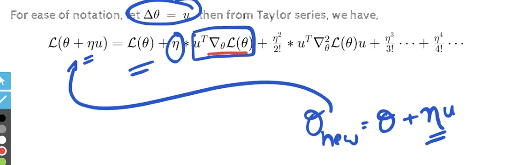
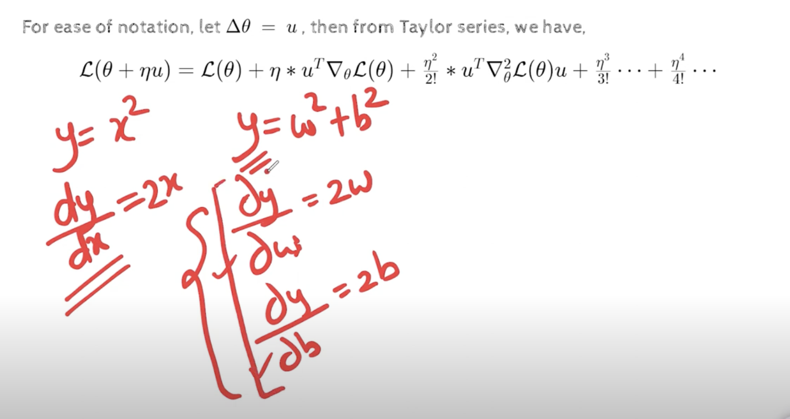
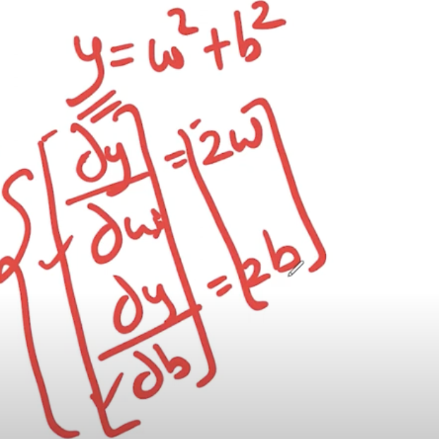
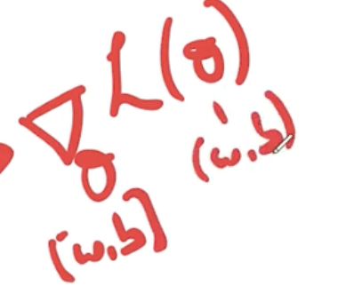
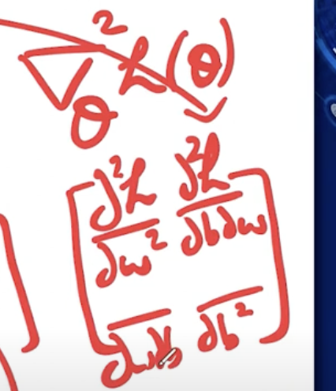
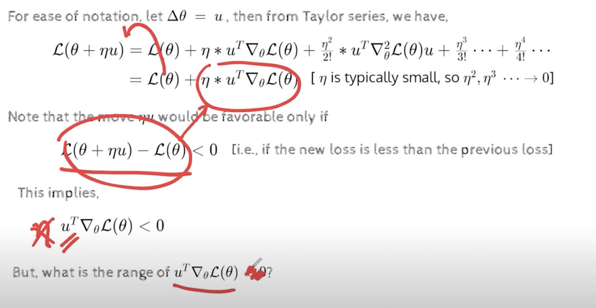
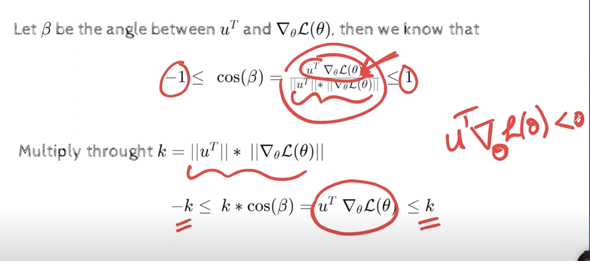
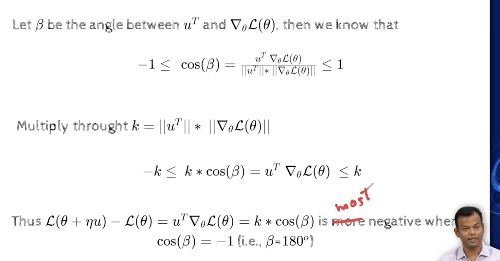

## 2.7 Learning Parameters: Gradient Descent

- original  goal , to find delta theta, that is good, that is going to reduce the loss function
- for ease of use we shall call delta theta as u, then from taylor's series, we have 
- 
- 
- gradient is nothing but the collection of partial derivatives of the loss function with respect to the parameters
- 
- here we have only 2 variables and so, we have  only two partial derivatives, so we can collect them, and we will get the gradient vector, which is a 2d vector
- 
- we are doing , gradient of loss function with respect to theta, and we are going to use this gradient to find the minimum of the loss function, and theta here is (w,b)
- for second order, we take gradient of gradient, ie. hessian matrix
- 
https://youtu.be/o2pT74Nplq0?t=420
- since neta is small, the square and cube will be even smaller, so we can ignore them, so we will use just the linear term
- 
- neta is positive value, so we omit it as it wont affect
- we have to select a u, such that , u.T * gradient vector <0   , only then our U will be good, 
- 
    - we are interested in the values less than zero
    - how less can i be, the more less the better
    - when the cos of beta =-1, we get the minimum value of u, ie. u is in the opposite direction of the gradient
    - when will cos beta be -1, when beta is 180 degrees, ie. when the angle between u and gradient is 180 degrees, that means we want u to be in the opposite direction of the gradient, hence in the direction of the gradient descent, direction opposite to the gradient
- 