## 2.8 Gradient Descent: Weight update rule
- the function has multiple minima,
- lets follow GD rule,, we are at w, we should move in the direction of the gradient, ie. in the direction of the steepest descent, and we will reach the minimum
- w-neta(dw)
- 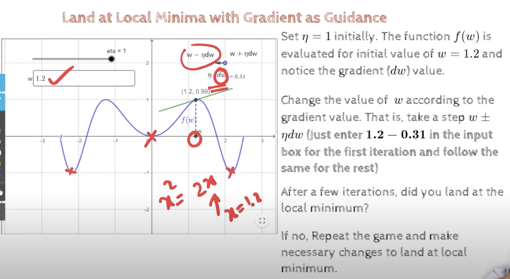
- initially w=1.2
- the second is 0.89 (1.2-0.31)
- 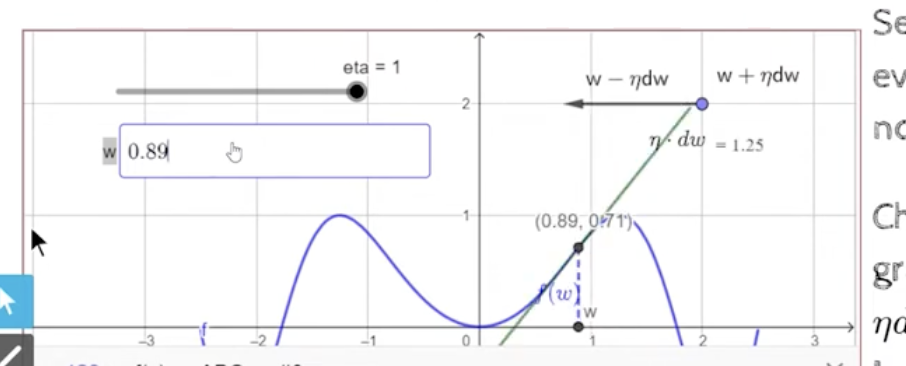
- looks like we have moved in a good direction
- next is (0.89-1.25=-0.36)
- 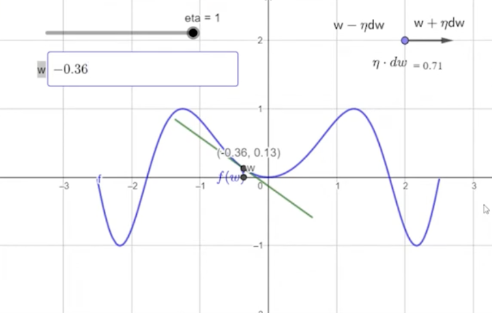
- we have moved a little bit far away from the minimum
- here we wont be able to reach minima, because we have a large neta, so we will overshoot the minima
- 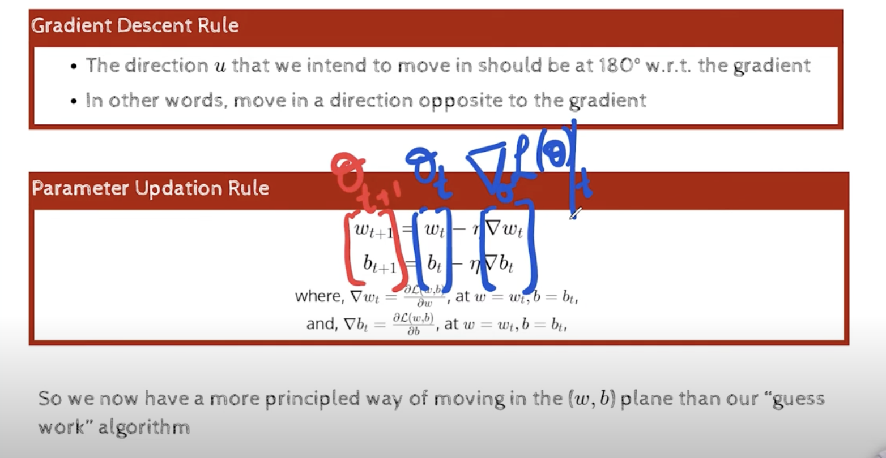
- 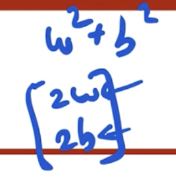
- 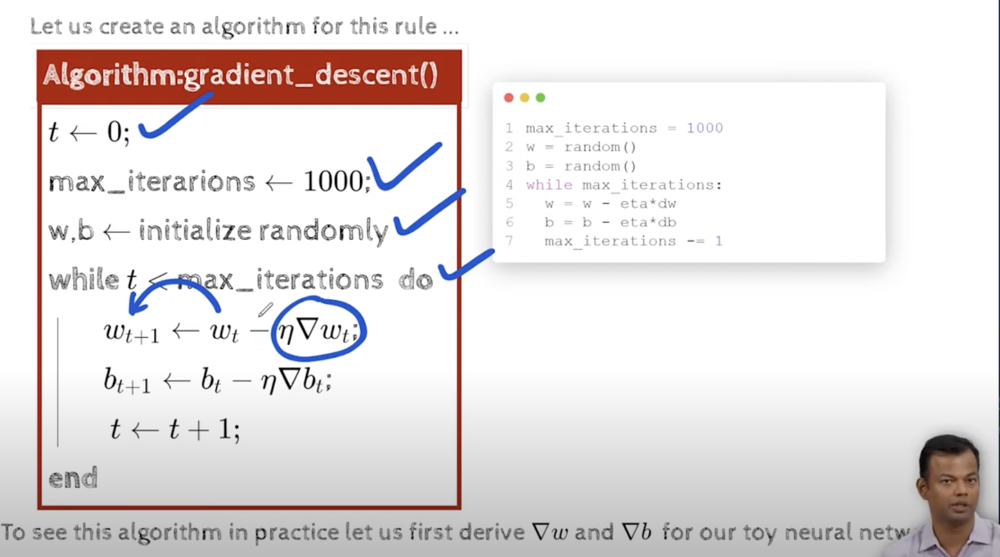
- in the above formula, everything except delta w and delta b is known
- 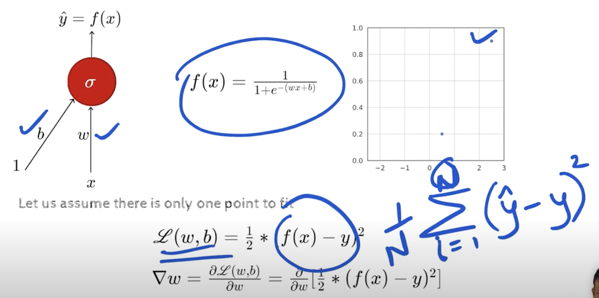
- 1/2 is just for ease of use, we can remove it
- https://youtu.be/HEx-q6fkCbo?t=607
- lets see how to calculate partial derivatives
- since we used have earlier, we are able to remove the 2 , so it makes the calculation easier, also we remove y from step 2, because y is just a constant, and the derivative of a constant is zero
- 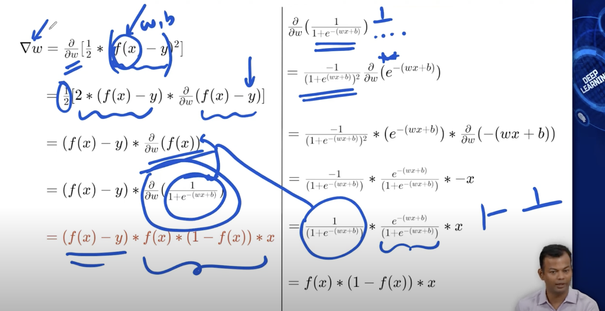
- https://youtu.be/HEx-q6fkCbo?t=936
- 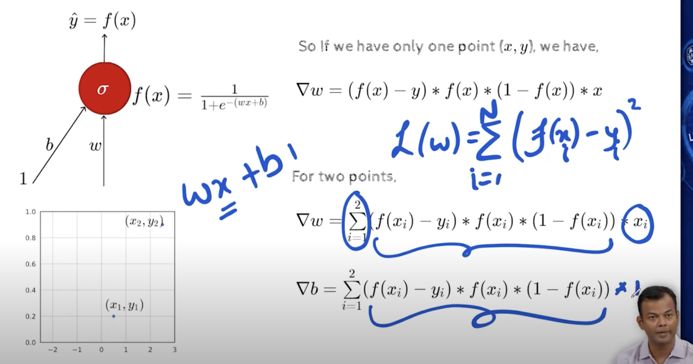
- https://youtu.be/HEx-q6fkCbo?t=961, code explanation
- 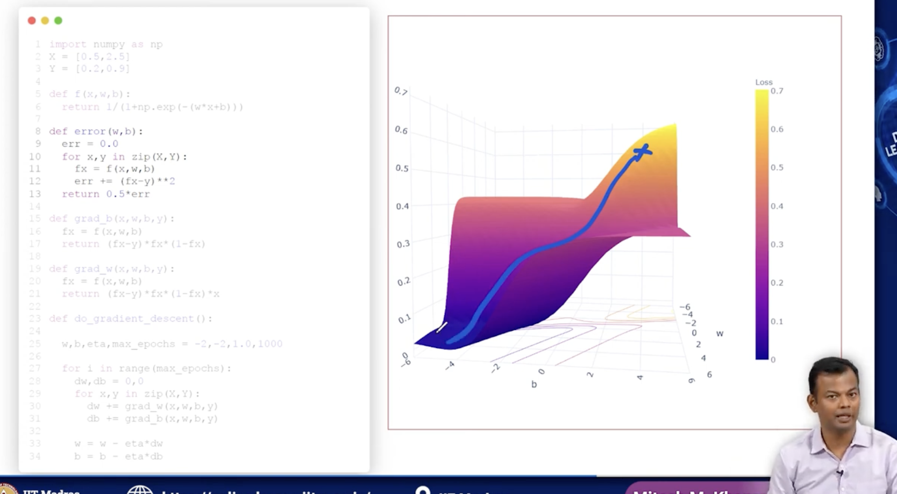
- we have two variables x,y, where x is the input and y is the expected output for a single variable function
- we should do GD to find right w and b, so that we can predict y for any x
- 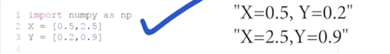
- lets call do_gradient_descent():
```
import numpy as np
X=[0.5,2.5]
Y=[0.2,0.9]

def f(x,w,b):
    return 1.0/(1.0+np.exp(-(w*x+b)))

def grad_b(x,w,b,y):
    fx=f(x,w,b)
    return (fx-y)*fx*(1-fx)

def grad_w(x,w,b,y):
    fx=f(x,w,b)
    return (fx-y)*fx*(1-fx)*x

def do_gradient_descent():
    
    w,b,eta,max_epoch=-2,-2,1.0,1000

    for i in range(max_epoch):
        dw,db=0,0 # initialize derivatives to zero
        for x,y in zip(X,Y): # in data points
            dw+=grad_w(x,w,b,y) # we will compute the gradient or partial derivative for each data point w.r.t w
            db+=grad_b(x,w,b,y) # we will compute the gradient or partial derivative for each data point w.r.t b

        w=w-eta*dw # update w
        b=b-eta*db # update b
```
- https://youtu.be/HEx-q6fkCbo?t=1225
- 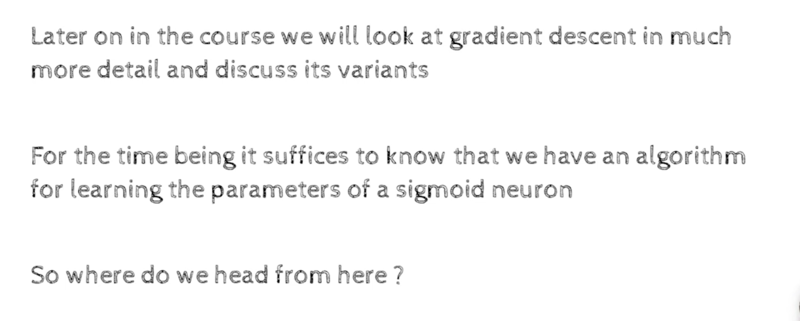