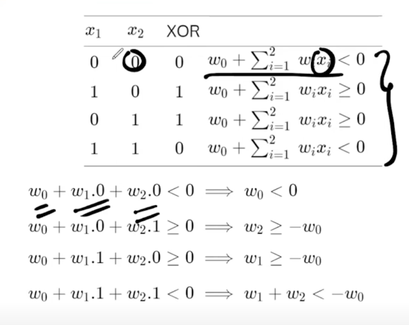
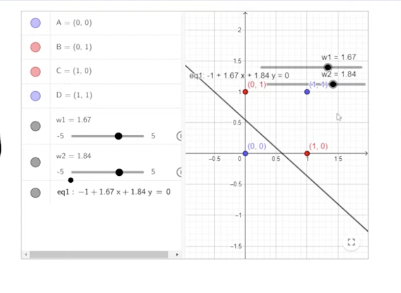
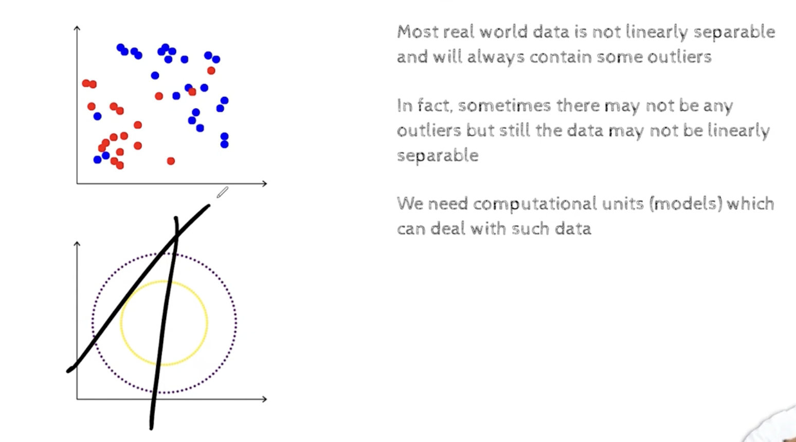
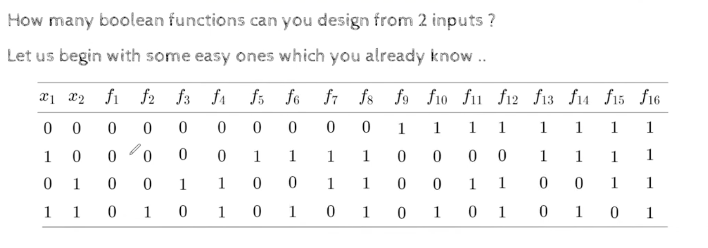
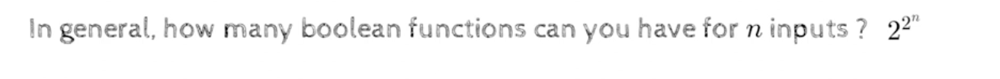

## LEct 2.1 Linearly separable functions

- in this module we will focus more on boolean functions and when are they linearly separable and not linearly separable
- perceptron guarantees only when the data is linearly separable

- we can see that we cannot satisfy these 4 inequalities
    - here w2 >= -w0
    - w1 >= - w0
    - w1+w2 < -w0 (this is not possible)
- we cannot find a set of wi's 
- whihc means this is not a linearly separable funciton
- 
- we wont be able to draw a line such that the two positive points are on one side and the negative points are on the other side
- 
- with a single perceptorn we cannot classify this function, but we can classify this function with a neural network (network of perceptrons) 

- 
- here each output can take 2 values, 0 or 1, so we will have 2**4=16 possible functions
- 
- f1- always off
- f16 -  always on
- f8 - or function
- f2 - and function
- similarly we can construct other functions
- 
- 
- xere n=2,{x1,x2}
- 
