## module 2.8 Representation power of a network of perceptrons

- we will see how to implement any boolean funciton using a network of perceptrons
- for this discussion we will assume True as +1, and False as -1
- we consider 2 inputs and 4 perceptrons
- each input is connected to all the 4 perceptrons with specific weights
- red edge indicates w=-1 and blue edge indicates w=+1 
- 2 inputs, 4 perceptrons, each input is connected to all the 4 perceptrons with specific weights, some are -1 and some are +1, and bias w0=-2
- what is perceptron rule?
    -  w0 plus the weighted sum of the inputs, should be greater than zero for it to be 1
- 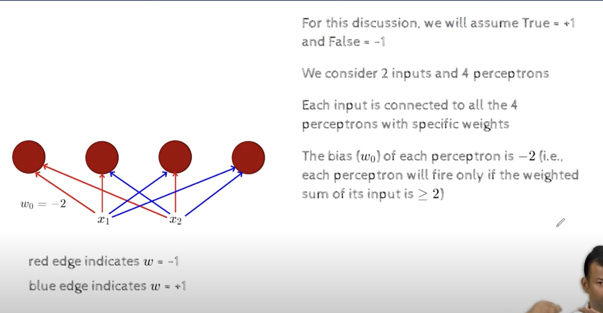
- it means that the weighted sum of the inputs should be greater than 2, for the output to be 1
- then we have one more perceptron , which is the output perceptron, which is connected to all the 4 perceptrons with specific weights(which need to be learned)
- 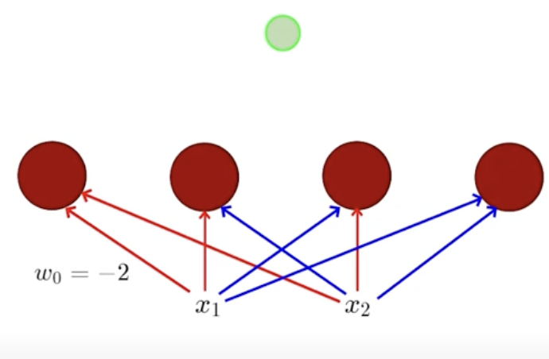
- the output of the green perceptron should match the output of the function, then we can say that the network of perceptrons is implementing the function
- let these weights be w1,w2,w3,w4, and the output of the green perceptron be y
- the outputs of the 4 perceptrons in the hidden layer are denoted by h1,h2,h3,h4
- the red and blue edges are layer 1 weights, and the black edges with (w1,w2,w3,w4) are layer 2 weights
- 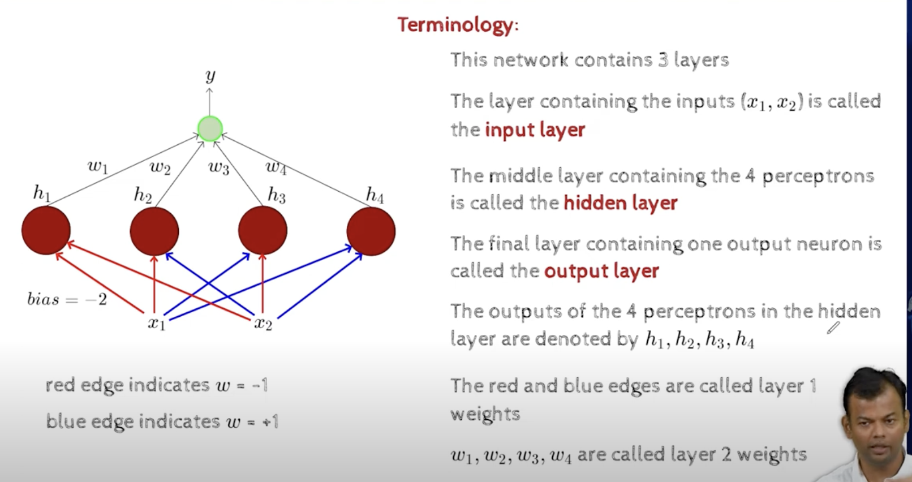
- we claim that any boolean function can be implemented using this network of perceptrons
- 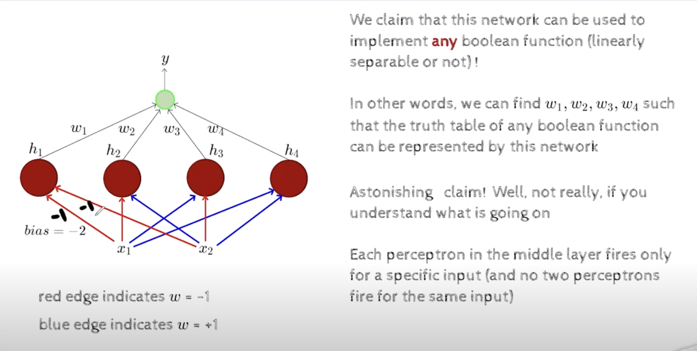
- in other words, we can find the weights w1,w2,w3,w4 such that the truth table of the function is implemented by the network
- here everything is fixed, except for w1,w2,w3,w4 which we need to learn, and the claim is that we can find the weights such that the network implements any of the 16 boolean function we saw in the previous slide with this as template
- we can learn specific w1,w2,w3,w4  , for each of these 16 boolean functions, and these might be different for each of the 16 boolean functions, such that when we plug in those weights, and now we start feeding the inputs, then the output will be the desired output as per the truth value of the function
- for the first input , x1=-1, x2=-1, w1=-1,w2=-1 and bias =-1, now weighted sum of `w1*x1+w2*x2-w0` = `2-2=0` >= `0`, so the output of the first perceptron will be 1,
- 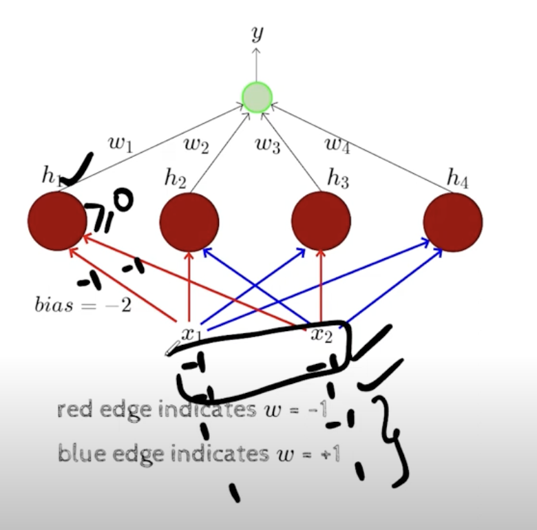
- but this perceptron will not fire for any other input, because the weighted sum will be less than 0, eg if x1=-1, x2=-1, w1=-1,w2=1, then the weighted sum (x1*w1+x2*w2+w0 = 1-1-2=-2 not >=0) will be -2, which is less than 0, so the output of the first perceptron will be 0
- similarly for (1,-1) and (1,1) this perceptron will not fire
- because thats how we have constructed the weights, such that this perceptron will fire only for (-1,-1)
- 
- 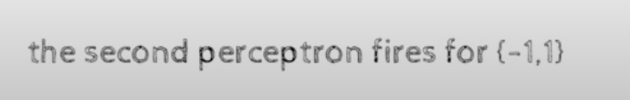
- for the second perceptron, we have w1=-1,w2=1, and bias=-2,
- this will fire for (-1,1) only, and not for any other input
- similarly for the third and fourth perceptron will fire for (1,-1) and (1,1) respectively
- so each perceptron is specializing for a specific input and ot will only fire for that

- ## how does this show that it can handle any function?

- xor is the function which is not linearly separable, and we will see how to implement xor using this network of perceptrons
- 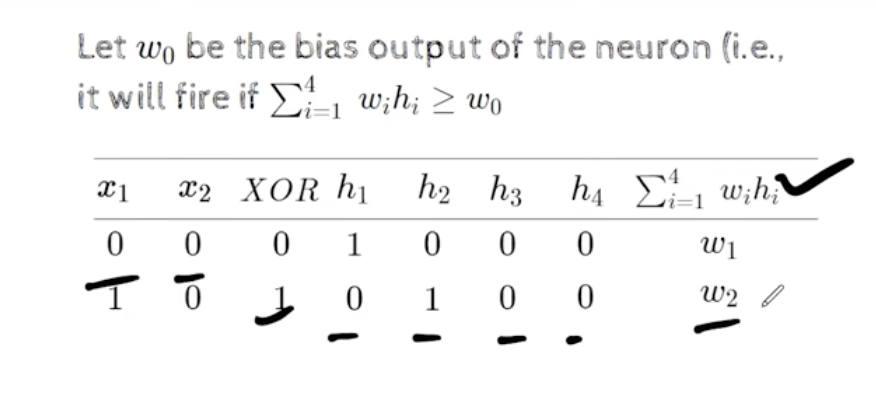
    - here at the end sum will be w2*h2, and others are 0, and as h2=1, the sum will be w2
- 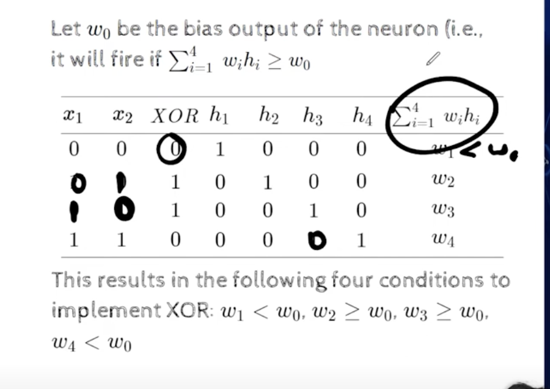
    - the above are the conditions for XOR function
- y=aggregate, if y < w0,the it will be 0
    - if y > w0, then it will be 1
- with single perceptorn we cannot implement XOR, but with a network of perceptrons we can implement XOR
- 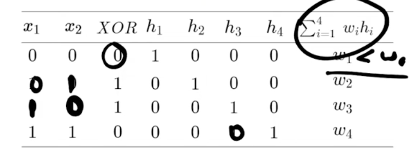
    - using this table we can get the equations for w1,w2,w3,w4, 
    - 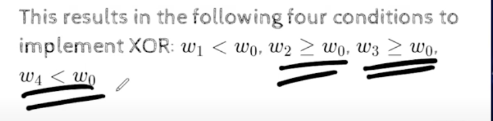
    - if output is 1, y< w0,
    - if output is 0, y>w0
    - so 
        - w1<w0
        - w2>w0
        - w3>w0
        - w4<w0 
- why is this happening?
    - because thats how we have configured, because every neuron is specialized for a specific input, hence leading to a condition on a specific weights, and two weights are not interacting in any condition, and hence , no contradictions that are happening
- the network is designed in a way , such that we have 4 possible inputs, and we have 4 possible weights, so 4 dof, and each weights can adjust itself to satisfy the conditions for the specific input
- 
- 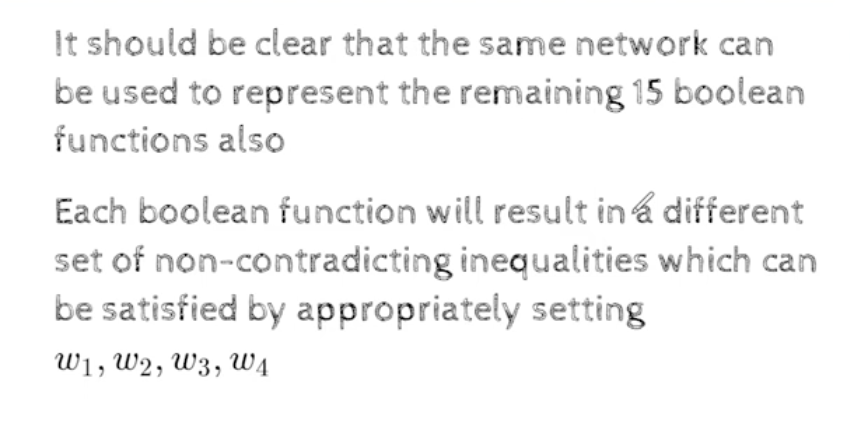
- ## what if we have more than 3 inputs?
- 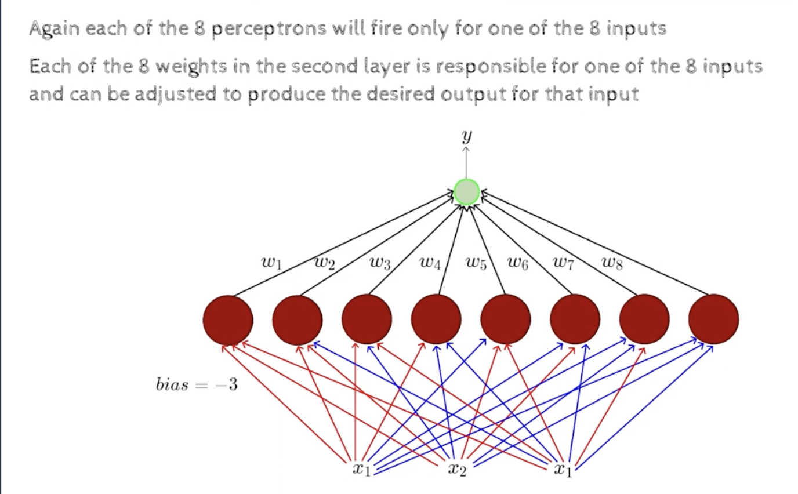
- for 3 inputs , we have 8 different inputs, and we have 8 different weights, so 8 dof, and we can adjust the weights to satisfy the conditions for the specific input
- here each red and blue , will adjust in a way such that the conditions are satisfied for the specific input
- 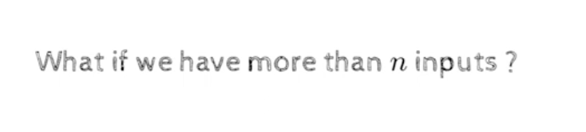
- how many perceptrons will we need in the hidden layer?
    - 2**n, where n is the number of inputs
    - each perceptron will be specialized for a specific input
- 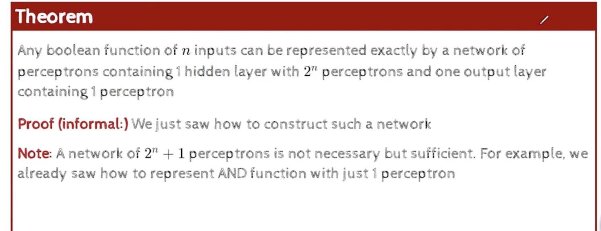
    - 2**n in the middle layer and 1 in the output layer, 
    - its not necessary to have 2**n +1, but its sufficient
    - we have seen that the and condition can be implemented using  a single perceptron, we dont really need 2**n+1
- 

- even if n=100, it becomes 2**100, which is a very large number, and we can still implement the function, but hard to handle
- ## how to make this network a bit more compact, its a question for later, 

- but we know that we can hndle any boolean function using a network of perceptrons
- why do we care about boolean functions?
- for most real world examples the data wil not be linearly separable, but we can still use a network of perceptrons to handle the data
- 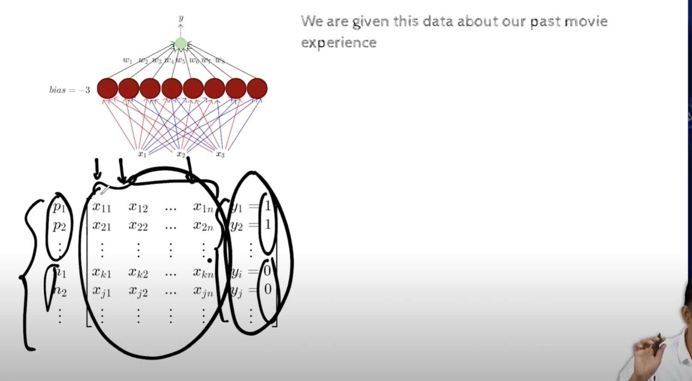
- p1,p2..p..are positive points, and n1,n2..n.. are negative points, as we can see the output, also the inputs or features are also binary
- the theore states that we can come up with a network of perceptrons, which will classify the data correctly
- 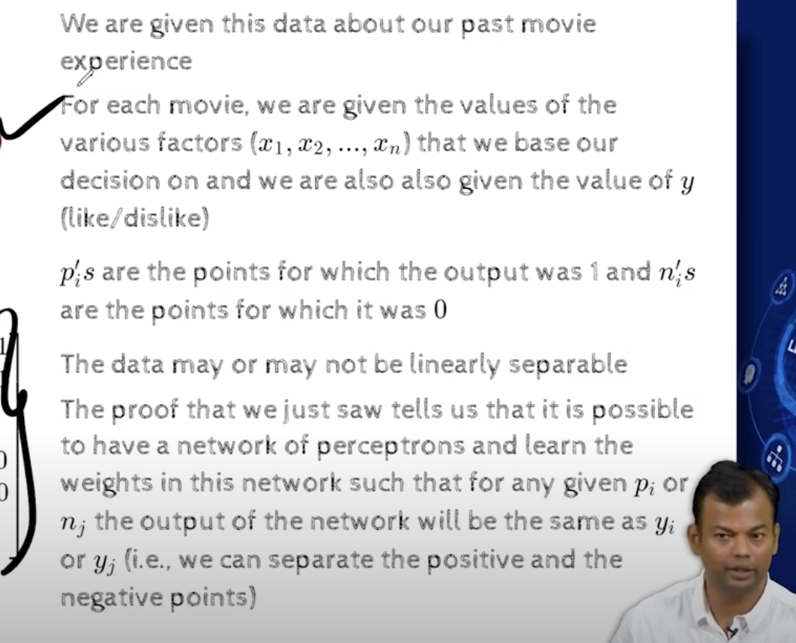
- 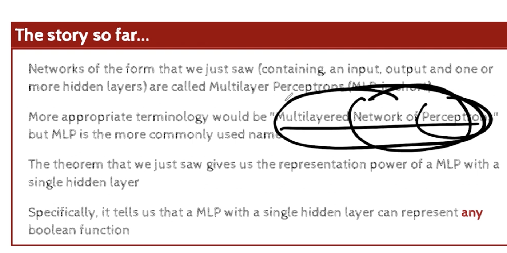