## Sigmoid Neuron
- 
- 'visualize backpropagation' by Ryan Harris, https://www.youtube.com/watch?v=Ilg3gGewQ5U
- 'http://neuralnetworksanddeeplearning.com/chap4.html'

- ## module 3.1 Sigmoid Neuron
- boolean functions
    - y=f(x), where both x and y are binary(boolean)

- we are trying to find the quantity of oil that is present in a particular region, so that we can decide whether to drill or not 
- we ahve lots of factors like
    - salinity
    - density of water
    - pressure at that location
    - temperature
    - marine diversity
- all of the above are real values
- 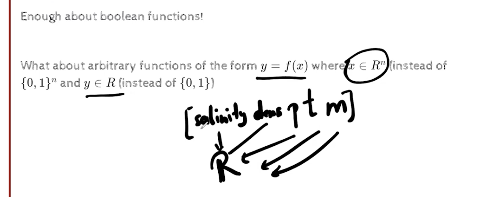
- y belongs to R

- another example is, what is the interest rate we should set for a certain customer as a bank, depends on 
    - past history
    - income
    - age
    - family size
    - was there any default in the past
    - etc..
- images, are pixel values, that tell us the intensity of the pixel, and we have 3 channels, red, green and blue, and each channel has a value between 0 and 255
- 
- 
- we want yhat approx y, where yhat is the predicted value, and y is the actual value
- 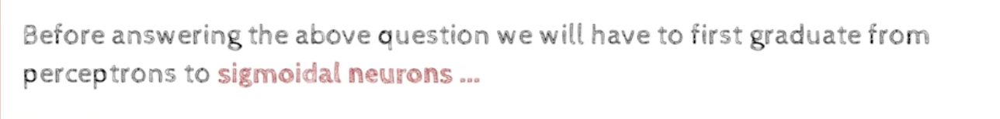
- 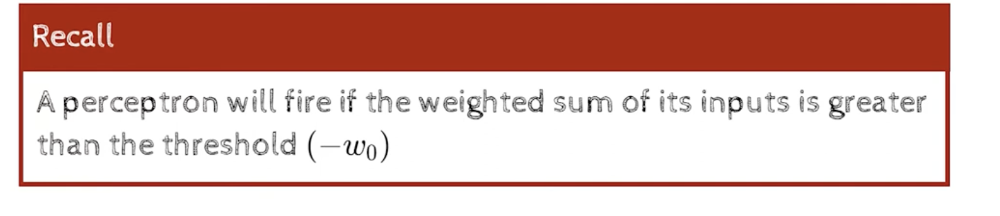
- single input perceptron looks like below,
- input, weight , output, bias or threshold,=0.5, -w0=0.5
- the thresholding logic 
- 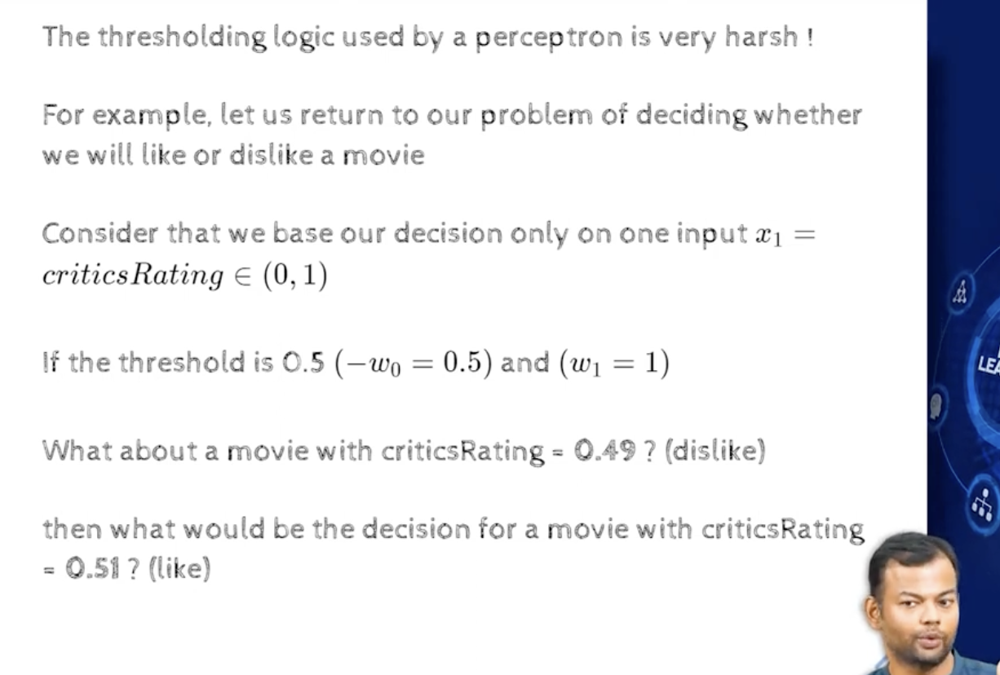
- 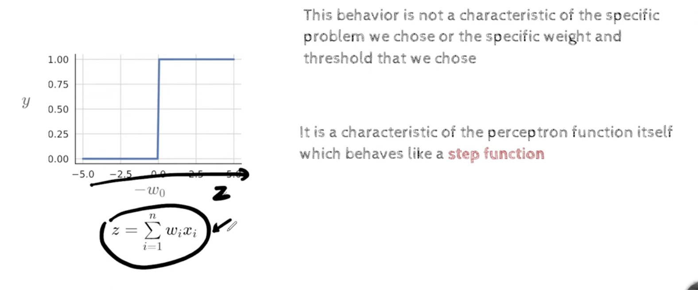
- this is what a perceptron function looks like,    
- 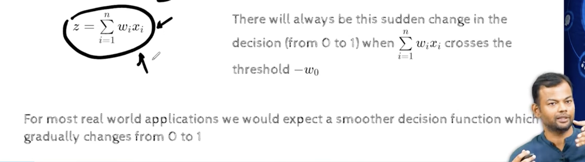
- sigmoid is a family of functions, ,
- we have several sigmoid functions,
    - tanh
    - logistic
    - arctan
    - etc..
- 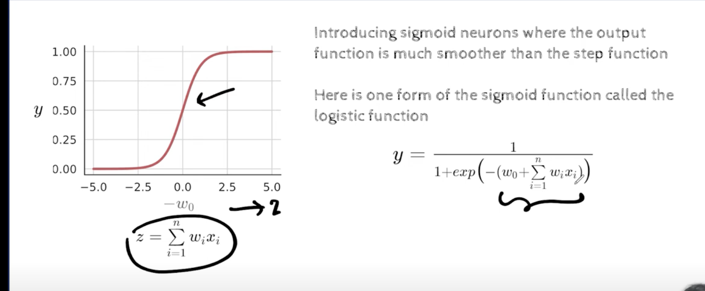
- 
    - the denominator is weighted sum of the inputs, and the threshold is the bias
- lets look at this function more carefully , what happrns when wt.x is very large, and tends to infinity
- 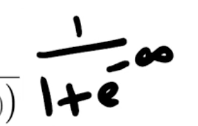
- 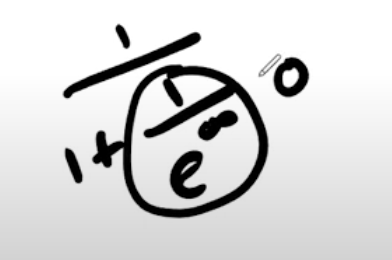
- if wtx=0, then 1/(1+e^0)=0.5
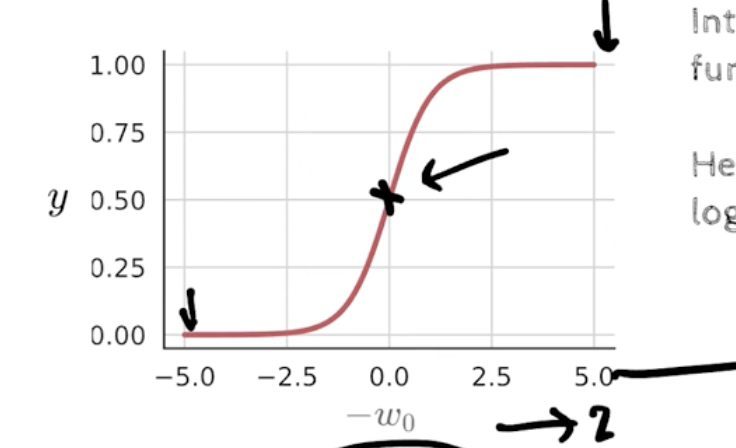
- in this case w0 =0, but we can have w0 as any value, and we can adjust the threshold accordingly and the graph will shift accordingly
- we no longer see sharp transitions, we see a smooth transition
- 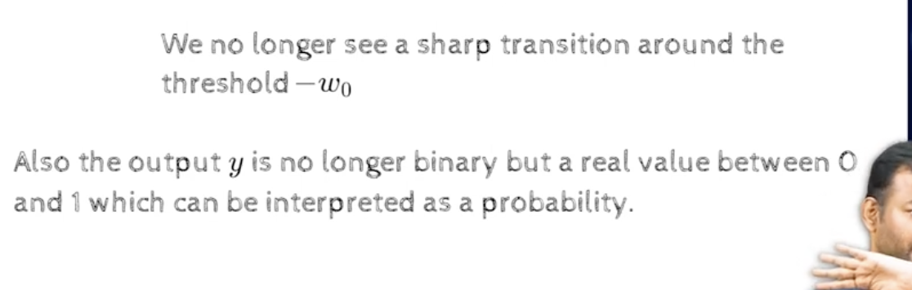
- since the values are between 0 and 1, we can interpret the output as a probability
- now the output of sigmoid function we can interpret as a probability
- if it gives .49, we can say that there is 49% chance that the output is 1, and 51% chance that the output is 0,
- earlier we were saying that there was 0 chance, this makes more sense
-  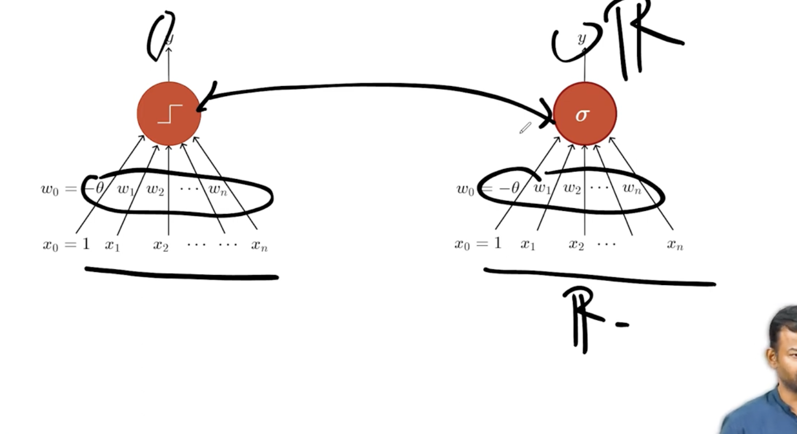
    - we see that the inputs, output and the weights are all similar , except fir the function
- the step function is obvious because of the formula we were using, 
- now we have smoother formula
- 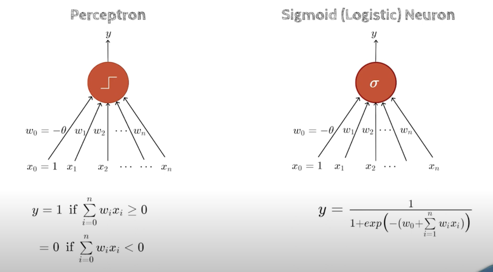
- 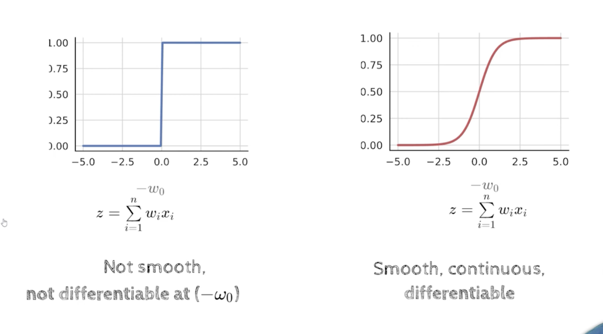
- why do we care about continuity and differentiability?    
- for large part of this course , calculus will be used
- derivatives are used to update the weights