## A typical supervised machine learning setup
- most important module
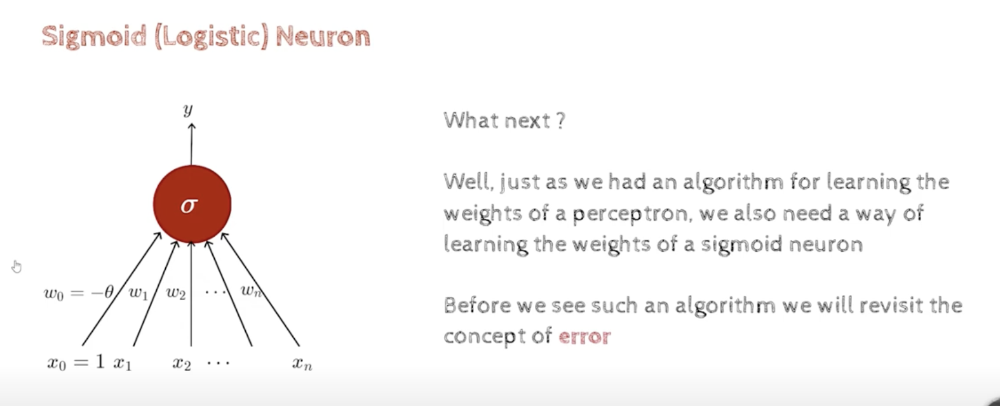
- we will see the ml setup 
- 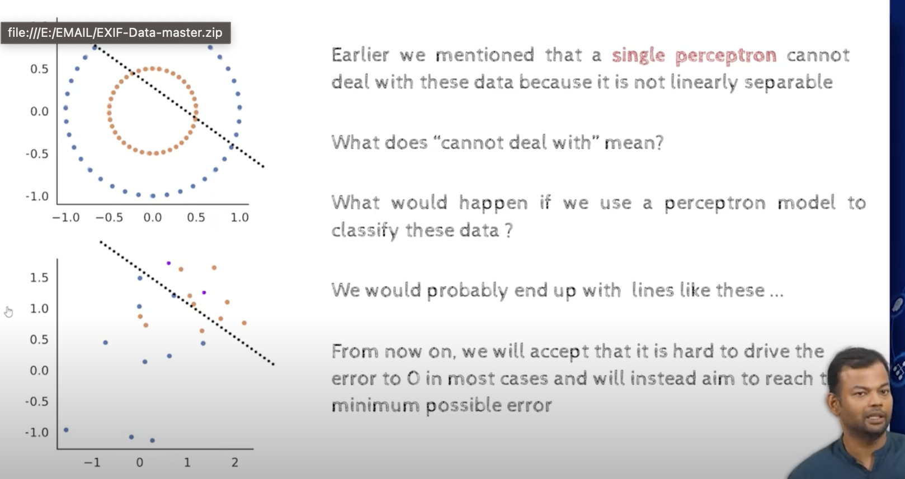
- 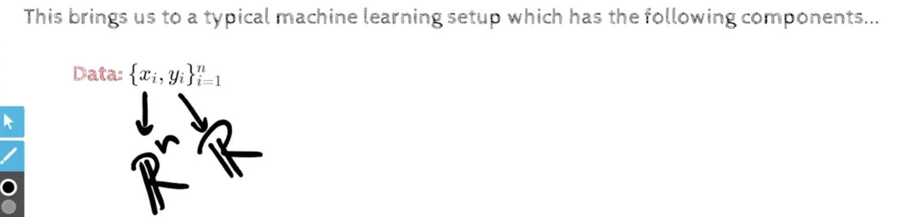
- we will start using the term minimizing the error instead of making the error zero
- this brings us to a typical machine learning setup which has the following components...
- we are given some data xi belongs to  Rn and yi belongs to R or Rn
- xi belongs to Rm, and we have n such data points, 
- in out oil mining case, we assume that there are already n drilling wells, and we have the data for each of the wells like the pressure, salinity, and we want to predict the quantity of oil in the n+1th well
- this is what a typical machine learning setup looks like
- other example, bank interest rate , we have the various history of the person like , salary, age, family size, etc.. and we want to predict the interest rate
- n training points, each of m dimensions, and we are predicting R real values 
- other example, is movie box office collection prediction, we have the data for the past movies, and we want to predict the box office collection for the next movie
- y depends on input x
- y=f(x)
- if i knew what is f, then i can predict y for any x, but i dont know what is f, so i need to learn f
- we know that the function f exists, but we dont know what is f
- 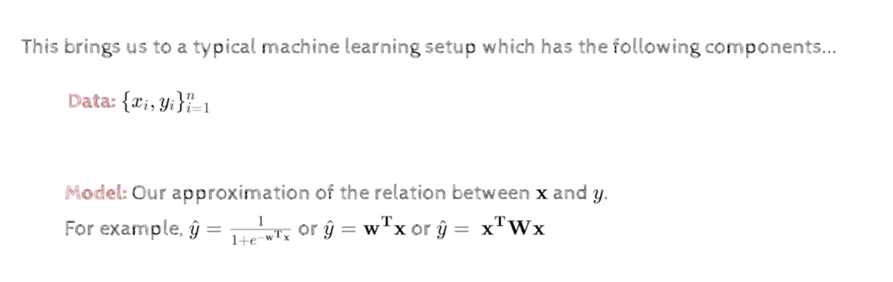
- 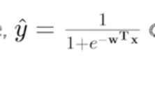
- The above is Logistic Regression, sigmoid function
- 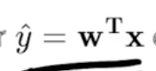
- The above is Linear Regression
- 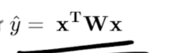
- The above is quadratic regression
- 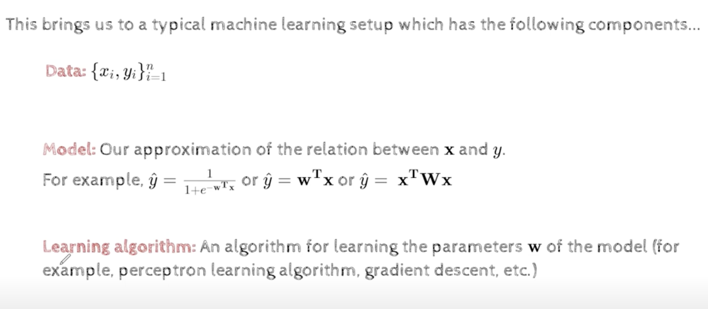
- what should be the goal of the learning algorithm?
    - in perceptron, while !convergence
    - this means we were going for zero error, 
    - but in machine learning, we will not go for zero error, we will go for minimizing the error
    - 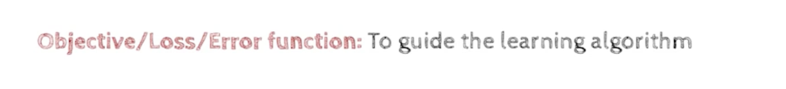
    - 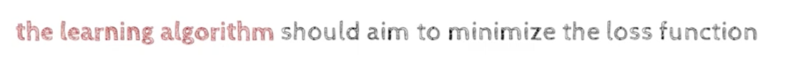
- we should be clear about, 
    - the data
    - the model, our approximation of the function between x and y 
    - the learning algorithm, which will learn w,the model from the data, which has to be driven by the objective function, which is minimizing the error

- As an illustration, consider our movie example
    - Data {xi=movie attributes, yi=like/dislike}i=1..n
    - Model yhat=1/1+e^(-w0-w1x1-w2x2-...-wnxn)
    - Parameters:w0,w1,w2,...wn
    - Learning algorithm:Gradient descent, we will see soon
    - Objective/Error/Loss function: minimize error,
    - 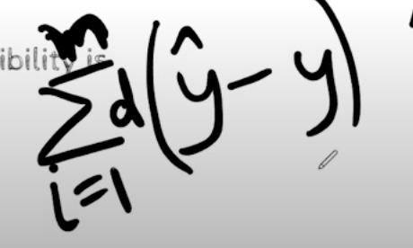
    - we can choose different ways of choosing this distance, 
    - 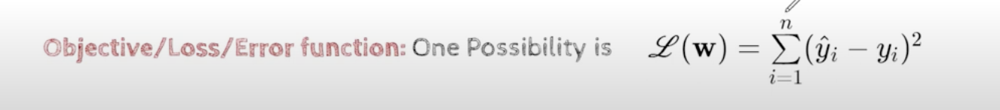
    - why do we choose square of the distance, because it is easy to differentiate and it is convex
    - because the positive error doesnt cancel out the negative error
    - why cant we instead use absolute value of the distance, because it is not differentiable, and it is not convex
    - whereas square of the distance is differentiable and convex
- The learning algos should find these W
- 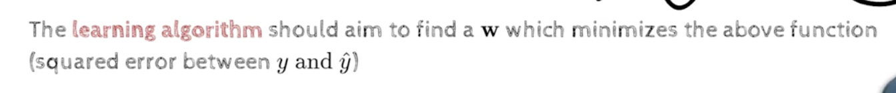
- there are infinite number of functions that can fit the data, but we want to find the best function that fits the data
- Rm, or Rm+1 if we include the bias
