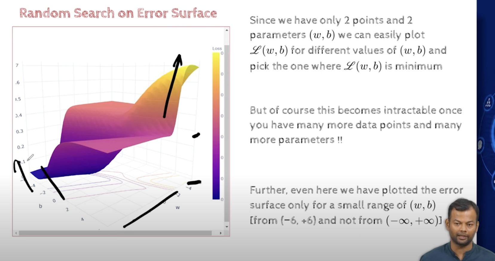

## Module 3.3 Learning Parameters: (Infeasible) guess work
- 
- this is the supervised ML setup , which has N inputs, have some weights and i have some output
- i want to learn the parameters w, using an algo , given the data, and using some objective function
- 
- 
- imdb rating will be from 0-1, (0.5,0.7,0.2... )
- N -> no of training pairs
- n -> no of inputs
- n=1 in this case
- objective is to find (w,b) such that the error is minimized
- 
- average diff of predictions from the true values, for all the training points
- Lets say we are given only two training points
- using the given point we want to learn the parameters w,b
- 
- 
- As usual we never know what w and b are, so we shall start with some random w and b
- 
- lets start with w=3, b=-1 and intuitively also we can see that this is not a good fit, why?
    - because both the points are not on the line, so the function is bad, But how do we quantify this?
    - we could  look at the loss function, 
    - 
- 
- 
- now we are able to quantify how bad the function is,but we want the loss function to be as close to 0 as possible, but we can settle for approx 0 also, so lets try for other values of w and b also
- 
- all these are guess work, which is not a good way to learn the parameters
- 
- w, b and vertical axis is the error(loss)
- we can plot this using computer,
- this is okay for this toy example, but as the number of 
- 
- plotting the errir surface in real data is not possible
- 
- we just understood the sense of what is required when we hit (0.94,-0.94), i,e we have to increase w and decrease b, and we continue,
- dinally we reach (1.78,- 2.27)