## Learning Parameters: Taylor series approximation
- 
- 
- 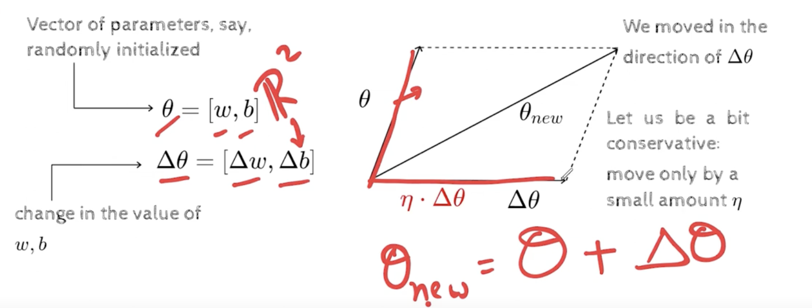
- neta is a  small scalar
- 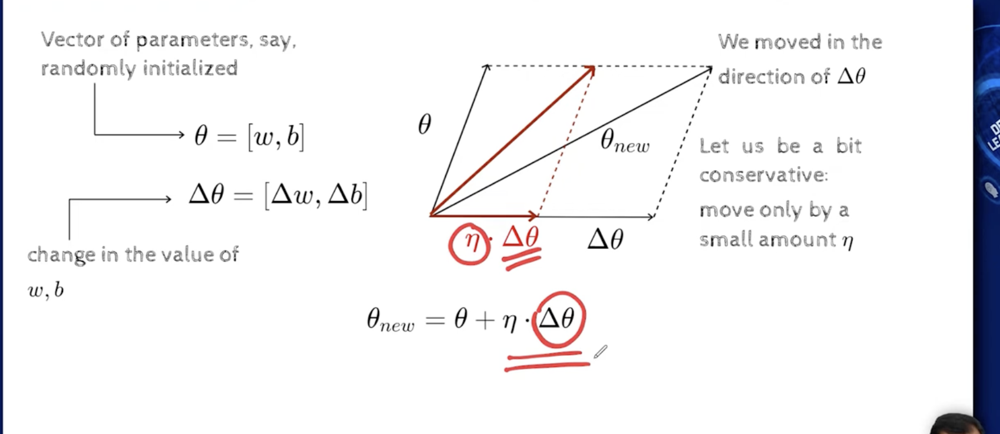
- if you tell what is delta theta, im going to move by a small value in that direction, and this is our update rule, delta theta is also a vector, question is what delta theta to use?
- 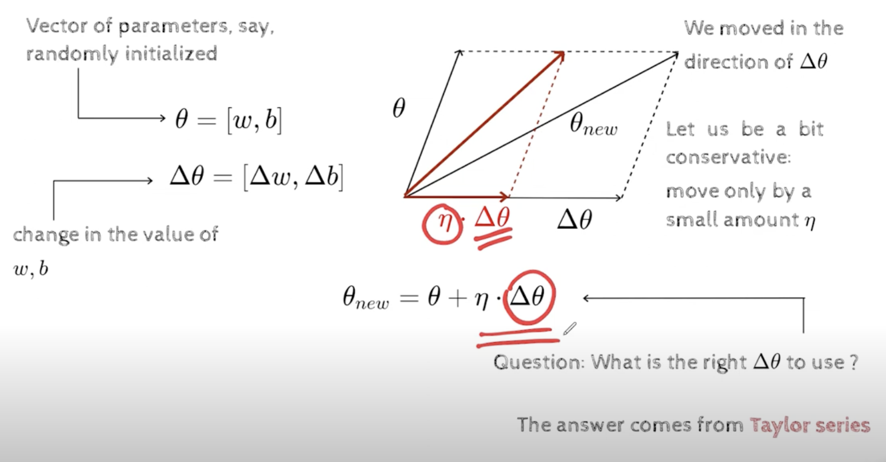
- whatever loss function we are dealing with is a differentiable function because, we have sigmoid neuron which is differentiable, and then our loss function, which is a squared error loss , whihc is again a differentiable function, 
- this differentiable function may have any shape, which is smooth and differentiable 
- what Taylor's series does is  it gives us a way of approximating this, using polynomials of degree n, The higher the degree the better the optimization
- 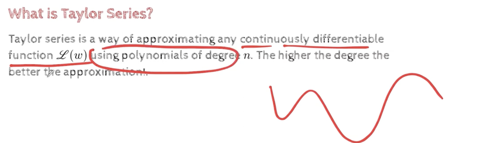
- 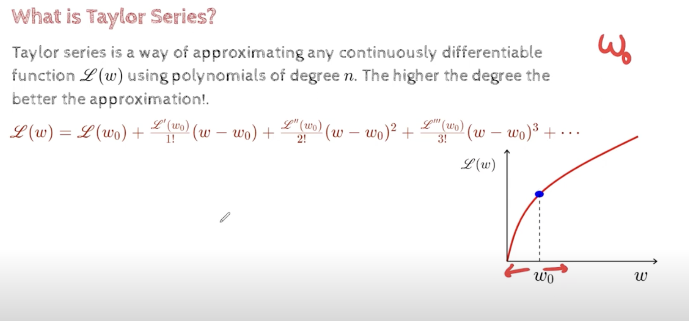
- if we know w0, what the taylor's series does is, if we know a point w, whihc is w0+delta, where delta =w-w0
- if we know the value of loss at a certain point then , i can approximate the value of the function in the neighbourhood of that
- interesting thing about the formula is that, we have the first order term, second order term and so on, and we can cut off at any point
- if we cut off the formula after two derivations, it is called second order approximation also, if we do so in the first derivation, then it is called first order or linear approximation ,so lets see what happens when we do linear approximation
- 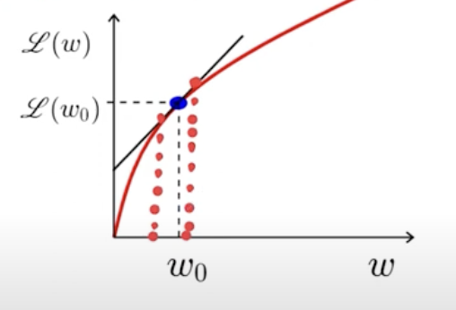
- in this small neighbourhood we assume that the function is linear, and we already know y0=mx0+c, m-> slope (derivative , L'(w)), we want to find value of y1=mx1+c
    - if we subtract 1st from second, we get, `y1-y0=m(x1-x0)`, ie. `y1=y0+m(x1-x0)`
    - 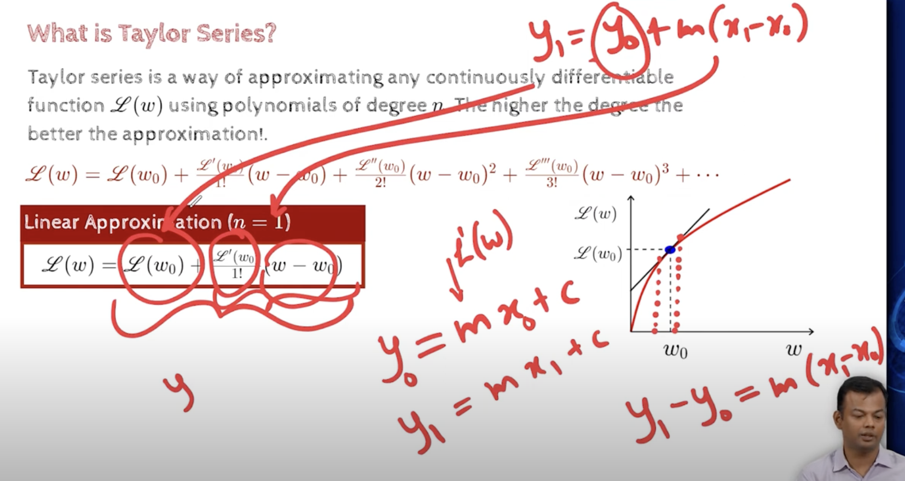
    - 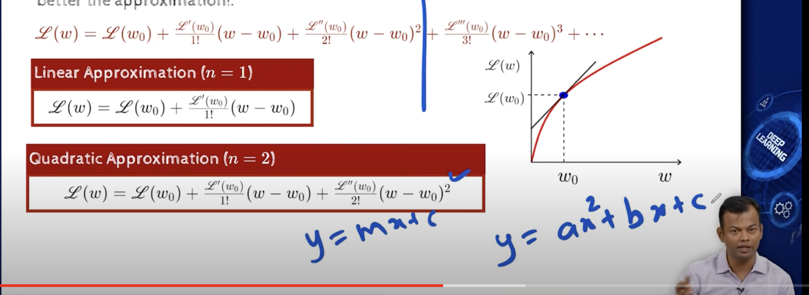
    - now we are approximating the function as a quadratic function, these coefficients are coming from the derivatives
    - 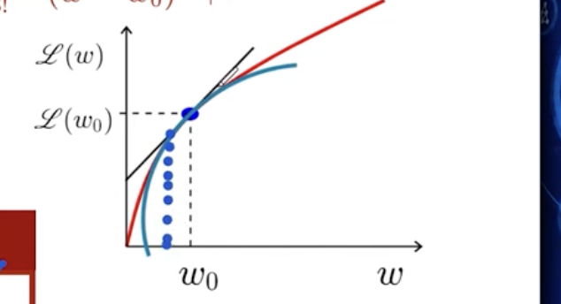
    - so in this neighbourhood, we are approximating the function as a quadratic function, and we are trying to find the minimum of this quadratic function, and we are going to use this quadratic function to find the minimum of the original function
    - we can see that second order approximation is better than first order approximation, and third order approximation is better than second order approximation
    - 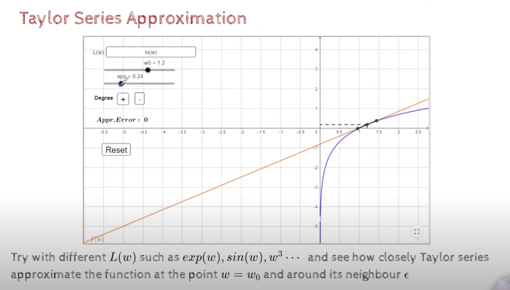
    - here eps(epsilon) actually defines the neighbourhood
    - the function we use is log(w),the value will be the value on the orange line
    - Approximating 2D functinos
    - 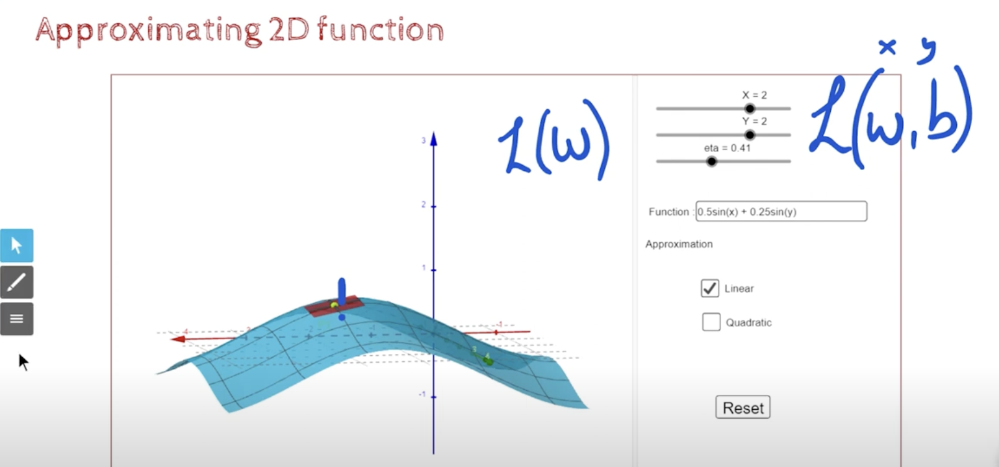