## 2.9 Representation power of Multilayer Network of Sigmoid Neurons: 1D functions

- 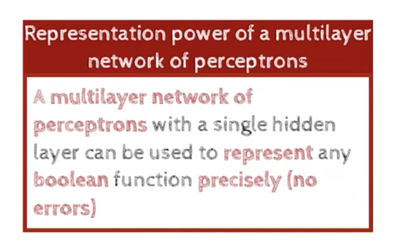
- if you have an n variable inputs, then we would have a boolean functions of n variables, and truth table, no matter what the tt is,
- we know that for an n variable input , we could have `2**2**n` different boolean functions, for any of these boolean functions, we could construct a network  that computes that function.
- every perceptron was specializing for a particular boolean function, and we could construct a network that computes any boolean function.
- 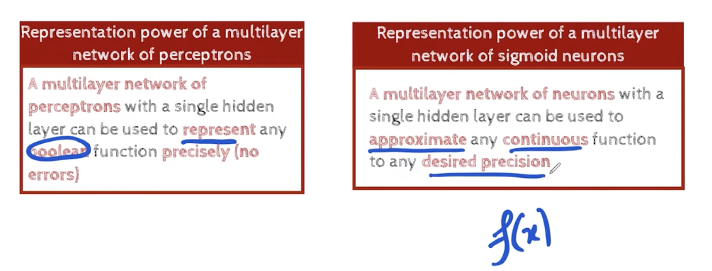
- epsilon = precision
- 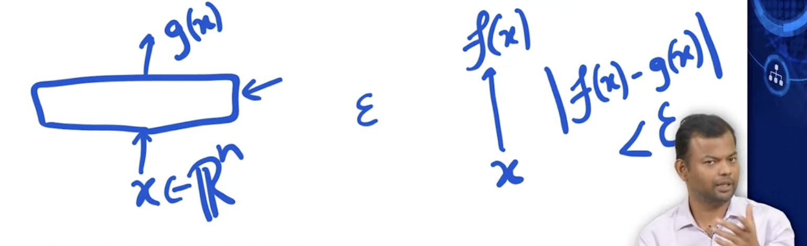
- we can come up with any network such that , the difference between the two output, would be less than epsilon.
- as the epsilon becomes smaller, the network becomes more complex.
- 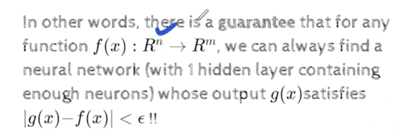
- this is the famous universal approximation theorem.
- 
- 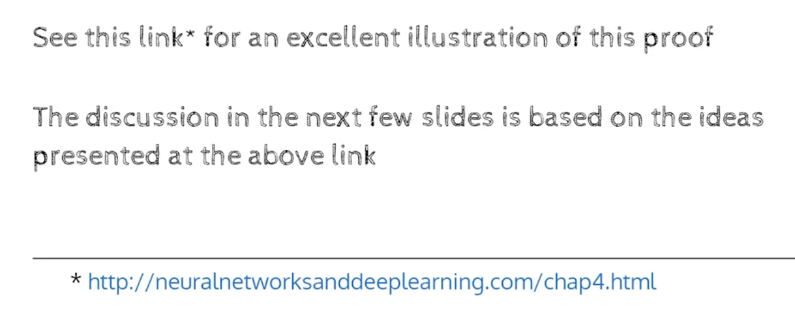
- http://neuralnetworksanddeeplearning.com/chap4.html
- 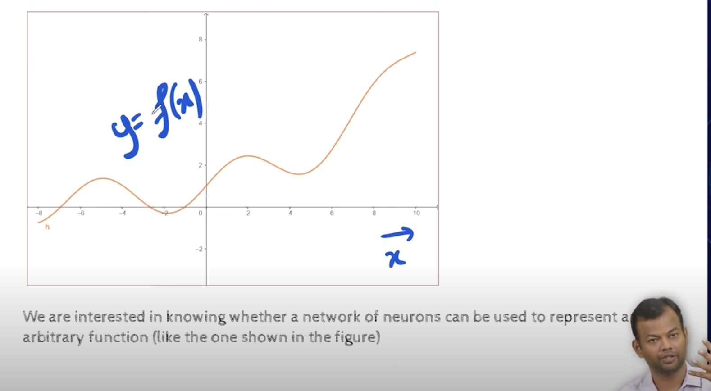
- 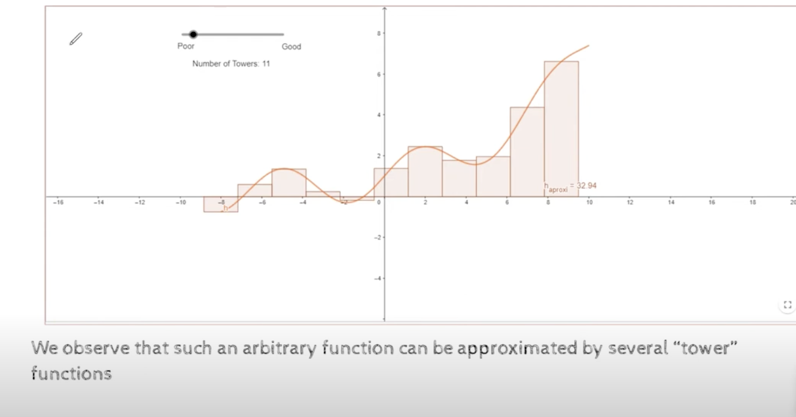
- the above is an example of a poorly approxiated function  , by towers 
- 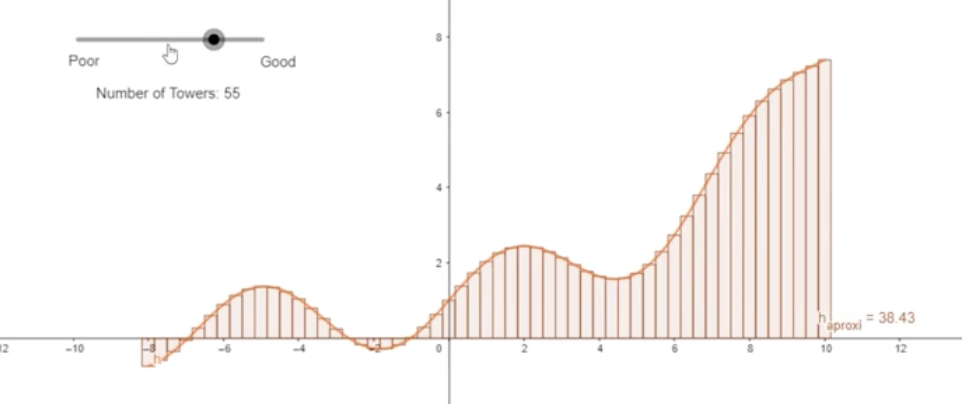, 
- as we increase the number of towers , we get a better approximation.
- 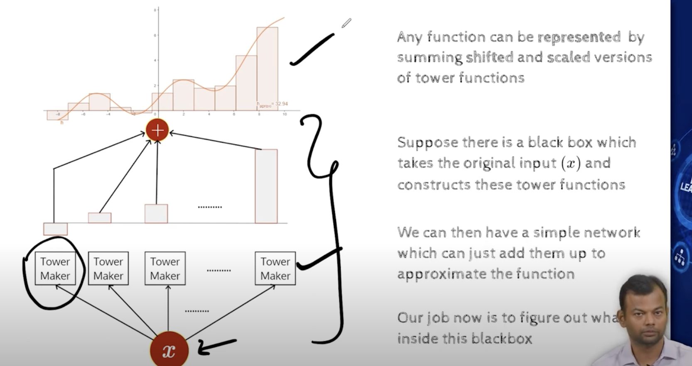
- 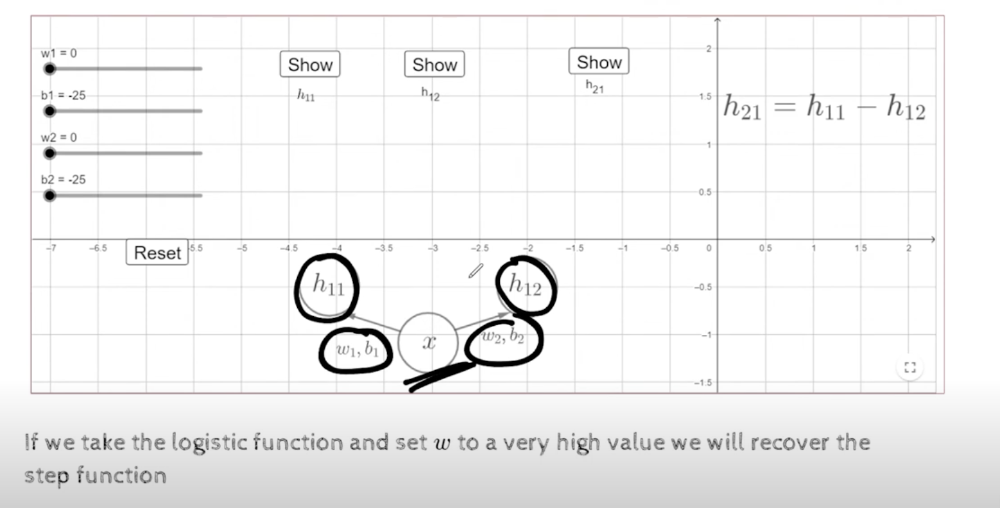
- we have an input x, and we have two parameters, w1,b1 and w2,b2
- h11, h12 are sigmoid neurons, , they are gonna take input x and return 1/1+e^-(w1x+b1) and 1/1+e^-(w2x+b2) 
- 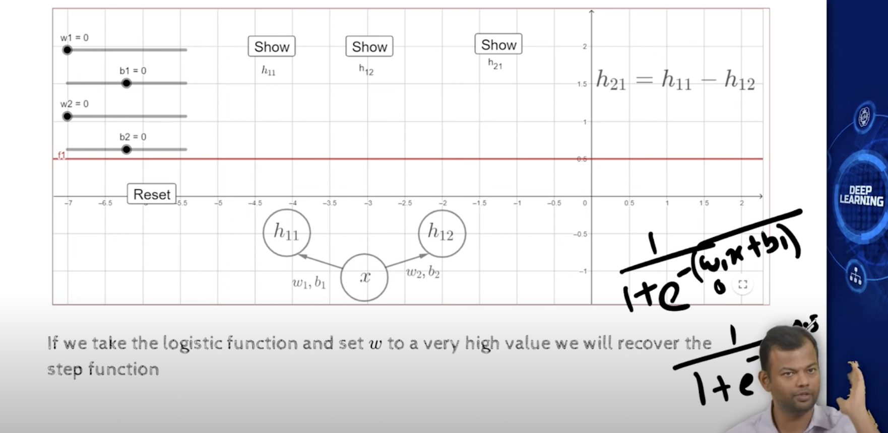
- here h11 is a straight line because w1=w2=0 and b1=b2=0, if we substitute these values in the sigmoid function, we get 1/1+e^0 = 1/2 = 0.5, ie for all the values of x, we get 0.5, which is a straight line.
- if we increase w1, it will increase the slope of the line, and if we increase b2, it will shift the line to the left.
- https://youtu.be/xHSErLWAlbU?t=1106
- 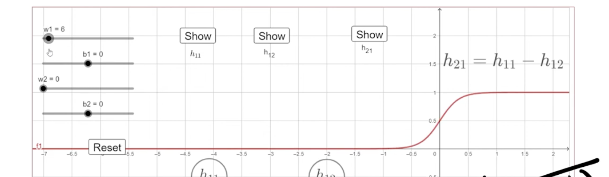
- 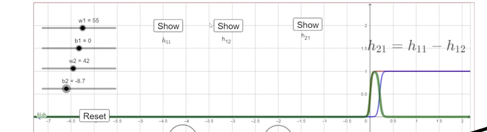
- formation of tower function
- 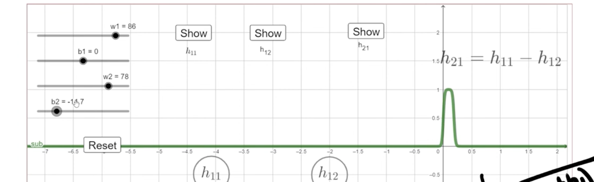
- now we got a network, which can produce a tower function, and not just any network, it uses our sigmoid function, we just have to set the w's to high values, so that we get a step like function , and we can control the b's to control the width of the tower.
- if b goes small ofcourse, the tower becomes narrow and height also reduces, and if b goes large, the tower becomes wide.
- 
- we have x, and we have two sigmoid neurons, the first will give a step function, because we set the w to very high, so will the second neuron
- subtract one from the other
- 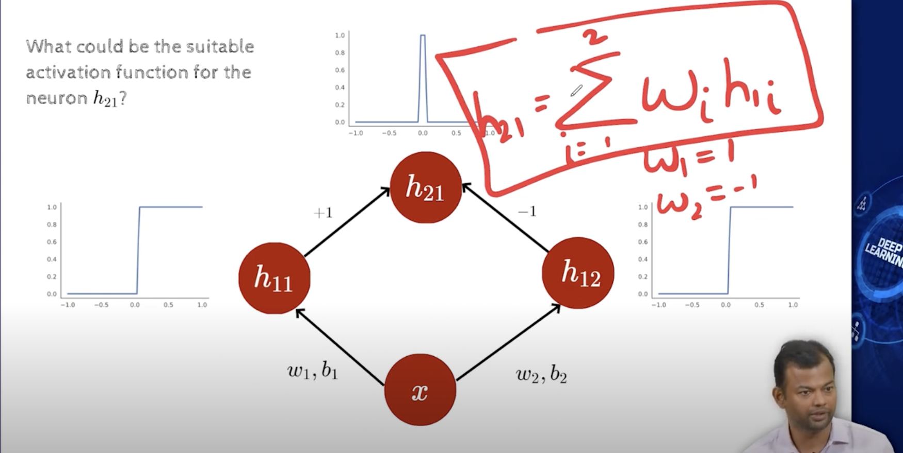