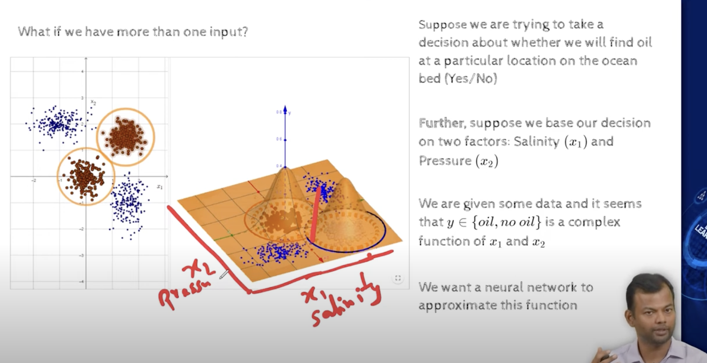
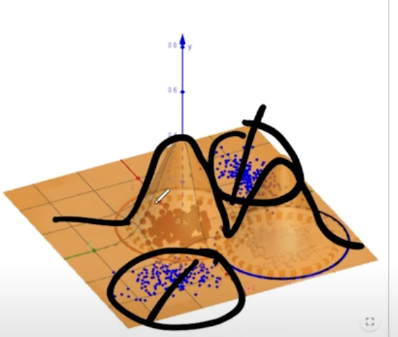

## 2.10 Representation power of Multilayer Network of Sigmoid Neurons: 2D functions

- what is we have more than one input?
- 
- let orange points be the place where we find oil and blue points be the place where we dont find oil.
- for all the blue points its predicting 0, and for all the orange points its predicting 1., see the below figure.
- 