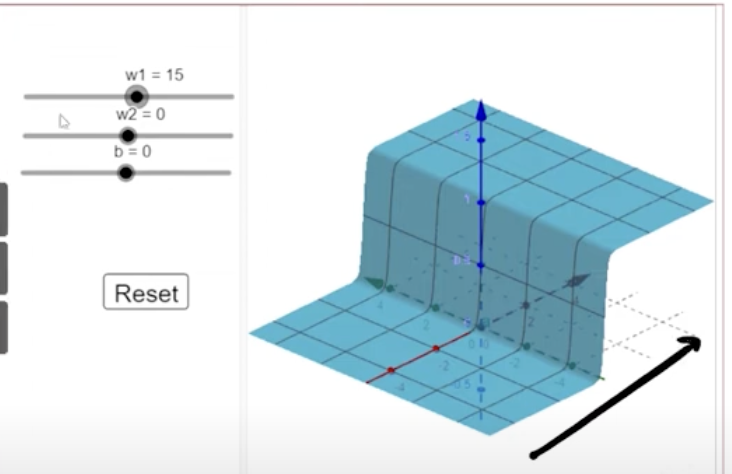

## 2.10 Representation power of Multilayer Network of Sigmoid Neurons: 2D functions

- what is we have more than one input?
- 
- let orange points be the place where we find oil and blue points be the place where we dont find oil.
- for all the blue points its predicting 0, and for all the orange points its predicting 1., see the below figure.
- 
- 
    - for this we want a 2d tower
- 
- w1 controls the slope in left to right direction
- 
- w2 controls the slope in up to down direction
- 
- b helps in movement along the direction
- if we increase both w1 and w2, something interesting happens, it rotates in clock or anti clock wise direction.
- 

- Now lets try to construct a tower in 3d
- 
- with h11 and h12
- 
- subtract both to get a tower function
- 
- 
    - we have played with w1 and w3, and kept w2 and w4 =0
    - we want a closed tower on all the sides
    - 
    - 
    - the walls are closed here
    - in the middle both are 1 so if we add them up , we will,get 2, an elevation will appear   
    - 
    - the structure sitting at the top is closed from all sides
    - we have 3 levels of output
        - 0,1,2 and we want to retain things which are greater than 1
        - so we pass in to a sigmoid neuron with threshold 1,
        - 
- finally we constructed a 2d tower with a network like this,
    - 
- 