- the early materials in this course is taken from an article called
    - `Deep Learning in Neural Networks:An Overview by Jürgen Schmidhuber`
    - [link](https://arxiv.org/pdf/1404.7828.pdf)

### Chapter 1: Bilogical Neurons
- reticular theory: the brain is a single continuous network of neurons (Golgi)
    - Golgi: neurons are individual cells
    - neuron doctrine: the brain is made up of individual neurons (Cajal)
    - reticular theory: also states that the brain is a single continuous network of neurons and that the neurons are not individual cells but are connected together in a network (Cajal)  

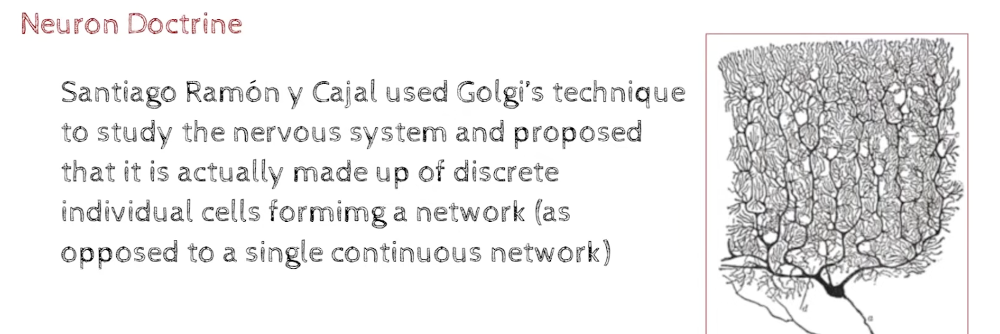
- this means first it was a single network, then it was individual cells, then it was a single network again

- two theories
    - one is that the brain is a single continuous network of neurons (reticular theory)
    - the other is that the brain is made up of individual neurons (neuron doctrine) - i.e there are many individual neurons and they are not connected together in a network (Golgi) 

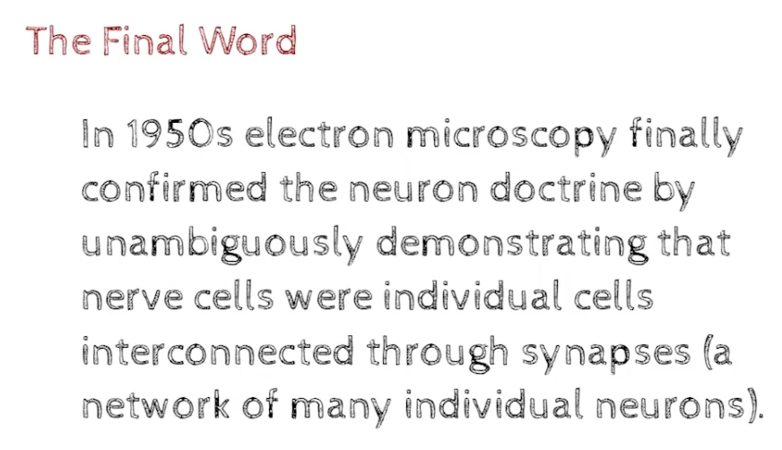
- The Great Brain debate: the brain is a single continuous network of neurons (reticular theory) vs the brain is made up of individual neurons (neuron doctrine) 
    - https://www.youtube.com/watch?v=pv6QHxkBFzY

    - one more thing , the processing in brain is ?
        - localized: each neuron is doing a specific task (certain portion for vision, certain portion for hearing)
        - distributed: each neuron is doing a little bit of everything(like a little bit of vision, a little bit of hearing, a little bit of touch, etc)

### Chapter 2: From Spring to Winter of AI (Artificial Neurons)
- 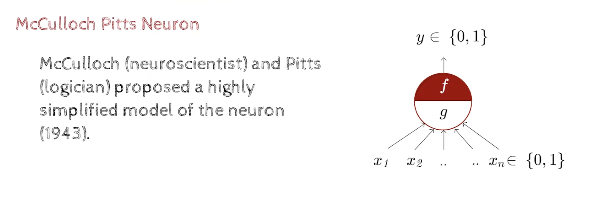
    - model of brain is that,there can be multiple inputs and an output, where the inputs are binary and the output is binary 
    - the output is 1 if the sum of the inputs is greater than a threshold, otherwise it is 0
        - is it raining today? yes or no
        - is there a traffic jam today? yes or no
        - is there a movie playing today? yes or no
        - if the sum of the inputs is greater than a threshold, then the output is 1, otherwise it is 0
- 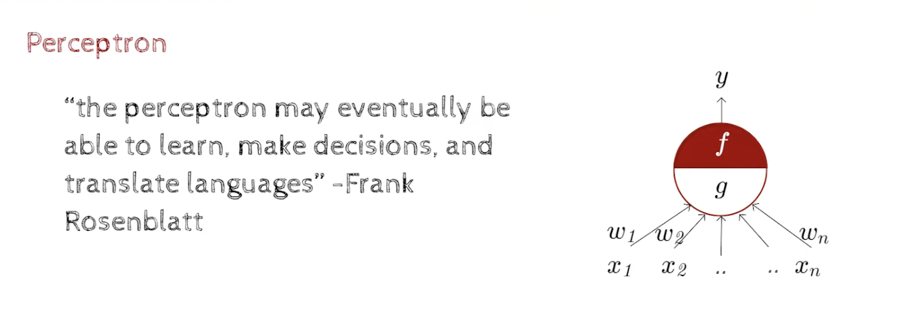
    - perceptron: a single neuron
        - each input is multiplied by a weight and then the sum of the weighted inputs is calculated
        - do i have money? yes or no
        - if no money, then no movie
        - so money has major weightage
        - if i have money, then i can go to the movie
    - why translate language is coming here?
        - Facebook is using this to translate languages
        - it has released a paper on this where 40000 pairs involving 2000 languages were used
        - the paper is called `Facebook FAIR's WMT19 News Translation Task Submission`
        - [link](https://arxiv.org/pdf/1907.06616.pdf)

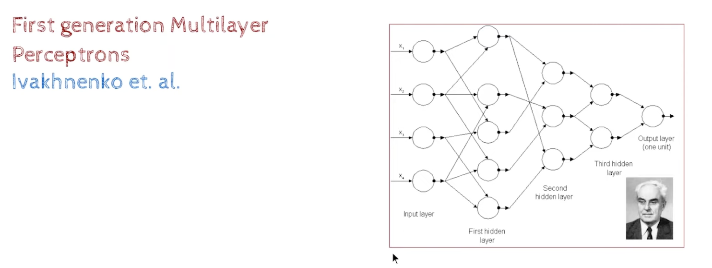 -1965-68
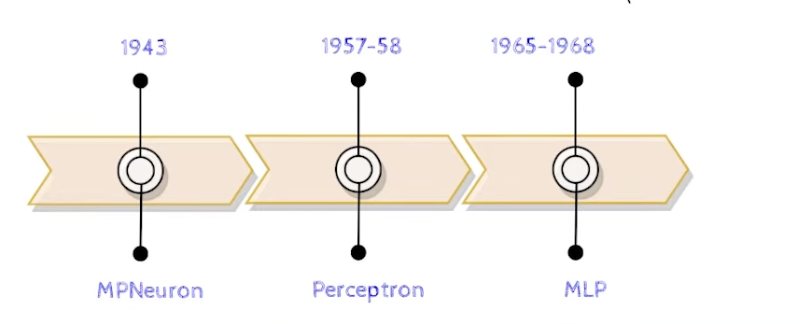
- MPNeuron - means McCulloch-Pitts Neuron
- MPNeuron is a single neuron- it has multiple inputs and a single output

- Perceptron is a single neuron- it has multiple inputs and a single output

- MPNeuron and Perceptron are the same thing - they are both single neurons with multiple inputs and a single output , only the name is different

- MLP is a multi-layer perceptron - it has multiple layers of neurons - it has multiple inputs and multiple outputs - it is a neural network

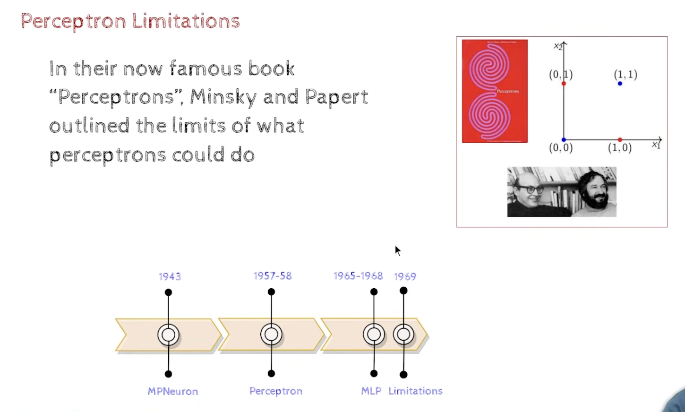
- 1969 a famous book was published called `Perceptrons` by Marvin Minsky and Seymour Papert
    - link: https://en.wikipedia.org/wiki/Perceptrons_(book)
    - PDF of the book: http://www.uta.edu/faculty/rcli/Book/Minsky%20Papert%20-%20Perceptrons.pdf
    - it showed that a single perceptron cannot learn the XOR function
    - XOR function: if the inputs are different, then the output is 1, otherwise it is 0

- 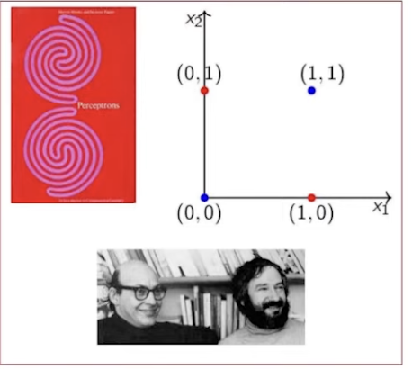
- simple function like AND, OR, NOT can be learned by a single perceptron
- but XOR cannot be learned by a single perceptron - it requires a multi-layer perceptron (MLP)
- MLP is a neural network with multiple layers of neurons
- MLP can learn the XOR function
- MLP can learn any function
- MLP can learn any function that is linearly separable
- MLP can learn any function that is not linearly separable - but it requires a lot of neurons and a lot of layers and a lot of training data and a lot of time to learn such a function that is not linearly separable - so it is not practical to learn such a function that is not linearly separable
- the XOR function is a binary function
- it is not linearly separable

- due to these , the perceptron was abandoned and the neural network research was abandoned and the AI winter started, which lasted for 15 years from 1969 to 1986 , during which there was no research in neural networks and AI and machine learning and deep learning and the field of AI was dead , Funding was stopped for AI research and AI was considered a failure and AI was considered a dead field 

- There are two types of AI:
    - Symbolic AI - Symbolic AI is based on logic and rules and symbols and symbols are manipulated to get the output
    - Connectionist AI - Connectionist AI is based on neural networks and neural networks are trained to get the output
- Today's AI is based on Connectionist AI - it is based on neural networks and neural networks are trained to get the output , and it is not based on Symbolic AI - it is not based on logic and rules and symbols and symbols are not manipulated to get the output

- Now we are trying to do a combination of Symbolic AI and Connectionist AI - we are trying to combine neural networks with logic and rules and symbols and symbols are manipulated to get the output - this is called Hybrid AI - it is a combination of Symbolic AI and Connectionist AI

- After 1986 , the AI winter ended and the AI spring started , and the neural network research started again and the perceptron was revived and the neural network research was rev ived and the AI research was 
- 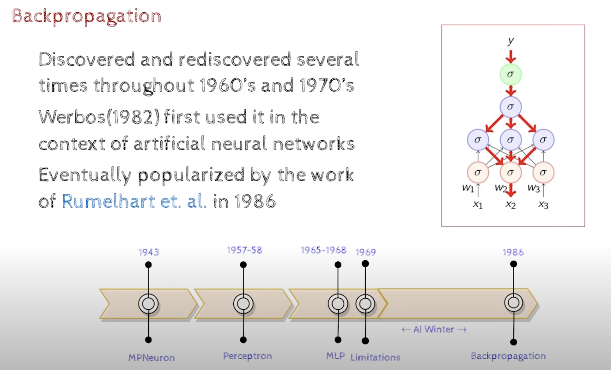
- 1986 Backpropagation was proposed  
- it was showed that the Backpropagation algorithm can be used to train a multi-layer perceptron (MLP) to learn the XOR function 

- Gradient Descent
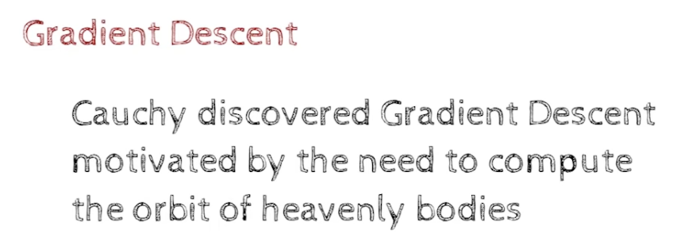

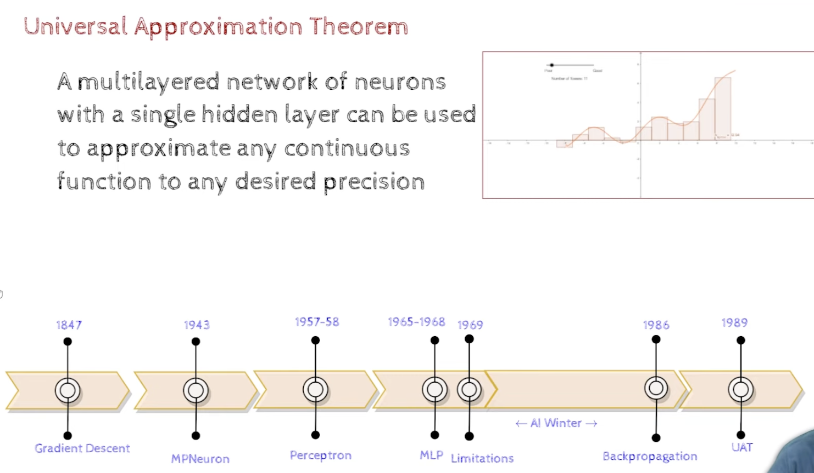
- Universal Approximation Theorem - it states that a multi-layer perceptron (MLP) can learn any function 
- MLP with a single hidden layer can be used to approximater any continuous function to any desired degree of accuracy

- UAT - said, you can come up with a multilayerd network of neurons,
     - if we have so, then we can take an x, given that we have many such examples, Now we can take an x and we can predict the y,which would be very close to the actual y

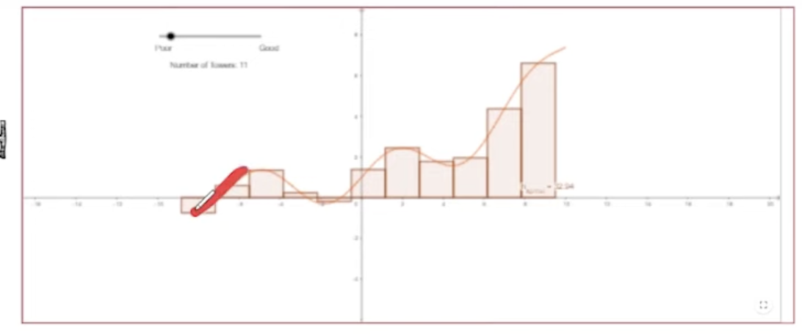

If orange curve is the actual function, which we dont know, but we have many examples of x and y, then we can take an x and we can predict the y,which would be very close to the actual y
    - it has been said that even with 1 hidden layer,with enough neurons, we can approximate any function
    - the rectangular bars are the outputs of the neurons , such that , the output will be closer to the actual,
    - the more the neurons, the more the accuracy, as you can see in the image, the more the neurons, the more the accuracy

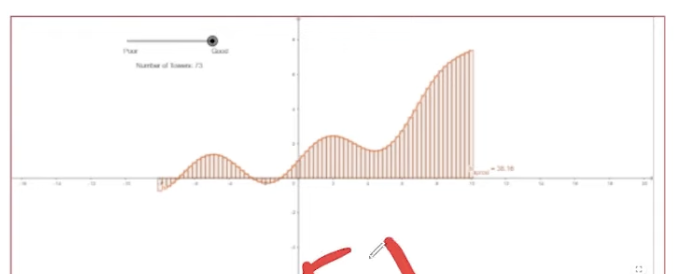

- this was a real breakthrough in neural networks and AI and machine learning and deep learning

- BackPropagation and MLP and UAT are the foundations of modern AI and machine learning and deep learning
    - BackPropagation is used to train a neural network
    - UAT states that a neural network can learn any function, there is value in training Deep NN

- People tried to apply these ideas, to real world problems and noticed that , training a MLNetwork using BackPropagation is very slow and it takes a lot of time to train a MLNetwork using BackPropagation
- its also not very stable, and it often gets stuck in a local minima and it does not reach the global minima
- while in theory it is possible to train a MLNetwork using BackPropagation, in practice it is very difficult to train a MLNetwork using BackPropagation
- so people started looking for other algorithms to train a MLNetwork
- people started looking for other algorithms to train a MLNetwork that are faster and more stable and that can reach the global minima
- 1989-2010 - people tried to train a MLNetwork using other algorithms