### The Deep revival- From Cats to ConvNet
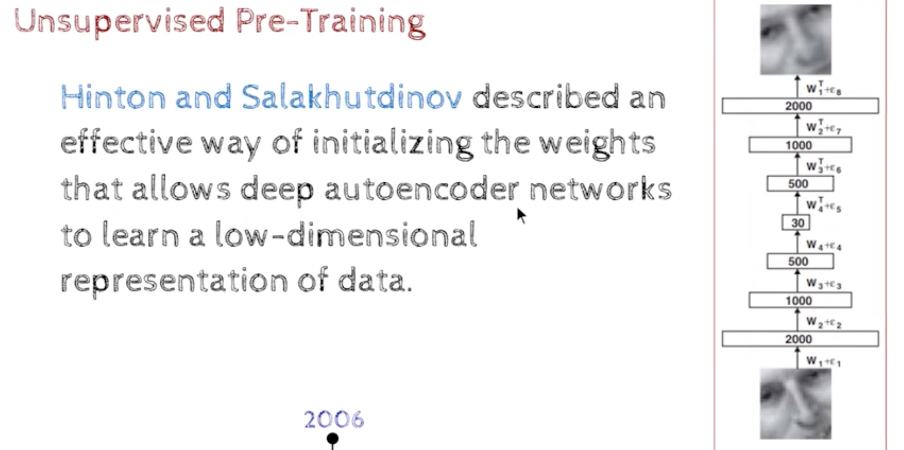 
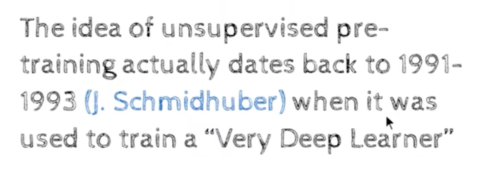
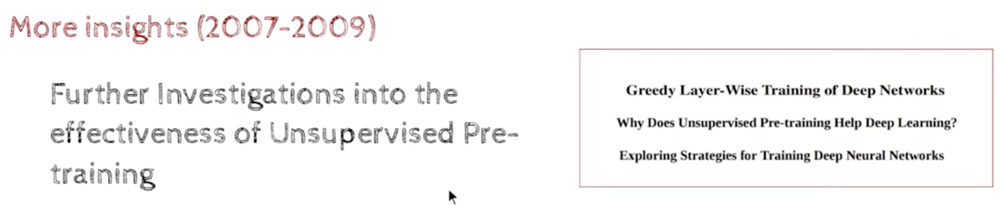
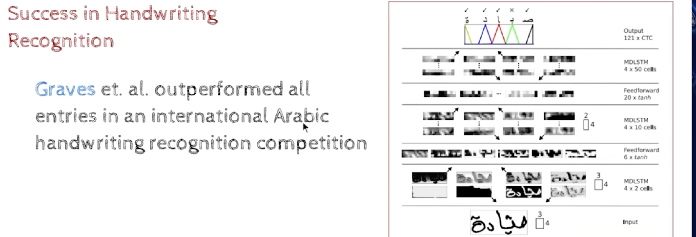
- MDLSTM - means Multiplicative LSTM
    - LSTM - means Long Short Term Memory
        - LSTM is a type of RNN - Recurrent Neural Network
        - RNN is a type of neural network 
        - RNN is a type of deep learning model 
- Feedforward Neural Network - means Multi-layer Perceptron
    - MLP - means Multi-layer Perceptron
    - MLP is a type of neural network 
    - MLP is a type of deep learning model

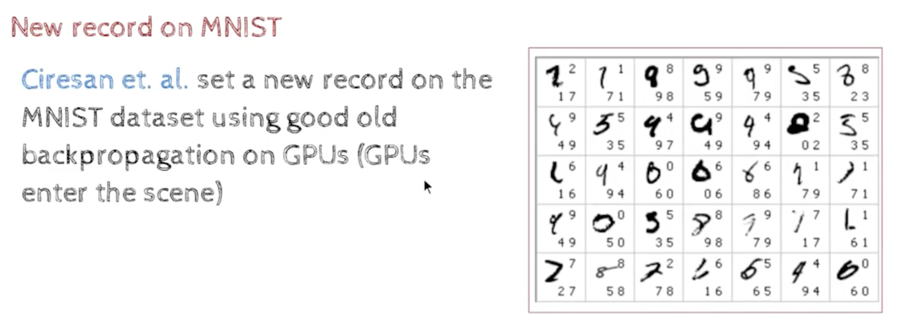
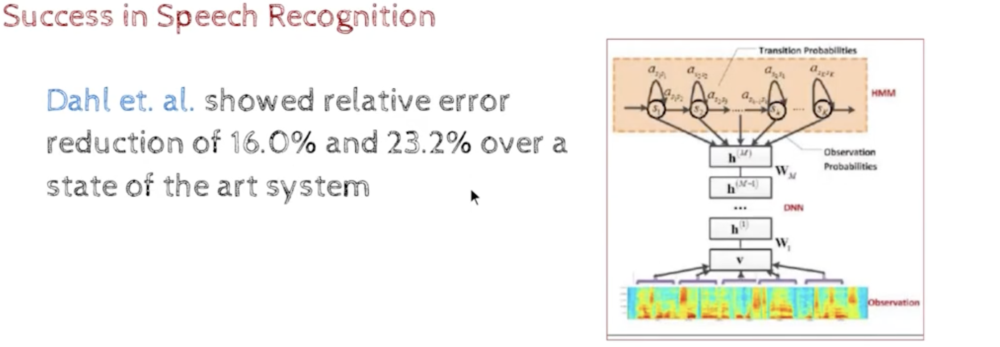
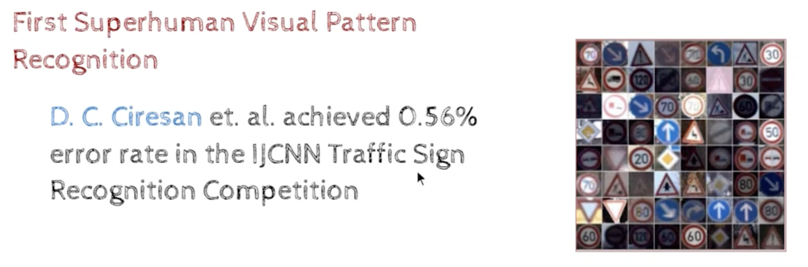
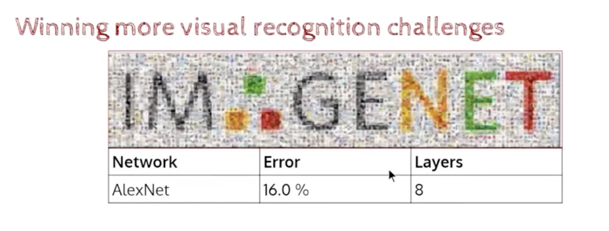
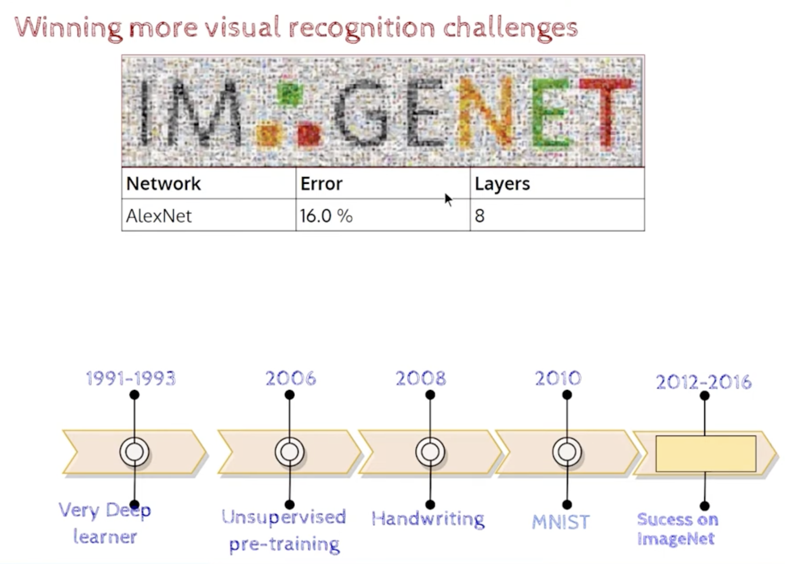

- IMAGENET - 
    - is a dataset of images , it has 14 million images , it is a very large dataset
    - it is used for image classification , image recognition , object detection , etc
    - it has 1000 classes of images , each class has 1000 images , so 1000 x 1000 = 1 million images
    - it is used for training deep learning models
    - the classes are like
        - cat
        - dog
        - car
        - truck
        - etc 

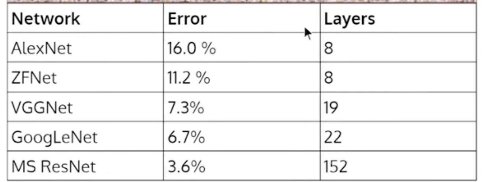
- MS ResNet - means Microsoft ResNet
    - ResNet - means Residual Network
    - it was better than VGGNet, AlexNet, etc and it won the ImageNet competition in 2015
    - it outperformed humans in image classification

### Chapter 4 - From Cats to Convolutional Neural Networks

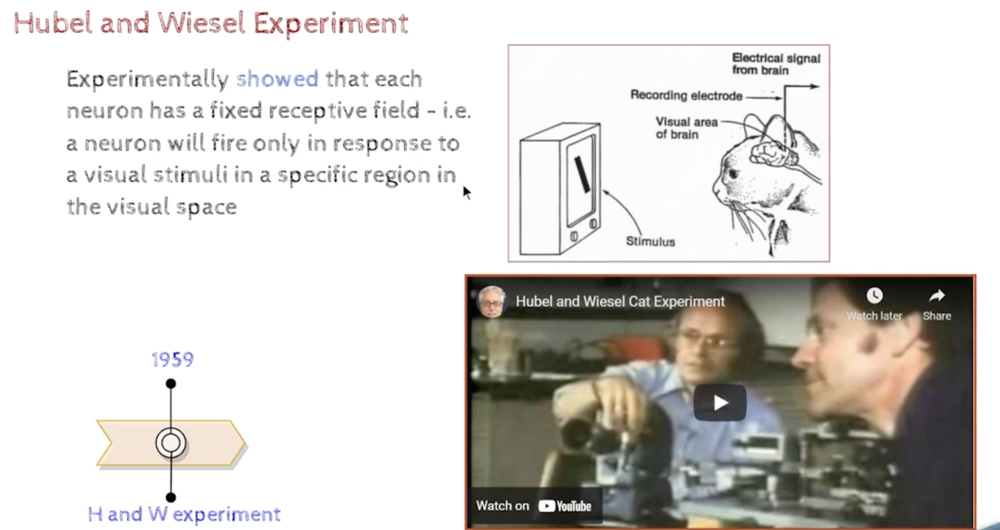
- https://www.youtube.com/watch?v=IOHayh06LJ4

- Hubel and Wiesel Experiment
    - they were neuroscientists
    - they were studying the visual cortex of cats
    - they were trying to understand how the visual cortex of cats works
    - they found that the visual cortex of cats has neurons that respond to edges of different orientations (horizontal, vertical, diagonal, etc)
    - for example, there are neurons that respond to horizontal edges, there are neurons that respond to vertical edges, etc

- NeoCognition
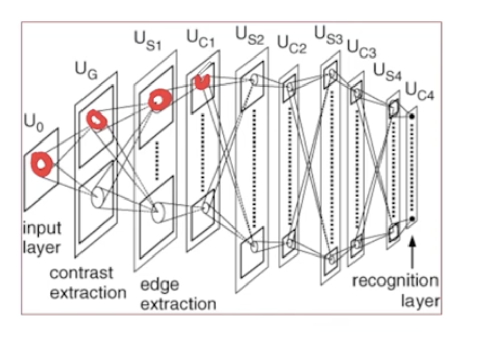
    - it says different parts of the image are processed by different parts of the network

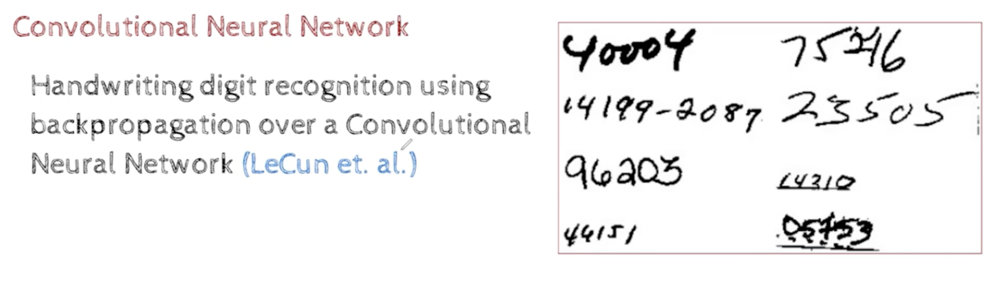
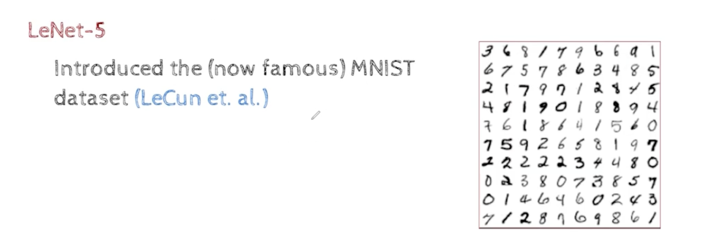