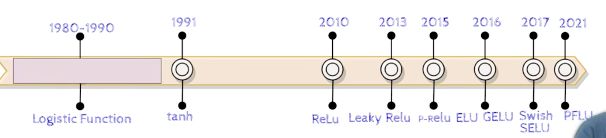
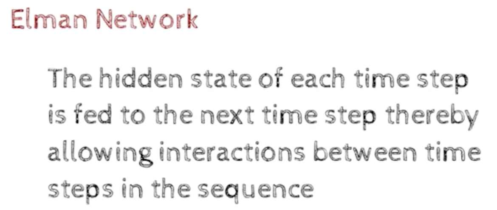

### Faster Higher and Stronger

- optimization Algorithms
    - Adagrad - Adaptive Gradient Descent
        - it is a type of Gradient Descent, where the learning rate is adaptive - it is not fixed 
    - RMSProp - Root Mean Square Propagation 
        
    - Adam - Adam is a combination of Adagrad and RMSProp
        - it is a type of Gradient Descent, where the learning rate is adaptive - it is not fixed 
        - it is a combination of Adagrad and RMSProp
    - NAdam - NAdam is a combination of Adam and Nesterov Momentum
        - it is a type of Gradient Descent, where the learning rate is adaptive - it is not fixed 
        - it is a combination of Adam and Nesterov Momentum
    - AdamW - AdamW is a combination of Adam and Weight Decay
        - it is a type of Gradient Descent, where the learning rate is adaptive - it is not fixed 
        - it is a combination of Adam and Weight Decay
    - RAdam - Rectified Adam
        - it is a type of Gradient Descent, where the learning rate is adaptive - it is not fixed 
        - it is a combination of Adam and Weight Decay
    - AdaBound - Adaptive Bound
        - it is a type of Gradient Descent, where the learning rate is adaptive - it is not fixed 
        - it is a combination of Adam and Weight Decay

- The above are better optimization algorithms 
- Now we will see better activation functions

- They are
    - ReLU - Rectified Linear Unit
    - Logistic Sigmoid - Logistic Sigmoid
    - Tanh - Hyperbolic Tangent
    - Leaky ReLU - Leaky Rectified Linear Unit
    - ELU - Exponential Linear Unit
    - GELU - Gaussian Error Linear Unit
    - SELU - Scaled Exponential Linear Unit
    - Swish - Swish
    - PFReLU - Parametric Flexible Rectified Linear Unit

- Better Regularization was also developed
    - Dropout
    - Batch Normalization
    - Weight Decay
    - Early Stopping
    - Data Augmentation
    - Mixup
    - Cutout
    - CutMix
    - MixMatch
    - MixNet

### Chapter - 6 : The curious case of Sequences

- 

- Jordan Network 
    - this is a type of Recurrent Neural Network (RNN)
    - it allowed the output of the previous time step to be fed as input to the current time step

- Drawbacks of RNN
    - 
    - Exploding Gradient
        - the gradients become very large and the weights become very large
    - Vanishing Gradient
        - the gradients become very small and the weights become very small

### Chapter - 7 : Beating humans at their own game(literally)

RL - Reinforcement Learning
    - 
    - Google DeepMind's Deep Q-learning playing Atari
    - https://www.youtube.com/watch?v=V1eYniJ0Rnk
    - PAcman and pingpong are also played by DeepMind's Deep Q-learning

- DNQs Alpha-Go 

- https://www.youtube.com/watch?v=kopoLzvh5jY&pp=ygUQaGlkZSBhbmQgc2VlayBhaQ%3D%3D

