### Chapter- 8 :Madness and the rise of transformers
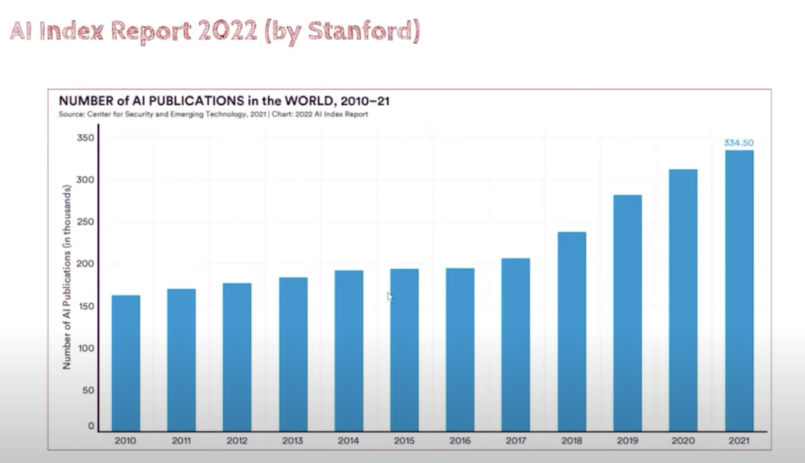
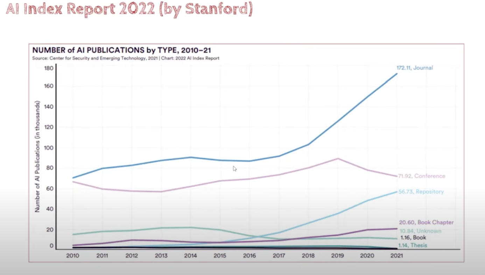
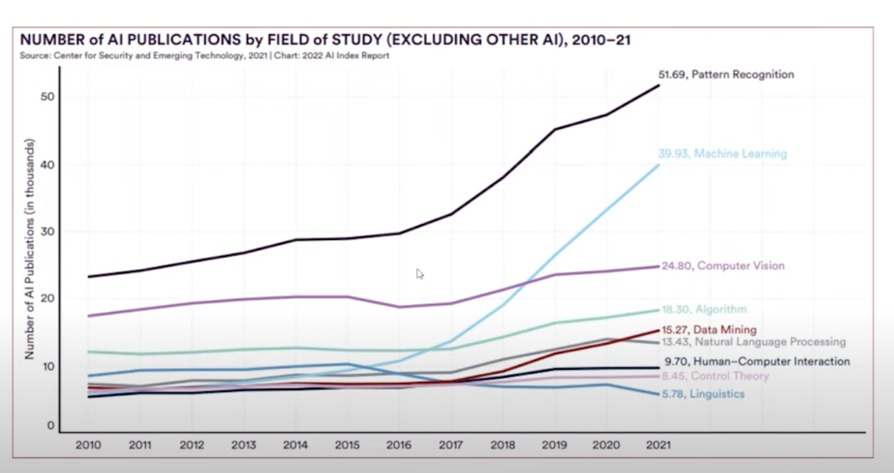
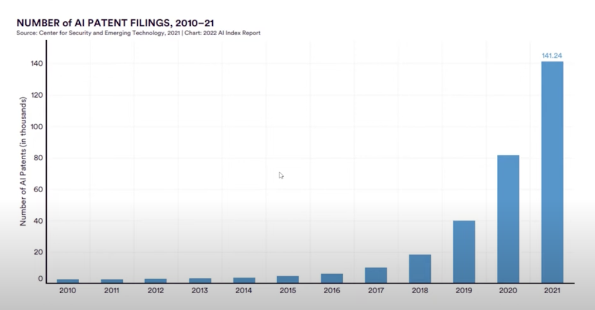

### Chapter 9 :  The rise of Transformers

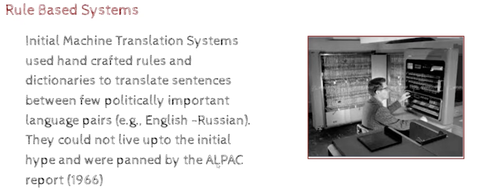
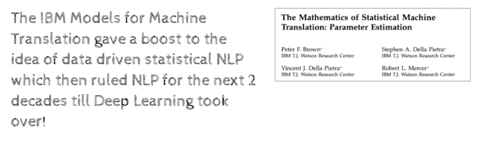
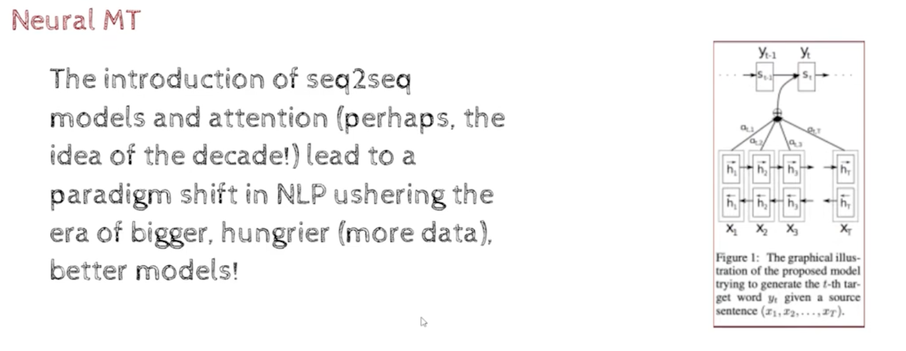
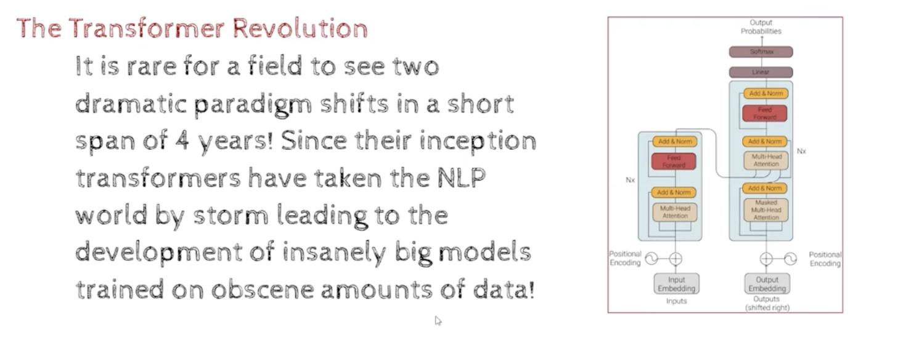
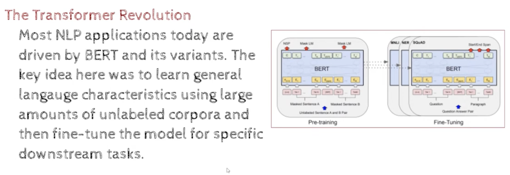
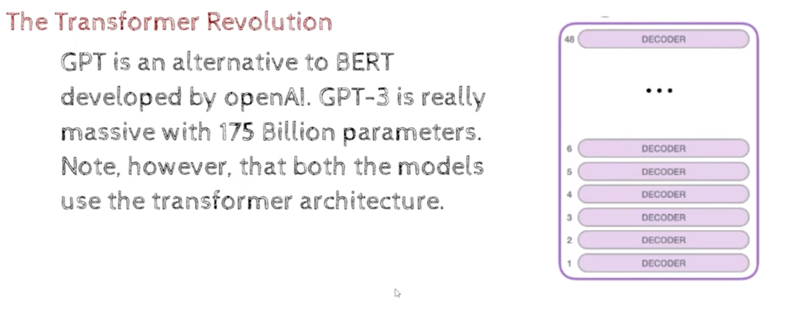
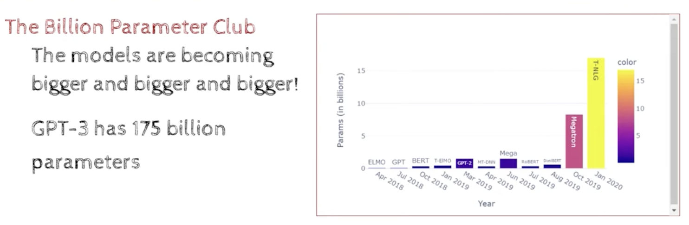
- TNLG - means T5 Neural Language Generation 
- T5 - means Text-to-Text Transfer Transformer
- Megatron - means Megatron-LM 

### Trillion Parameter club
- Synapses-> equivalent to weights in neural network
- 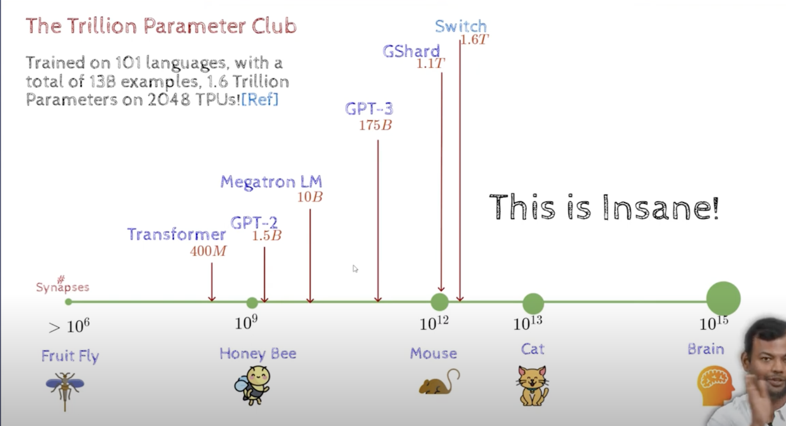
   - Gshard - means Google Shard for training large models and translation
   - Switch Transformer - means Switch Transformer: Scaling to Trillion Parameter Models
   - 2048 TPUs - means 2048 Tensor Processing Units

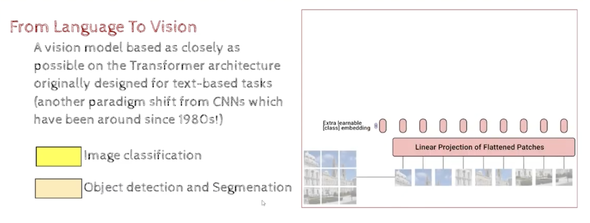
- https://youtu.be/m2tyQC2qTDQ?t=911, see the animation in slide    
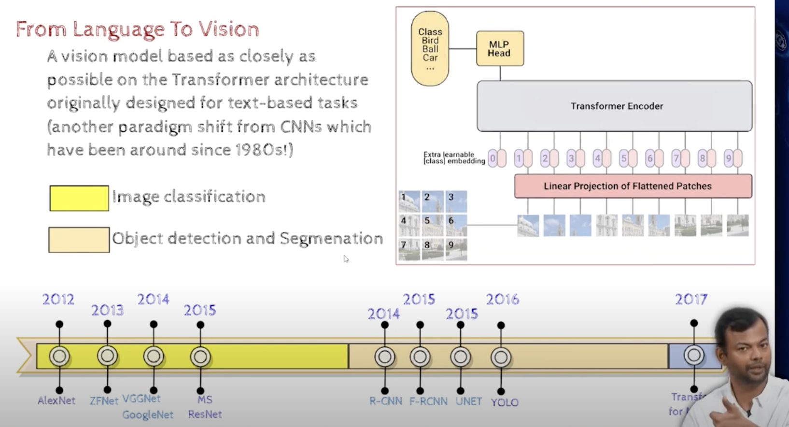
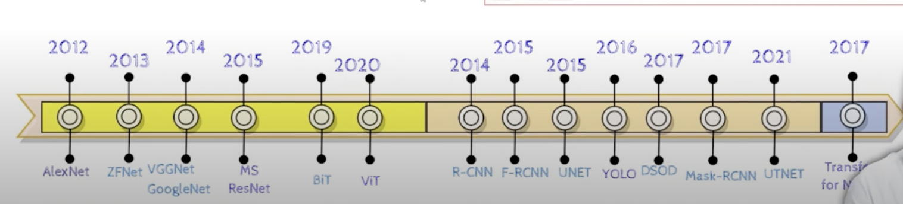

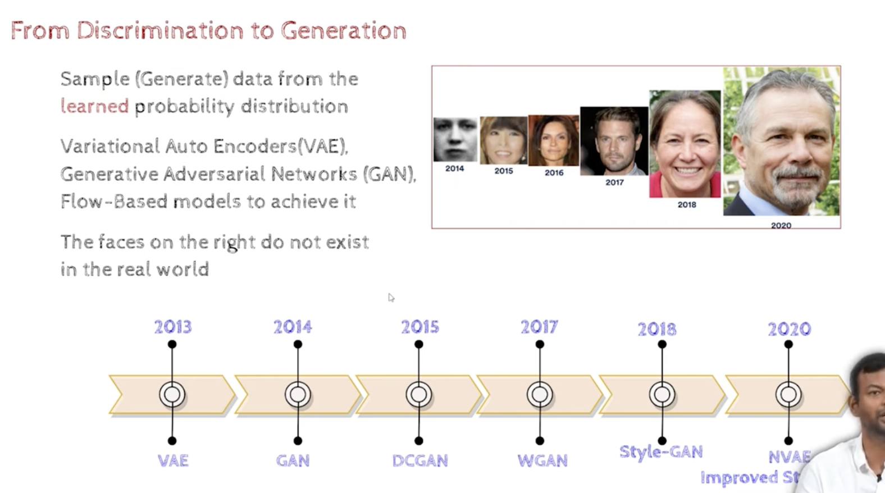
- Discrimination means classification and regression
- Generation means translation, summarization, etc,     
    - we are generating images that do not exist in the real world

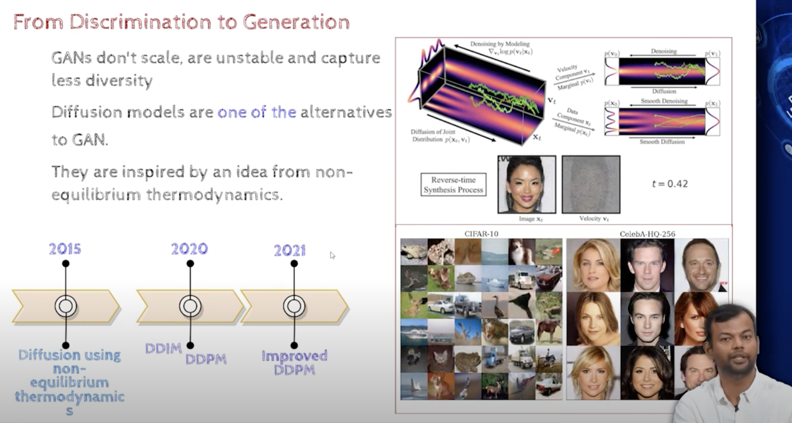
- GAN - Generative Adversarial Network 
- diffusion based models

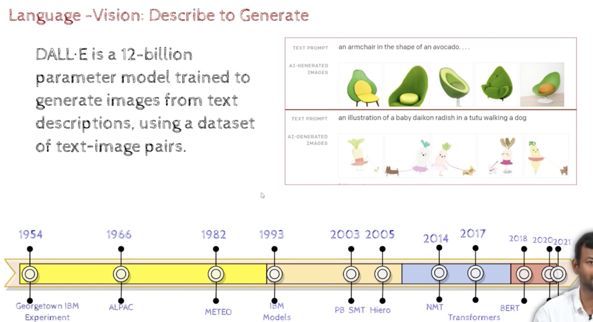
DALL-E was trained on a dataset of text-image pairs.and it can generate images from text descriptions.,
it is a transformer based model and not a diffusion based model

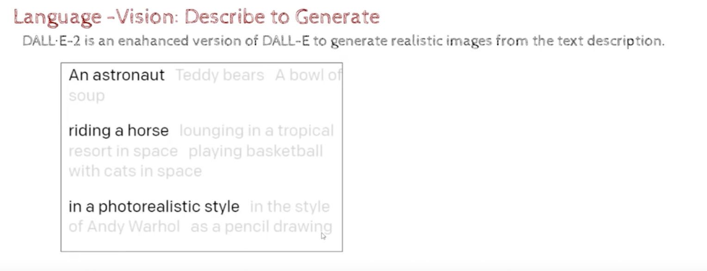
- Dall-E2 is a successor to Dall-E and it is a diffusion based model