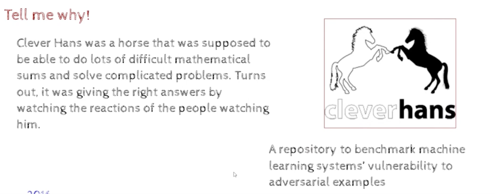

### Call for sanity in AI - Efficient Deep learning
(Interpretable,Fair,Responsible,Robust,Secure,Private,Green,etc)

- The paradox of DeepLearning
    - why does deep learning work so well despite 
        - high capacity(susceptible to overfitting) 
        -  high complexity(hard to train)
        - numerical instability (vanishing/exploding gradients)
            - Gans are often unstable and hard to train
        - sharp minima (susceptible to adversarial attacks) leading to overfitting
            - loss function in DNN is non-convex, there are many local minima, and the local minima are sharp, so the DNN is susceptible to adversarial attacks
            - adversarial attacks are a type of attack on a DNN, where the attacker can change the input to the DNN, such that the DNN will misclassify the input
        - high computational cost (hard to deploy)
        - non-robustness()
            
            - here with stickers the machine is reading it as speed limit 45

- we still dont know why deep learning works so well despite these problems

- no clear answers yet but ...
    - Slowly but steadily there is an increasing emphasis on explainability, and theoritical justification of deep learning

https://www.youtube.com/watch?v=hAJlAuEo7Ac

- interpretable machine learning, a guide for making black box models explainable
    - https://christophm.github.io/interpretable-ml-book/

- success is mostly about male and failure is mostly about female
    - due to Bias in the data

- predicting the 3d structure of protein

https://www.youtube.com/watch?v=KWHXchlJzSw&pp=ygUmZGlzY292ZXJpbmcgc3RhdGUgdmFyaWFibGVzIGhpZGRlbiBpbiA%3D

### Chapter 12 : Efficient Deep Learning

https://github.com/ChristosChristofidis/awesome-deep-learning

Other areas:
    - Text to speech
    - Voice conversion
    - speech recognition