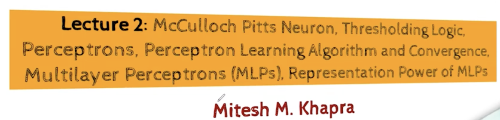
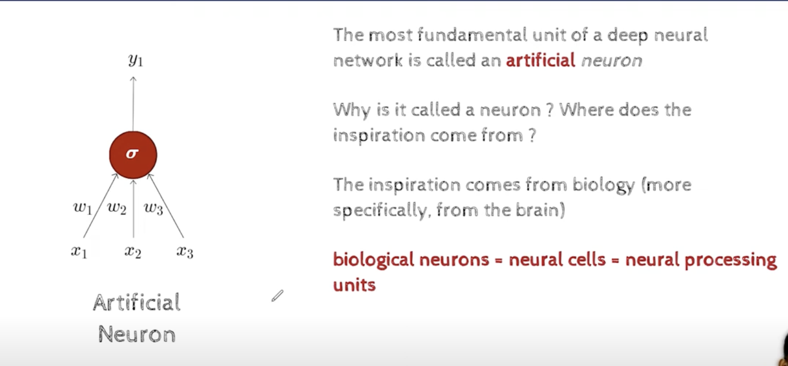
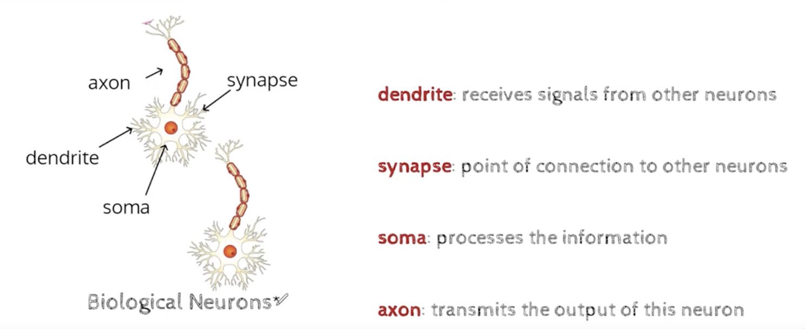
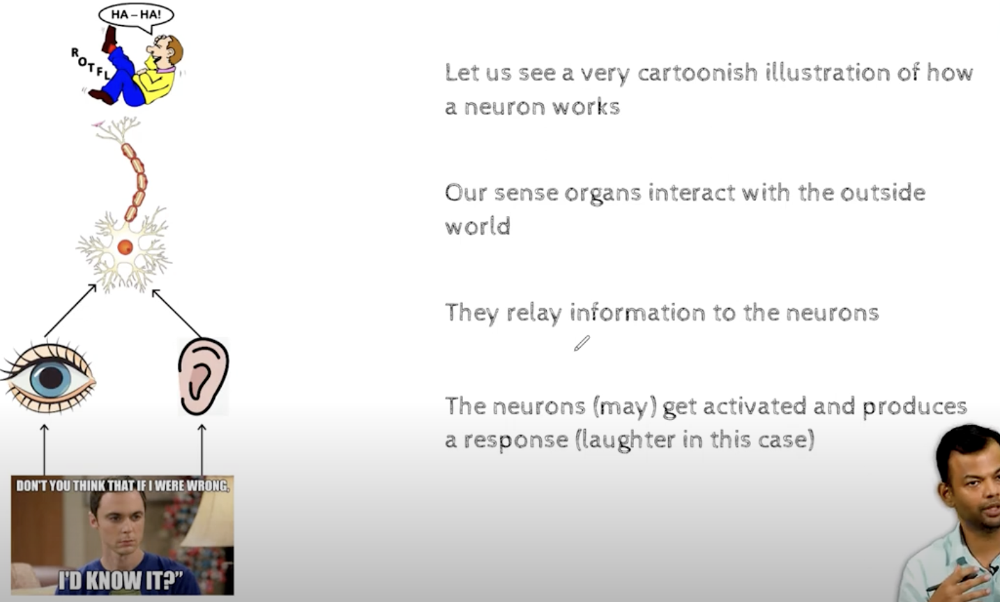
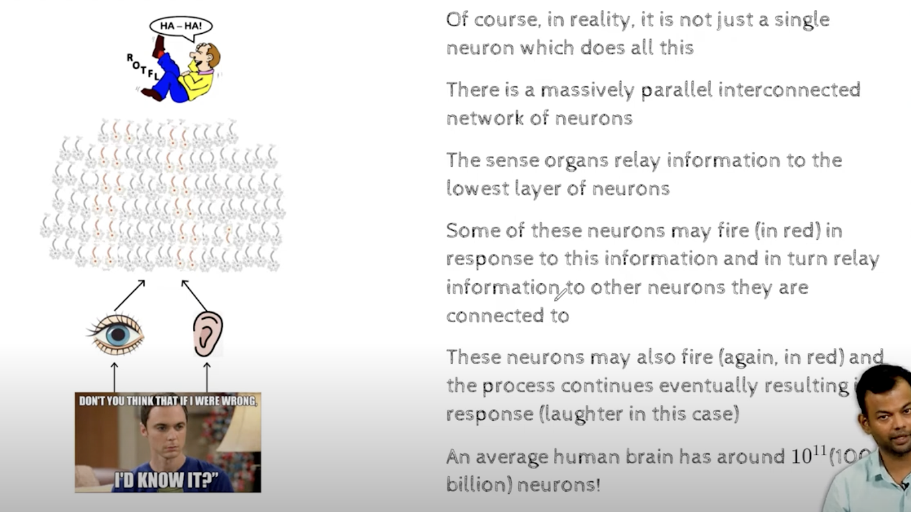
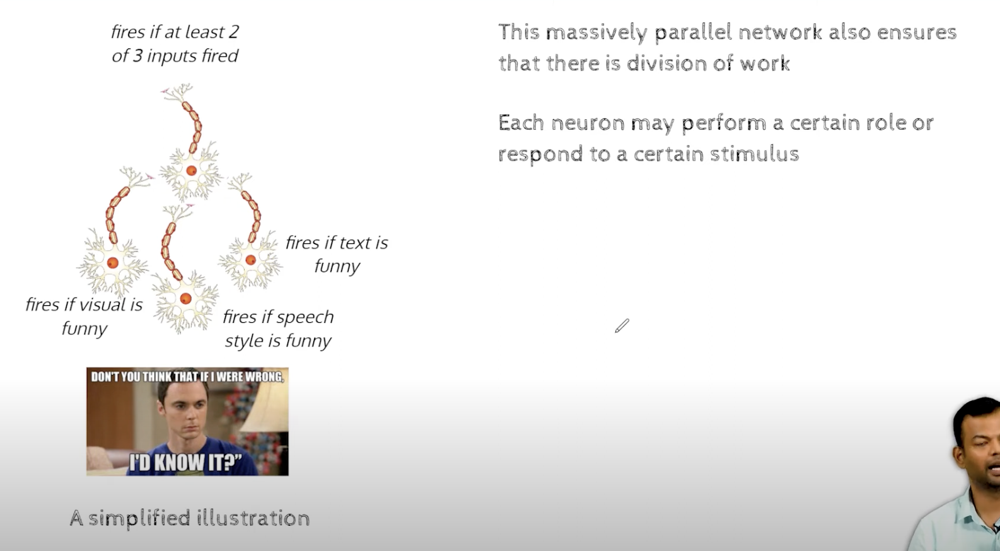
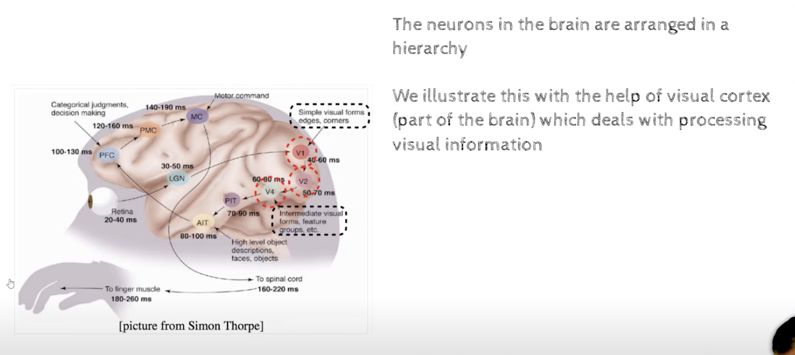
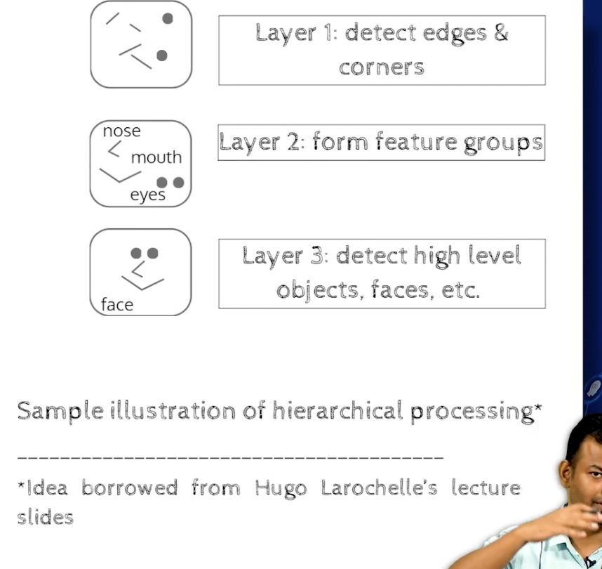

### Lect 1.6 Motivation from Biological Neuron

- McCulloch Pitts Neuron , it is a simple model of a biological neuron , it is a binary classifier , it takes in binary inputs and gives out binary outputs , it is a linear classifier , i can draw a line to separate the two classes 
    - it is a linear classifier , it can only separate linearly separable data , it cannot separate non linearly separable data
- Thresholding Logic , , in this case the threshold is 0.5 , if the input is greater than 0.5 then the output is 1 , if the input is less than 0.5 then the output is 0
- The perceptron is a linear classifier , it can only separate linearly separable data , it cannot separate non linearly separable data
- Perceptron Learning Algorithm and Convergence , the perceptron learning algorithm is a simple algorithm to train the perceptron , it is guaranteed to converge if the data is linearly separable , if the data is not linearly separable then the algorithm will not converge
- Multi Layer Perceptron , it is a neural network with multiple layers of perceptrons , it is a universal function approximator , it can approximate any function , it can approximate any function to any degree of accuracy , it can approximate any function to any degree of accuracy if it has enough layers and neurons
- Backpropagation , it is an algorithm to train a neural network , it is a generalization of the perceptron learning algorithm , it is guaranteed to converge if the data is linearly separable , if the data is not linearly separable then the algorithm will not converge
- Representation Power of MLP's , it is a universal function approximator , it can approximate any function , it can approximate any function to any degree of accuracy , it can approximate any function to any degree of accuracy if it has enough layers and neurons

### Module 2.1 Biological Neurons

     

- LGN is the lateral geniculate nucleus , it is a part of the thalamus , it is a part of the brain , it is a part of the visual system , it is a part of the visual system in the brain
- AIT is the anterior inferotemporal cortex , it is a part of the brain , it is a part of the visual system , it is a part of the visual system in the brain
- V1 is the primary visual cortex , it is a part of the brain , it is a part of the visual system , it is a part of the visual system in the brain
- V2 is the secondary visual cortex , it is a part of the brain , it is a part of the visual system , it is a part of the visual system in the brain
- V4 is the tertiary visual cortex , it is a part of the brain , it is a part of the visual system , it is a part of the visual system in the brain
- PIT is the posterior inferotemporal cortex , it is a part of the brain , it is a part of the visual system , it is a part of the visual system in the brain
- MC is the motor cortex , it is a part of the brain , it is a part of the motor system , it is a part of the motor system in the brain
- PMC is the premotor cortex , it is a part of the brain , it is a part of the motor system , it is a part of the motor system in the brain
- PFC is the prefrontal cortex , it is a part of the brain , it is a part of the motor system , it is a part of the motor system in the brain
