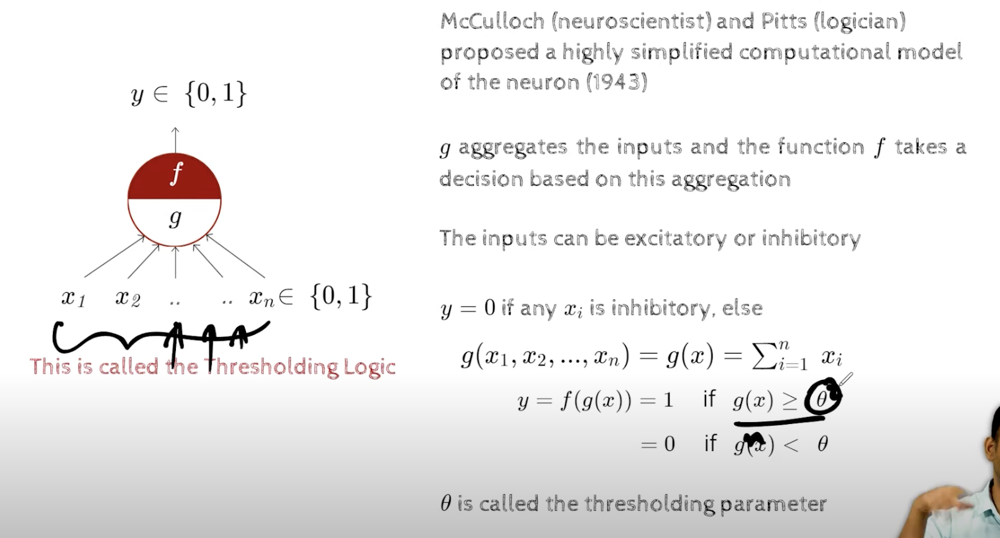
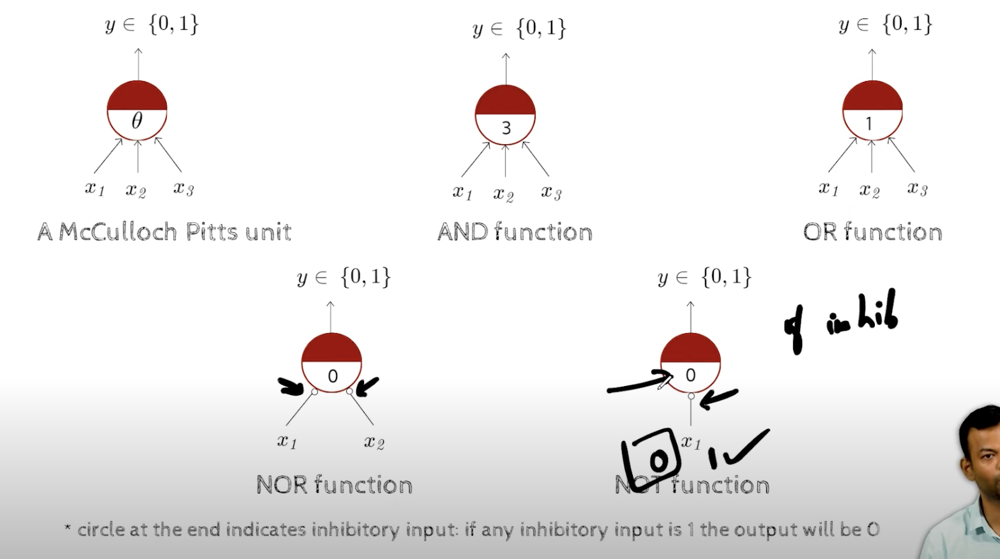
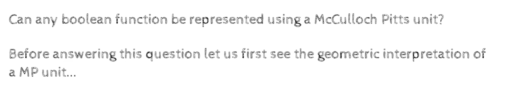
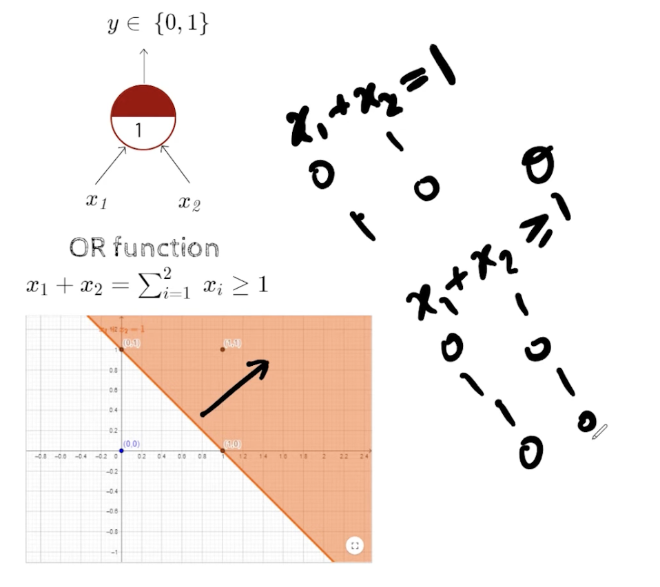
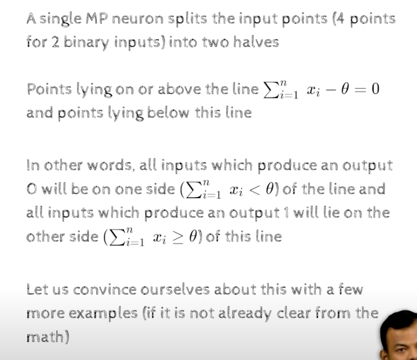
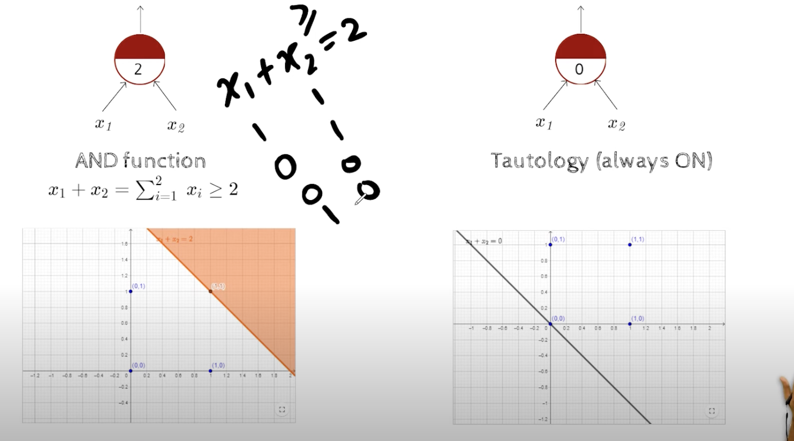
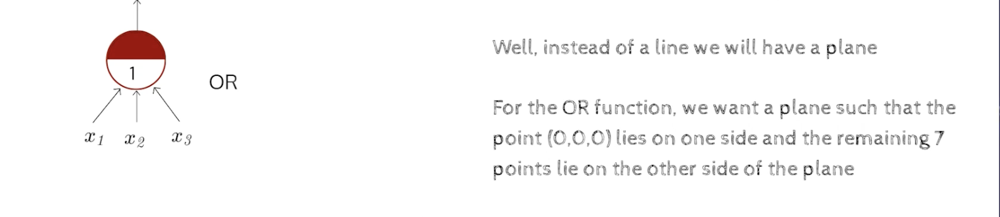
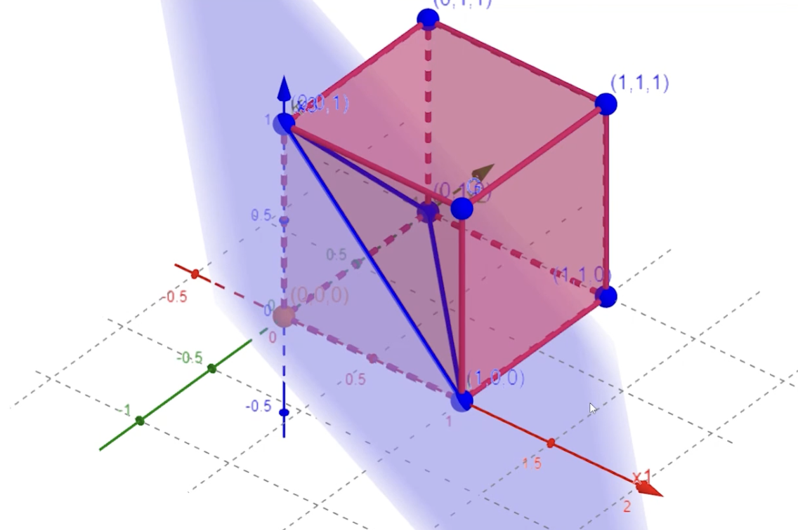
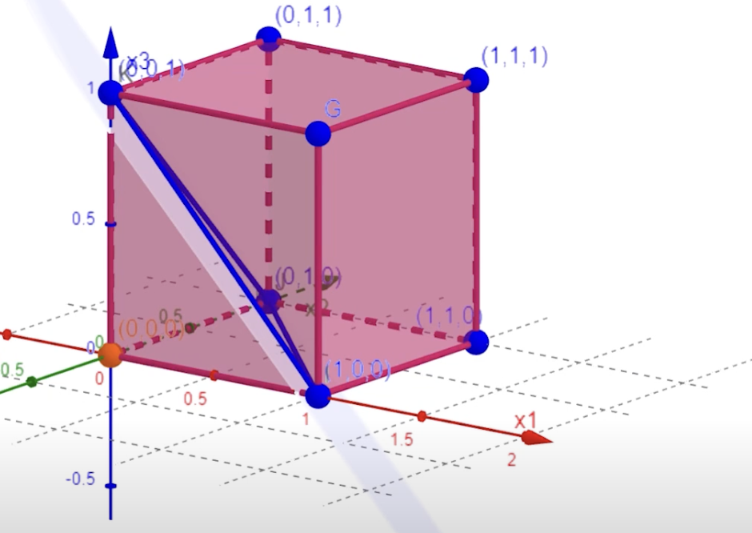
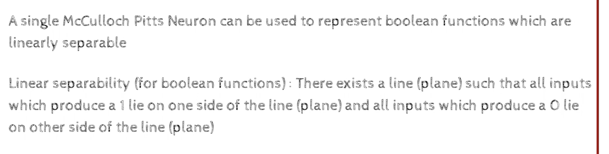

### Module 2.2 McCulloch Pitts Neuron

- the text inputs can be exitatory or inhibitory , the exitatory inputs are positive and the inhibitory inputs are negative , the exitatory inputs are excitatory and the inhibitory inputs are inhibitory
- if inhibitory input is 1, then the output is always 0 no matter what the other inputs are
- its like a party spoiler , if one person is not having fun then the whole party is not fun
- if i have fever, then i am cannot go to work, even though i have a lot of work to do,or there is party at work, or any good thing is happening at work, i cannot go to work

- theta here is the threshold , if the sum of the inputs is greater than the threshold then the output is 1 , if the sum of the inputs is less than the threshold then the output is 0, 
    - atleast two out of there is favourable, then yes

- Thresholding Logic, where we aggregate the inputs, then we have a theta and based on the theta, we decide the outputs

- why Boolean functions, because the model itself take binary inputs and gives binary outputs, so it is a binary classifier, it can only classify two classes, it cannot classify more than two classes

- NOR - not or
- NAND - not and

- there is one point below the plain and all the other points are above the plain, so it is linearly separable

