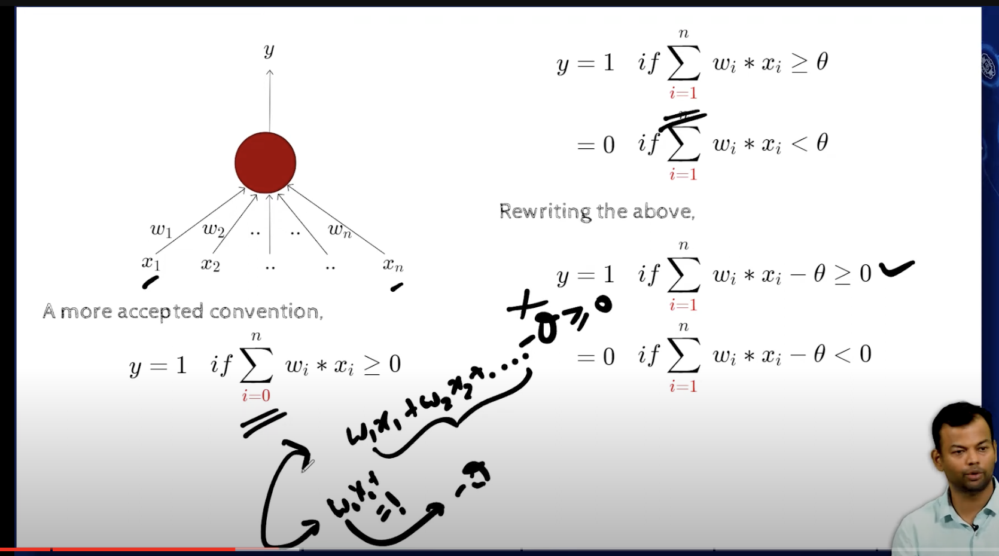

### Lect 1.8 Perceptrons

- difference between perceptron and McCulloch Pitts Neuron is that
    -  perceptron can take real valued inputs and give real valued outputs, but McCulloch Pitts Neuron can only take binary inputs and give binary outputs
    - intro to numerical weights and bias, and a mechanism  for learning the weights and bias
    - algorithms for learning the weights and bias

- in the bottom left we can see that , theta is gone, and we have a bias term, and the bias term is negative theta
- w0x0 replaces the theta, and w0 is the bias term, x0 is always 1, so w0x0 is always w0
- w0 = -theta

- the bias theta is the entity that tells about the person, 
    - for eg, if you are a niche person, then you will have a high theta, and if you are a generalist, then you will have a low theta
    - in this case if you are a niche person, your bias will be -3, and only when the three inputs are on, you will go to the movie, and if you are a generalist, then your bias will be -1, and only when two inputs are on, you will go to the movie   
    - theta is also called prior or the bias    
- but if you are a movie buff, then you will go to the movie even if only one of the inputs is on, so you will have a bias of 1, and you will go to the movie even if only one of the inputs is on or even if none of the inputs are on you will go to the movie and in this case bias is 0

- so even in perceptron we are learning a line, in some points that lie in the positive  region, the line will be closer to the point, and in some points that lie in the negative region, the line will be closer to the point

    - error is 2 as two points are misclassified
    - w0 is the y intercept
    