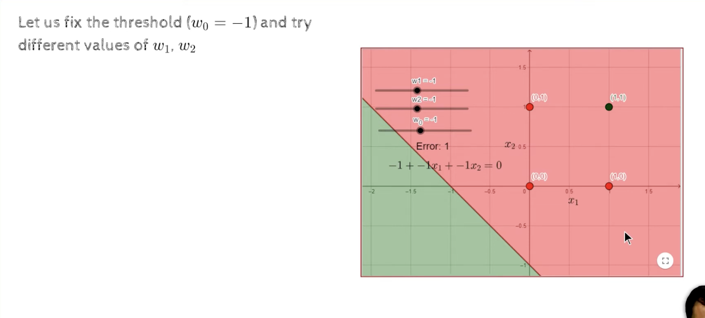
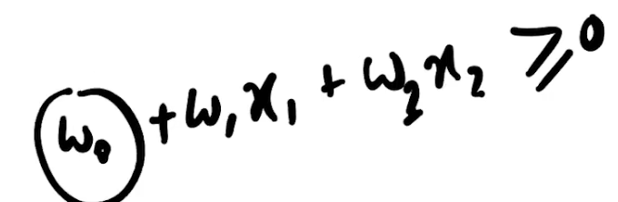
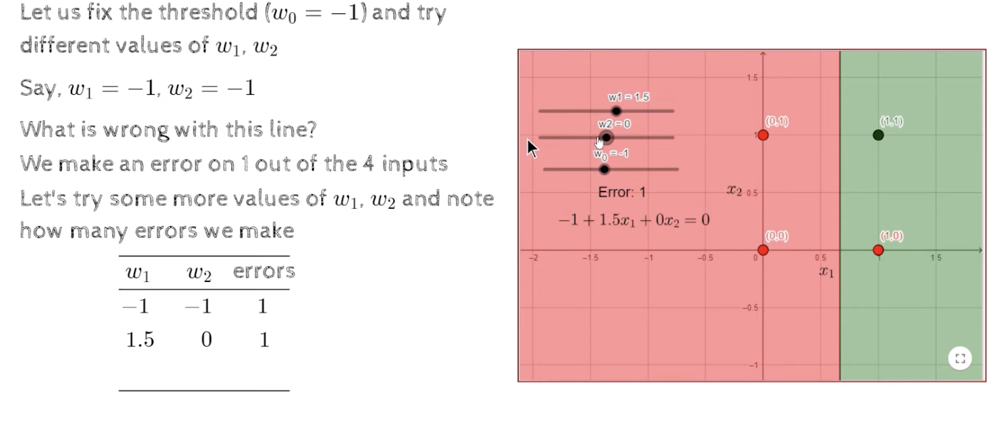
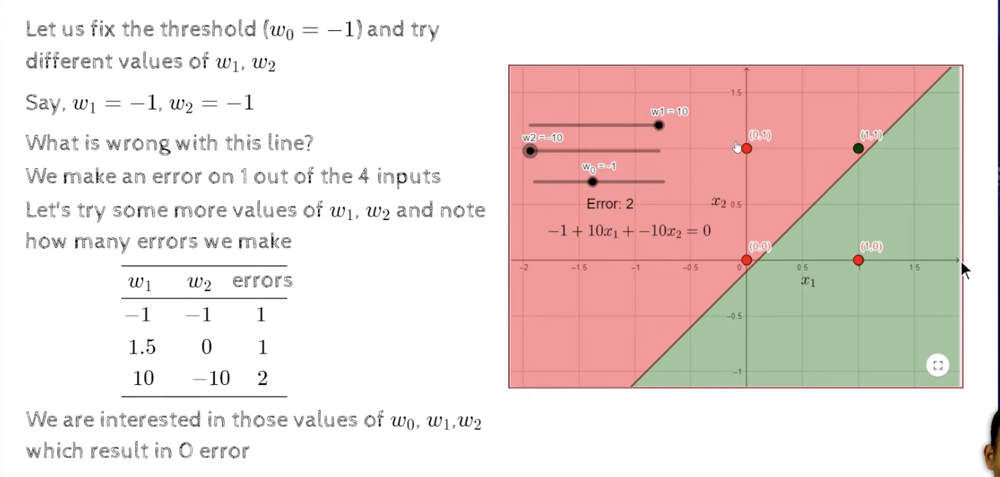
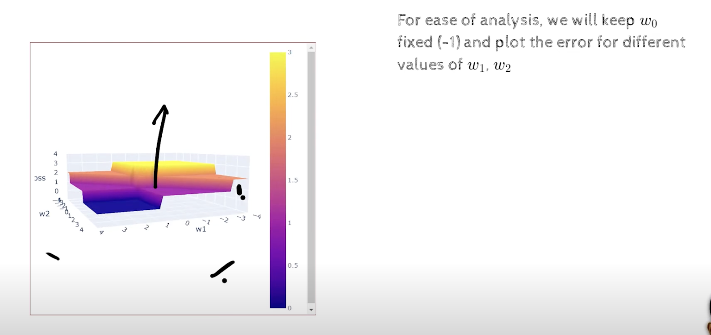
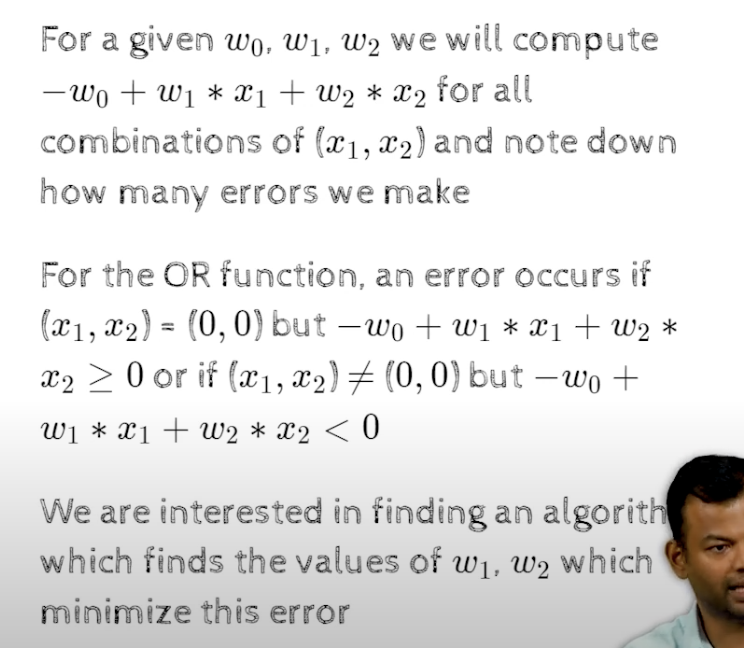

### module 2.4 Error and error surfaces

- error is the difference between the actual output and the desired output
- error surface or loss surface is the plot of the error as a function of the weights

- AND function

- since w0=-1 , the y intercept is -1
- the  line in picture is wrong 

- w1=1.5 and w2=0 , still we have error

- w1=10 and w2=-10 , still we have error of 2

- the error function can take integer values , 0,1,2,3, thats why we have step function
    - 0 error -> dark blue
    - 1 error -> purple
    - 2 error -> orange
    - 3 error -> yellow

- we want to algo , such that if i have n inputs , allows me to find one such w1 and w2, such that if my input is linearly separable, then for that value of w1 and w2 , my positive will be on correct side, , that is called the perceptron learning algorithm
- if the data is linearly separable, then the perceptron learning algorithm will find a solution in finite time , if the data is not linearly separable, then the perceptron learning algorithm will not find a solution in finite time