### module 2.5 Perceptron Learning Algorithm

- the perceptron learning algorithm is a simple algorithm to train the perceptron , it is guaranteed to converge if the data is linearly separable , if the data is not linearly separable then the algorithm will not converge

- we saw perceptron, we saw that the decision boundary of perceptron is linear, 

- we introduced the concept of error , where if weights are not proper, then we have error, in diving the points into two classes

- we didnt talk about how we got this w1 and w2, we just adjusted them by hand,
- Now we will look at this perceptron learning algo which will help us to find the w1 and w2
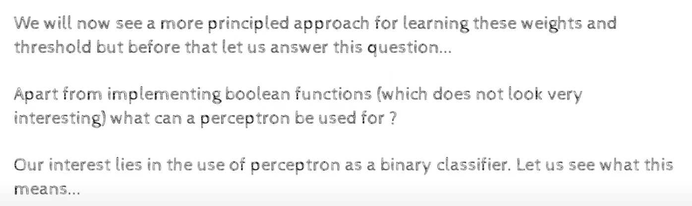
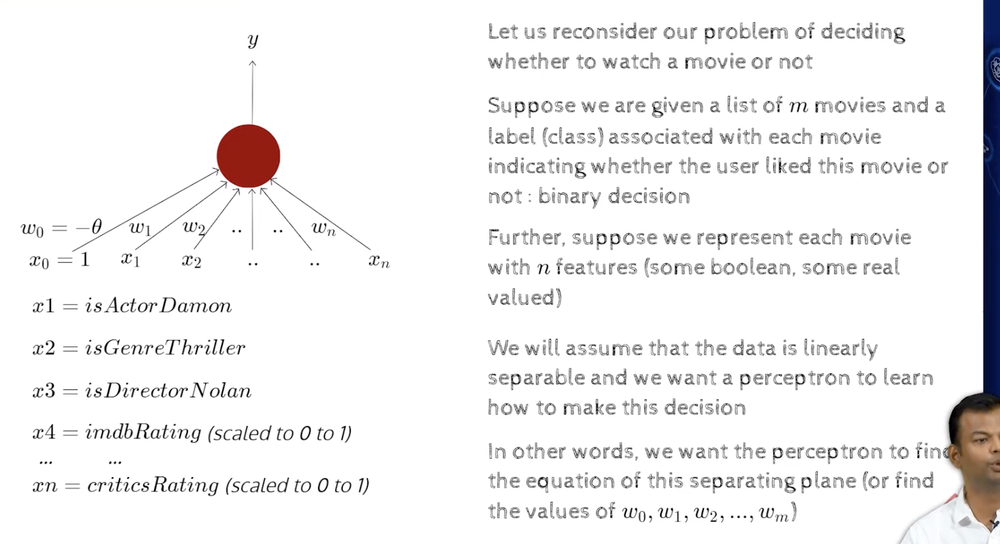
- we dont know what these weights are, we need to learn them, such that once we learn them, we can use them to classify the data

- This is not a cooked up example, this is a real example, this is a real data set, this is a real problem, this is a real perceptron learning algorithm, 
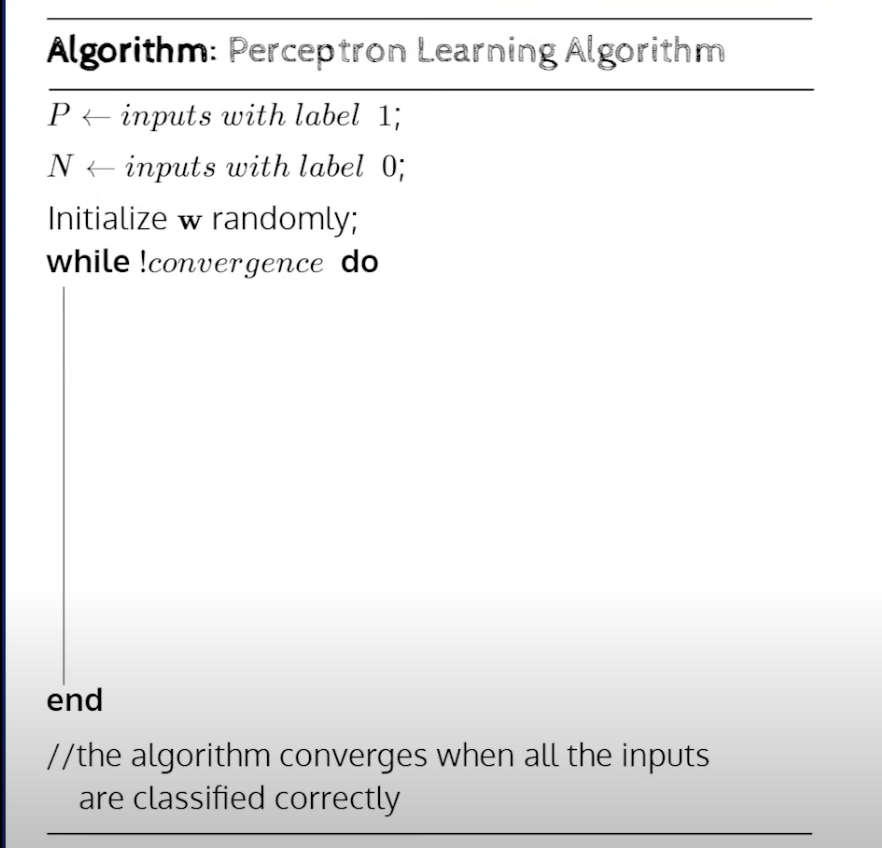
- the meaning of convergence  here is that, if i reach a point where i have zero error,
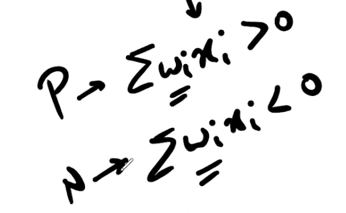
- this means we will clearly be able to separate the data,
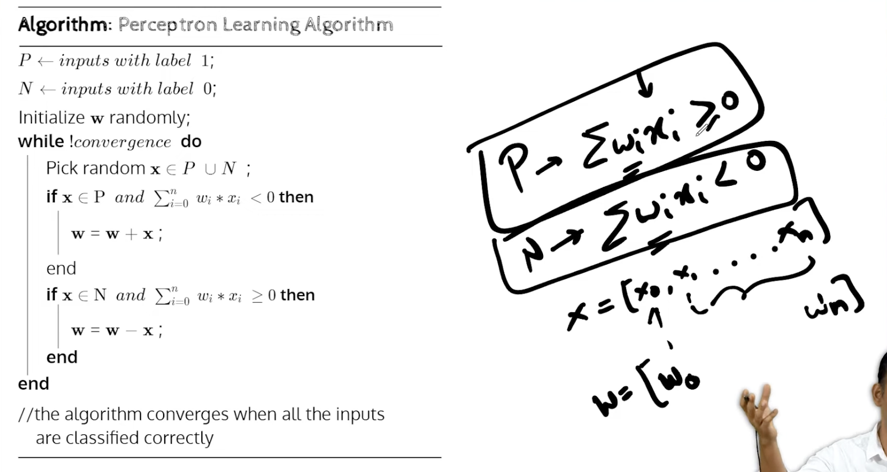
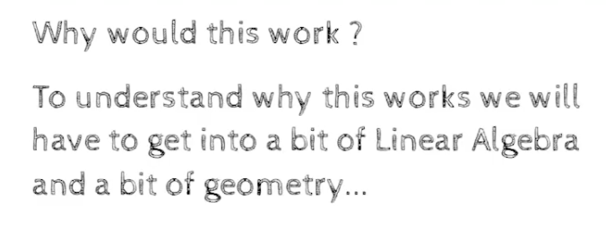

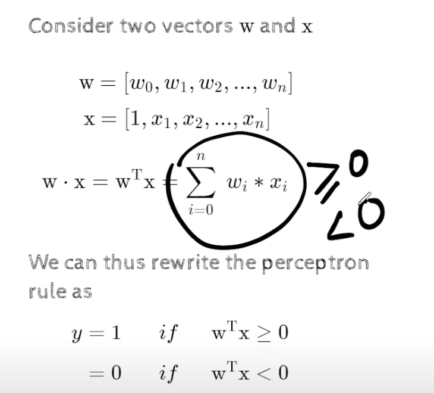
- if sum of wi*xi=0, it will still be positive
- if sum of wi*xi<0, it will be negative

- 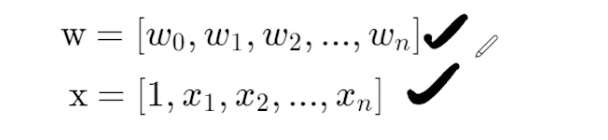
- here both x and w are vectors,
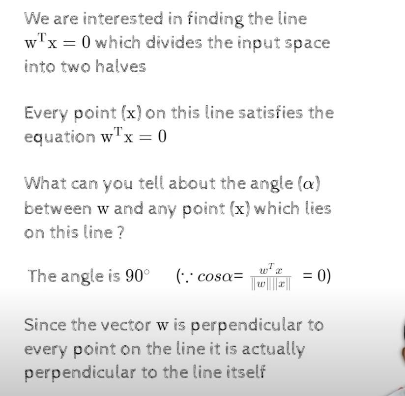
- if the point lies on the line, the the angle alpha is 90 degree with the weight vector. it means that the dot product of the two vectors is zero
- weight vector will be perpendicular to the line
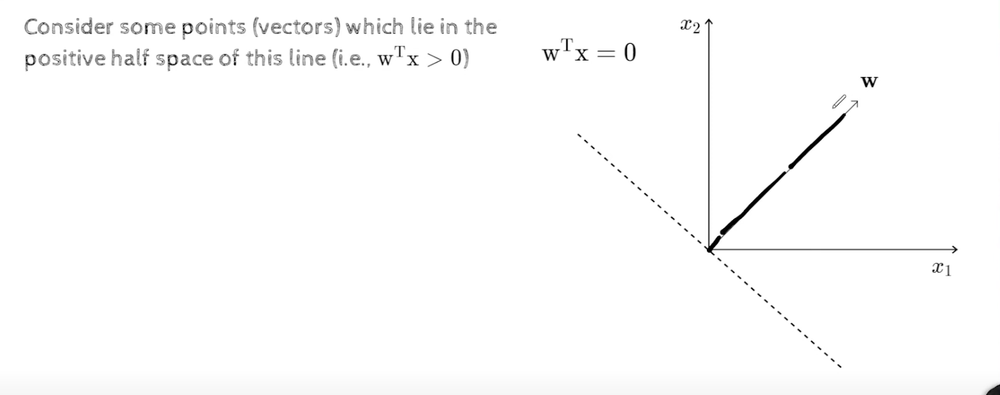
- w is the weight vector, and x is the input vector (in dotted format), and w is perpendicular to the line, 
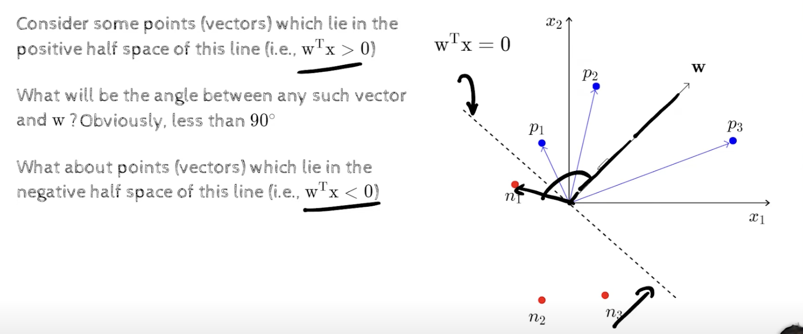
- positive points lie in less than 90 degree, and negative points lie in more than 90 degree with the weight vector
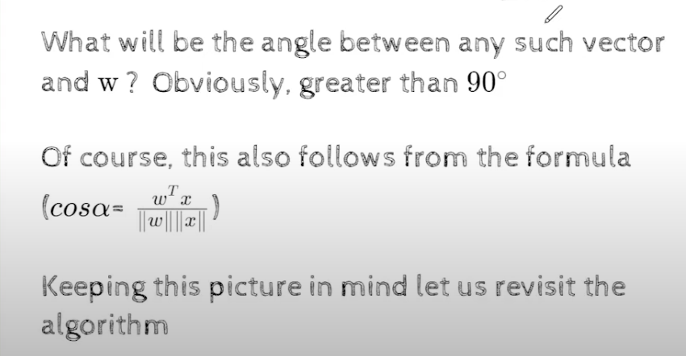
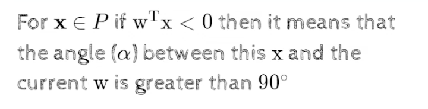
- if a point p is misclassified, then the angle between the weight vector and the input vector is greater than 90 degree, but i want this angle to be less than 90 degree, so i should try to adjust the w , atleast such that whatever is the current angle, that angle should decrease, it may not become less than 90 degree in one shot, but atleast it should decrease as we are in a bad situation right now
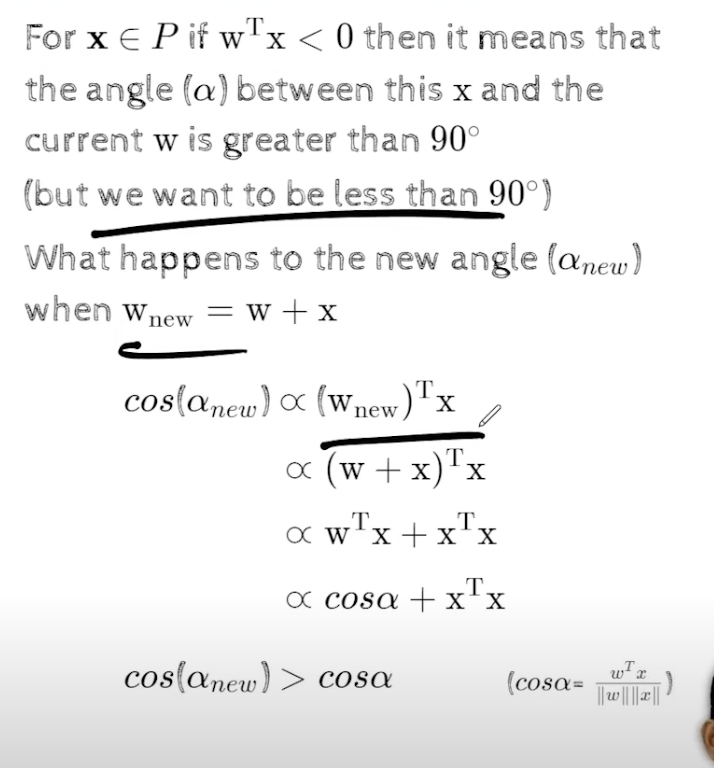
- since cos(alpha new) > cos(alpha)
    - it means alpha new will be less than alpha
    - this is what we wanted
    - eventually we want it to be less than 90 degree, but ,maynot be able to do it in one shot, so i will try to make it less than
- using proportionality, simplified the equation to show the intuition
- thus alpha new is less than alpha, and we are moving in the right direction, which is what we 

- If X was a negative point , and if we were making an error, 
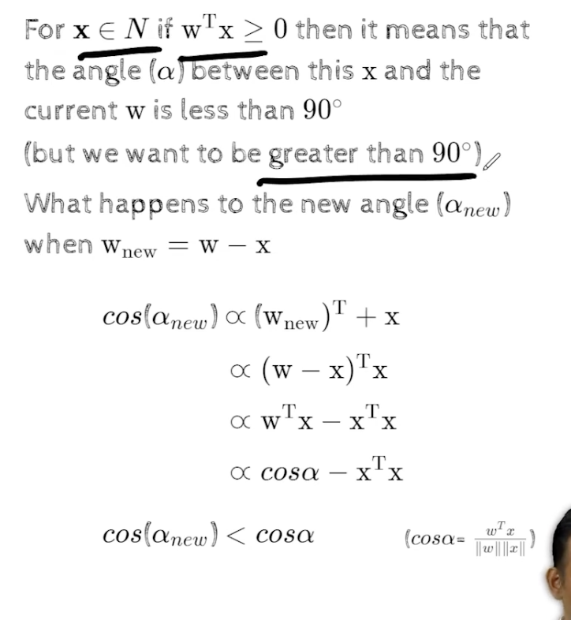
- we slowly slowly move towards the correct direction, and we will eventually reach the correct direction
- that is we keep picking these points again and agian cyclically, and we keep adjusting the weights, and we keep moving towards the correct direction, and eventually we will reach the correct direction
- This is why that update makes sense
- We still need to see whether this algo will converge or not, but this is the intuition behind the update

- Now we will see this algorithm in action for a toy dataset
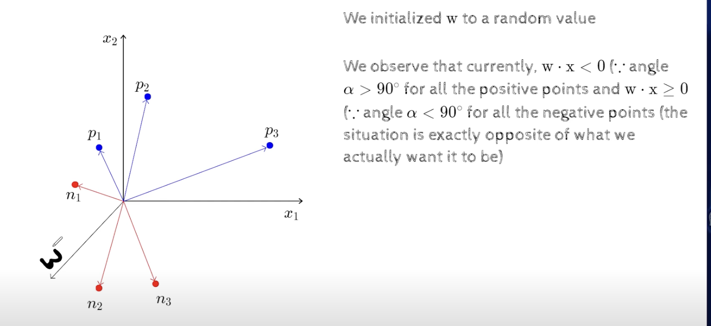
- if you see w is actually opposite to how it should be, it should be in the positive region, but it is in the negative region
- ie it has less than 90 degree angle with the negative points, and more than 90 degree angle with the positive points
- here w is clearly wrong, 
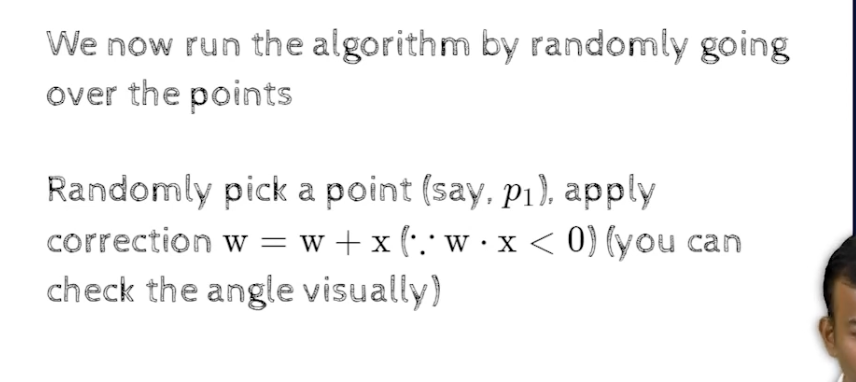
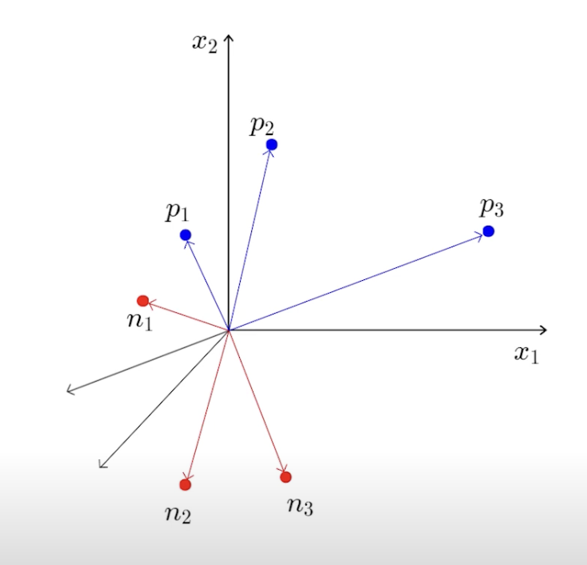
- we can see that the angle with p1 has reduced. this greedy step has worked , in the sense that it has reduced the angle with p1
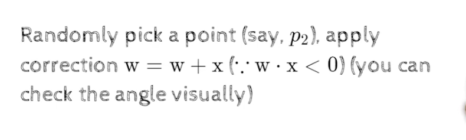
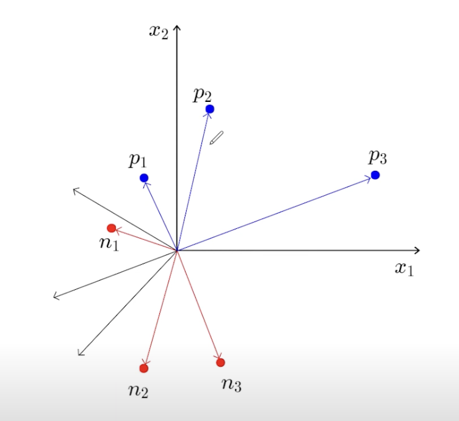
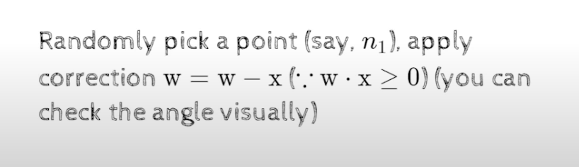
- lets pick n1
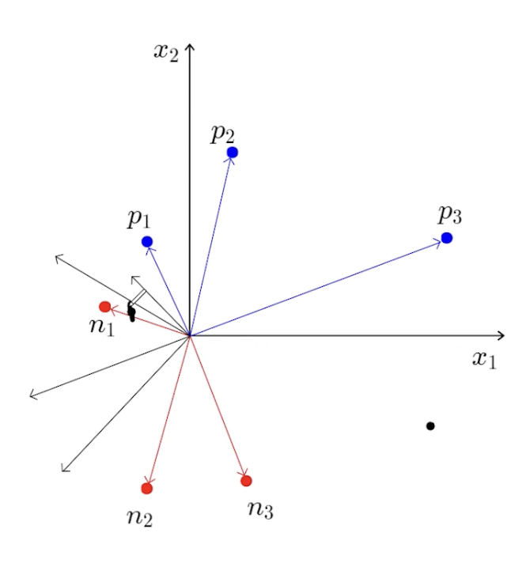
- 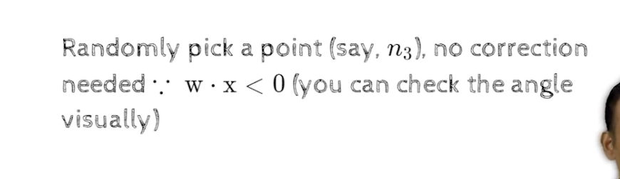
- no correction is needed for n3 as it is already in obtuse angle with w
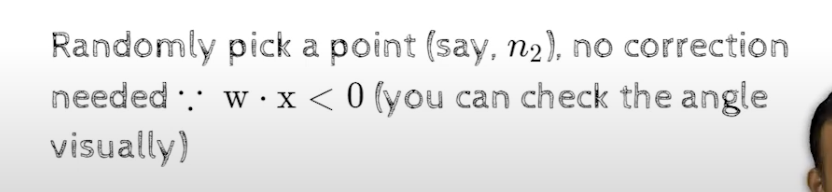
- n2 is already safe so no correction is needed
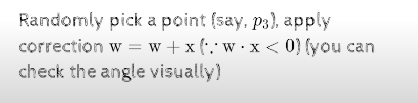
- p3 we need to correct
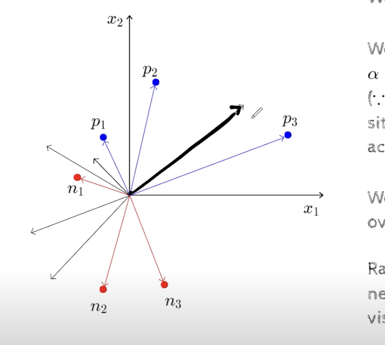
- new w is darker
- p2 no correction needed
- again n1 , no correction needed 
- again n3 , no correction needed
- keep cycling through the points, and keep updating the weights, and eventually we will reach the correct weights
- once we see no correction is needed for the entire cycle, then we can stop the algorithm
- so at convergence, all the positive points will be on one side of the line, and all the negative points will be on the other side of the line
ie all the positive points will have an acute angle with the weight vector, and all the negative points will have an obtuse angle with the weight vector

- now the question is , whether i could have just kept toggling, what if these changes were counter productive, what if i was just going back and forth, and i was not converging,   