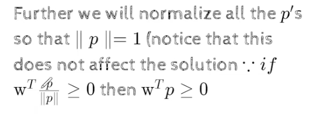
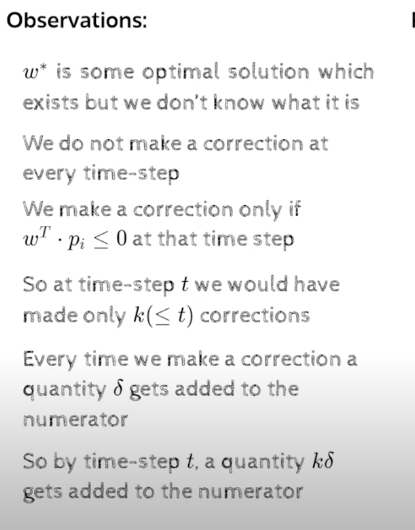
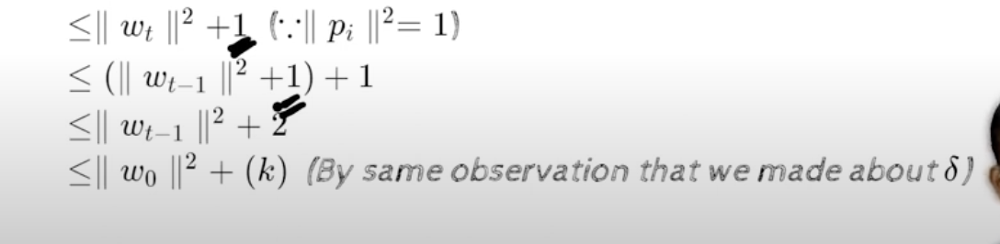

### Lect 1.11 Proof of Convergence

- Lets formalize whether it will converge or not  
- Theorem
    - Definition: 
        - Two sets P and N of points in an n-dimensional space are called absolutely  linearly separable if n+1 points w0,w1,...wn exist
            such that 
            - for every point x1,x2,...xn in P,satisfies sum(wi.xi)>=0 and 
            - for every point x1,x2,...xn in N,satisfies sum(wi.xi)<0
    
    - w0,w1...wn are the weights
    - we are going to find the weights,
    - if such points exists such that , every point x1,x2,...xn belongs to P,satisfies 
    
    - ### proposition:
        - if the sets P and N are finite and absolutely linearly separable, then the perceptron learning algorithm will converge to a solution and update the weight vector w in a finite number of steps.
        - in other words, if the vectors in P and N are tested cyclically one after the other , a weight vector w will be found after a finite number of steps t such that
        it can separate the two sets. 
    - 
    - data is finite and linearly separable, then the perceptron learning algorithm will converge to a solution and update the weights in a finite number of steps
    - w=w+x in some cases and w=w-x in some cases
    - what if it is not linearly separable, then it will not converge
    - 
    - the proposition is saying that it wont go into infinte loop, it will converge in finite number of steps, ie.  it will find a weight vector that will classify all the points correctly
    # Proof
    - 
    - if X belong to N, (negative class) then w.x<0,
    - wt(-x)>=0
    
    - conside a single set P'=P union N- 
        - where N- is the negation of all the points in N
    - for all p belong to P' (union of P and N points),we  ensure that w.p>=0 
    - 
    - after this, every point in the data set will have the output as 1 because of the above equation
    - P' is a collection of points for which w.p>=0
    - now every point in P' will have the output as 1 
    - 
    - initialize w randomly
    - while not converged
        - pick up a point p  from P' 
        - if sum(w.p)<0 (if condion of perceptron is violated, update the weight vector)
            - w=w+p
        - end
    - end

    - we dont need the other condition, because we are saying that every point in P' will have the output as 1, so we dont need to check for the other condition
    
    
    - we are normalizing the points p
    - 
    - p=p/||p||(normalization), 
    - wtp>=0, 
    - this ensures norm of p is 1
    
    - the proof start by saying that if, the points are linearly separable, that means there exists some W (we call w* , which will classify all the points) then the perceptron learning algorithm will converge to a solution and update the weights in a finite number of steps
    - which means there will be some w, w* which will classify all the points correctly
    - 
        - if at t  th iteration, the perceptron makes a mistake, if the condition is violated, then the weight vector is updated
        - we make a correction to the weight vector
        - 
        - why we dont have ||w|| in the denominator, because we are normalizing the weight vector, so we dont need to have ||w|| in the denominator
    
    - 
    - these dot products are some scalar values, 
    - we can take the minimum of all the dot products, and we can say that the minimum of all the dot products as `delta`
    - delta= dot product of w* and each of points in p', and whatever is the minimum of all the dot products, we can say that as `delta`
    - 
    - which means any of the points in p' will have a dot product with w* which is greater than delta, because delta is the minimum of all the dot products
    - 
    
    - wt = (wt-1+pj) because wt came from wt-1
    - 
    - we know that w*.pj>=delta
    - we replace w*_pj as delta, hence we get 2delta
    - 
        - why is the input k, and not t
        - t is no of steps we have taken, but at everystep its not necessary to have made a correction, because for some pi taken the right condition would have satisfied , so K (number of updates we make ) <= t (no of steps)
        - because we are saying that the perceptron makes a mistake at kth iteration, and not at tth iteration
    - 
    
    - now lets focus on denoinator
    
        - we know that wt.pi <=0, thats why we are in this stage, and ||pi||2 =1, as we noralized the P's
        - 
        - as many times as we make an update , a 1 will be added
    - 
    
    https://youtu.be/9AmGI-tVCSQ?t=1095
    - we simply substituted the numerator and the denominator, this  wil be greater than or equal to, because the numerator is greater than or equal to and denominator is less than or equal to,so if we put numerator over denominator , end result will be cos beta >= qty
    - here we have k in numerator and root k in denominator,cosB thus grows proportional to root K, where k is no of updates    , we wanted to show that k is finite and k cannot tend to infinity , 
    -
    - as  k keeps on increasing , cos B keeps on increasing,
    https://youtu.be/9AmGI-tVCSQ?t=1139
    - if k becomes arbitrarily large     , goes to inifinte , that means the algo is not converging , it keep on increasing, then what will happen to cos B ,will it keep on increasing, no
    - because cos B range between +-1
    - 
    - thus there can only be a finite number of corrections(k) to w and the algo will converge
    - 
        - 2 , now we can learn all the params, not just the threshold w0, but also w1 to wn
        - 4, for non linear , its still not possible , because our perceptron , will be able to find the weights only if the data is linearly separable
        - we will see how to handle them