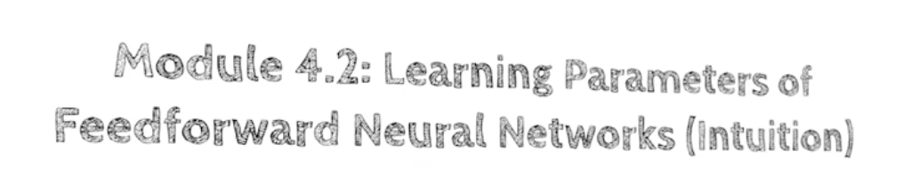
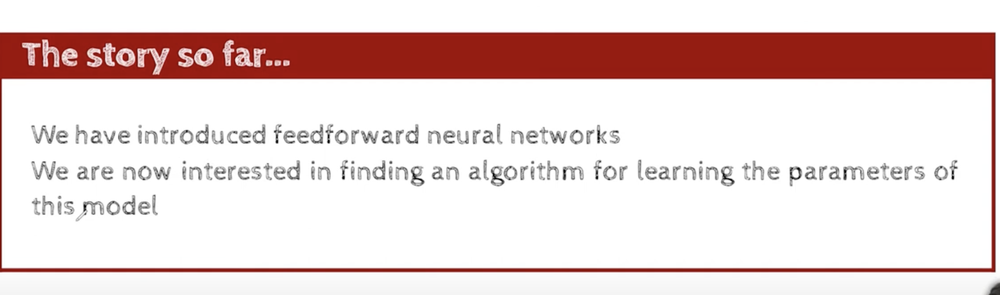
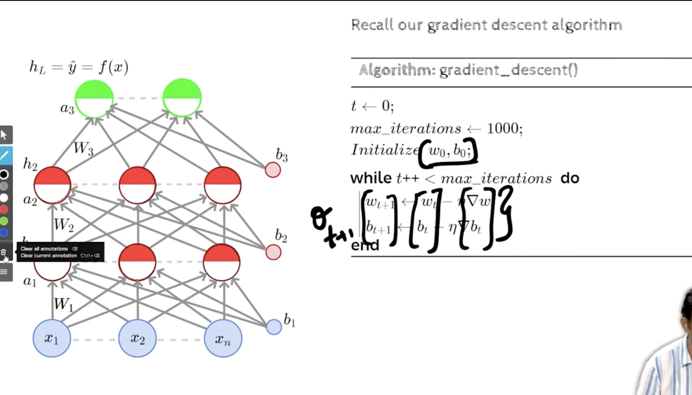
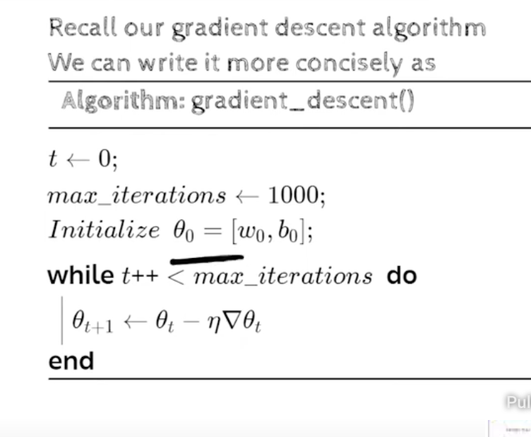
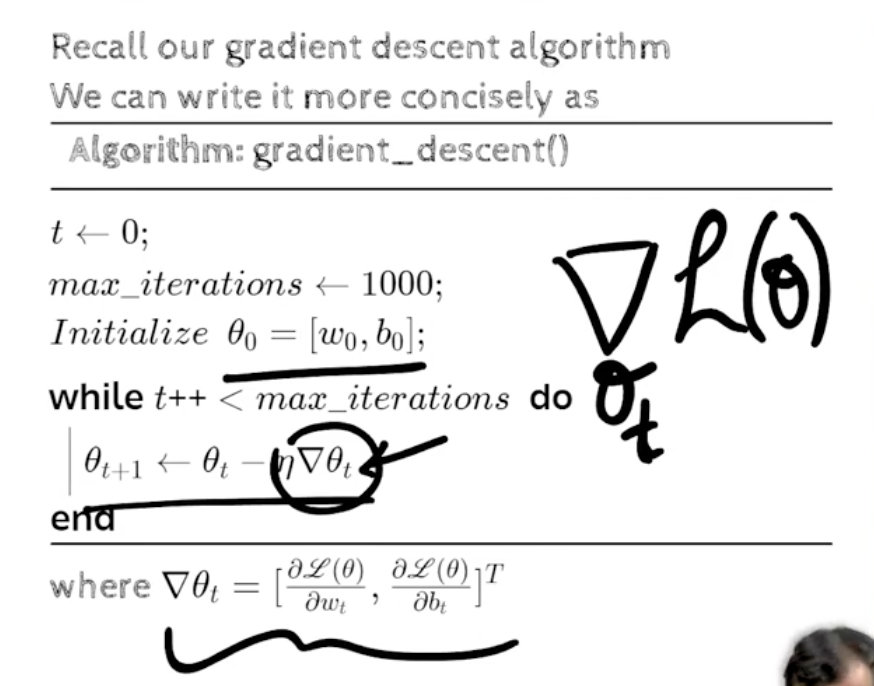
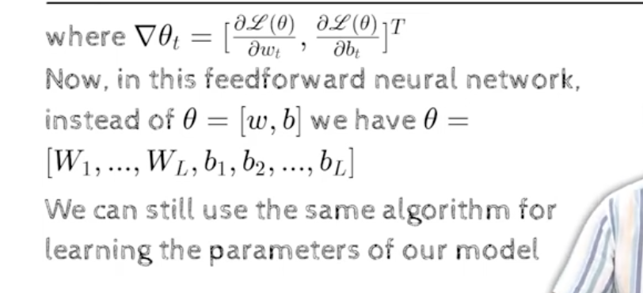
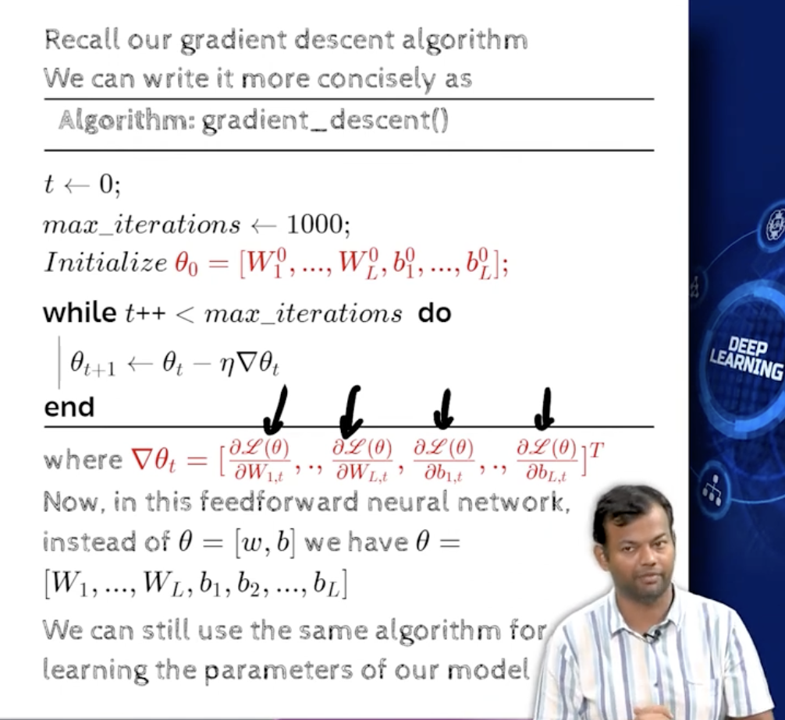
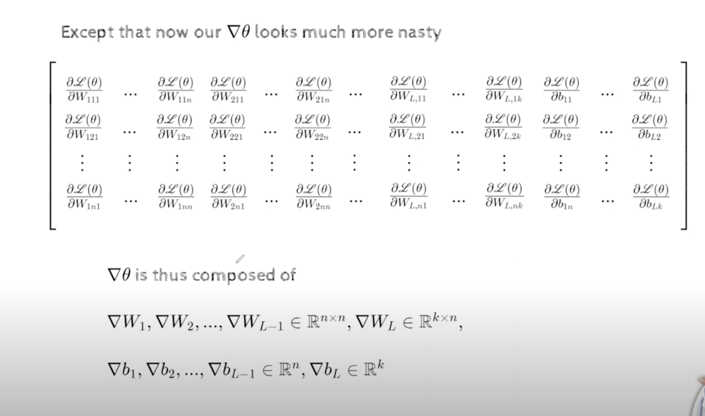
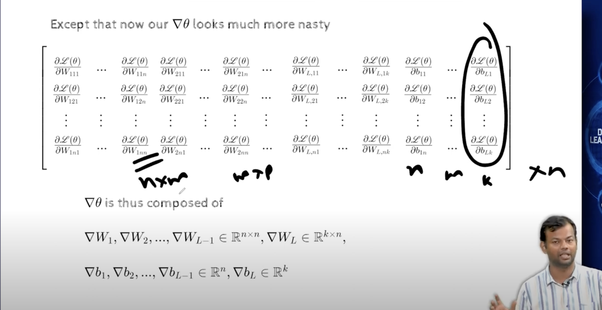
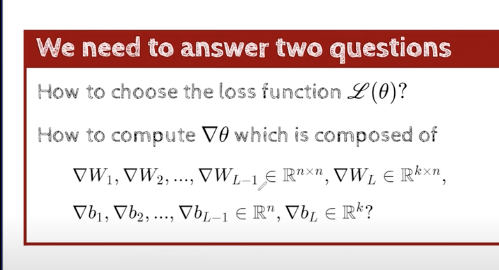

## 3.2 Learning parameters (Intuition)
- 
- we earlier saw , how to learn parameters of a very simple nework, for a single neuron which had a w and a b, with a single input x, and there was a y hat,
- we saw how to learn the parameters w and b, using gradient descent algorithm.
- can we use the same algorithm to learn the parameters of a network of sigmoid neurons? ( feed forward neural network)
- 
- 
- let write these notations more compactly
- 
- 
- 
- 
- our quest will be to come up with a formula to without painfully computing all these, derivations
- 
- w111 -> first weight in w1 matrix, all the way up tp nn weights
- similarly n2 weights we have in the w2 matrix
- similarly nk weights we have in the last layer
- similarly n biases we had in each layer and k biases we had in the last layer
- this is not a matrix, instead it is a collection of partial derivatives
- 
-  these are all the partial derivatives we need, we should do this conveniently and not painfully go over everyelement and write down the formula for that and compute,we want to take the entire matrix at once and compute the partial derivatives of its elements
- if we can do that, we are awesome,
- We need to answer 2 questions:
    - How to choose the loss function?
        - because we need to compute the partial derivatives of the  loss function with respect to  the weights
        - unless we know the loss funciton we cant even start writing that formula
        - so we need to know how to choose the loss funciton
    - 

