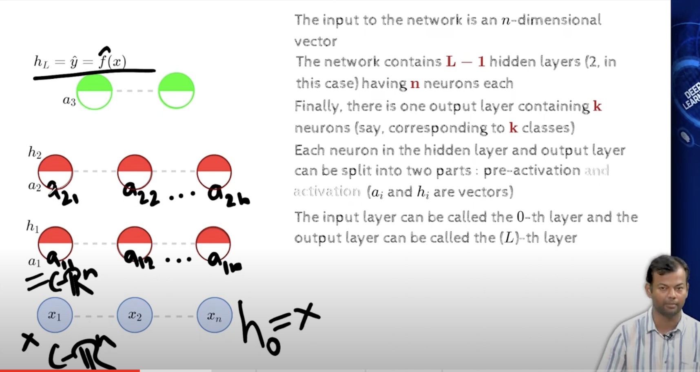

## 3.1 Feed forward neural networks

- MP neurons
-  perceptrons(repressentation power of perceptron, where it is just a linear separator ,can only work for data which are linearly separable ) 
- sigmoid neurons(single sigmoid neuron with w and b, we saw gradient descent algorithm,we talked about represenetation power of network of sigmoid neurons, UAT , if we had one non linear layer then we can approximate any arbitrary function to the desired degree of precisiion) 
- feed forward neural networks
- 
- videos of Hugo Larochelle , on backpropagation (https://www.youtube.com/watch?v=GlcnxUlrtek&list=PL6Xpj9I5qXYEcOhn7TqghAJ6NAPrNmUBH&index=3)
- CS231n winter 2016 lecture 4 backpropagation (https://www.youtube.com/watch?v=i94OvYb6noo&list=PLkt2uSq6rBVctENoVBg1TpCC7OQi31AlC&index=4)

- 
- 
- weight will be n*n
- W1 belongs to Rn*n, also we will have biases, n such biases , so bi belongs to Rn
- 
- 
- the activation takes the preactivation
- g is element wise function
- 
- h1 is a 3d vector, where g is called activation function
    - tanh
    - sigmoid
    - relu
    - leaky relu
    - linear
- all of these are going to act element wise
- aLx is the preactiavtion at the last layer(output)
- g is the function for hidden layers
- for output we need special function, we cannot always use sigmoid at the output because sigmoid will only give values between 0 and 1, but we want to predict values between 0 to 100 , score of a test , so we need a different function for output layer
- 
- 
- 
- g is an element wise function
- 
- 