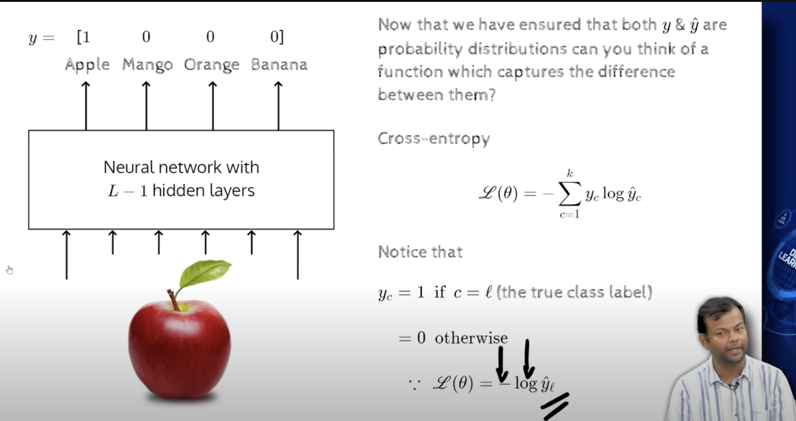
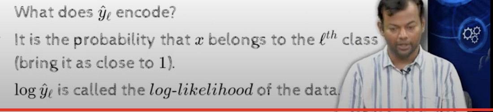

## 3.3 Output functions and loss functions

- we were talking about how to choose the loss function, which in term will decide out output function 
- 90% of the problems fall into regression or classification
- 
- for real values take squared error loss
- 
- for the output layer use linear activation function
- al=[al1 al2 al3]
- 
- if a, b w is not bounded, how can we make sure that algo will start, or y hat , it can be 100's 1000's etc etc... but i want it to be around 10, 
- How would network deal with this,?
    - its through the loss function
    - if network predicts 1000, and the actual value is 10, then the loss will be 1000-10 = 990, which is a huge loss, and the network will try to reduce this loss, by reducing the weights and biases, and hence the output will be reduced.

- Lets talk about classification
    - we need to know about cross entropy
    - https://www.youtube.com/watch?v=sbvv-uQmwVY
    - additional link to cross entropy (https://www.youtube.com/watch?v=ErfnhcEV1O8)
    

- given an image ,we want to classify it into one of 4 classes, we want to predict the probability of each of the 4 classes, and we want to choose the class with the highest probability
- how do we choose an output function such that they sum to 1, and they are all positive ,ie it should be a probability distribution
- 
- we can use cross entropy loss function
- https://youtu.be/1hefEWZHvJg?t=726
- 
- O is known as softmax function, 

- e raised to negative is always positive, so we are safe
- e raised , we are using to handle negative values, and we are using it to make sure that the sum of the probabilities is 1
- 
- 
- L(o) = -log(yhatl)
    - negative log of the   predicted probability of the true class
    - hence called negative log likelihood
    - 
    -   
    - 