## 3.4 Backpropagation (Intuition)

- 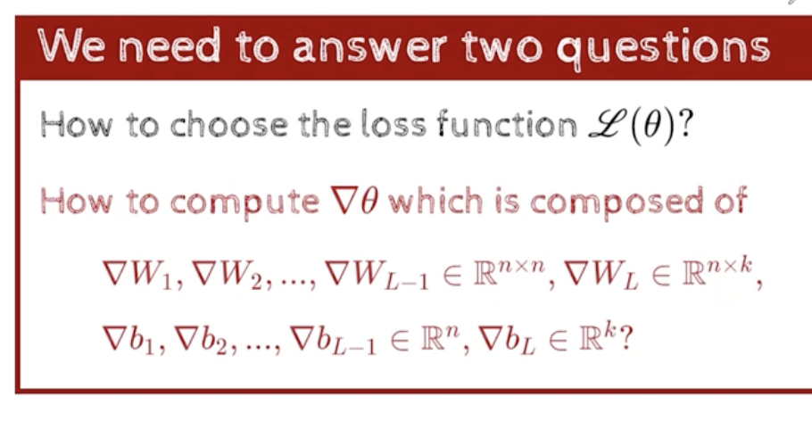
- we need to start talking about the  derivative of the loss function, with r.t parameters of the neural network
    - if we know the derivative of the loss function,with r.t parameters of the neural network, we can use gradient descent to train the neural network
    - in case of DNN, its not complicated , but slightly more work involved, than what we had in that simple network
- 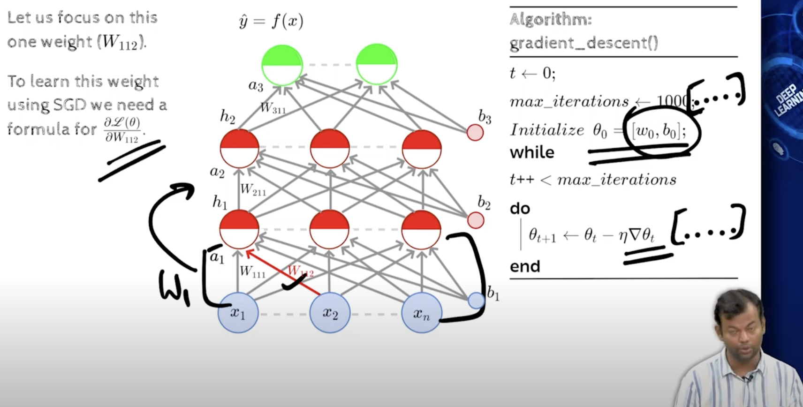
    - if we learn how to compute the derivative for one weight, we can use the same to compute for all the weights in the one layer, and then if we can do it for one layer, we can do it for all the layers
    - lets start with 
    - 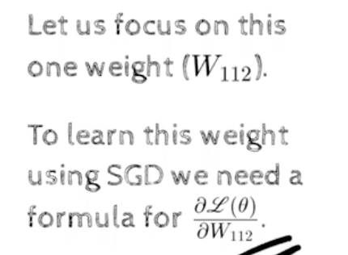
    - 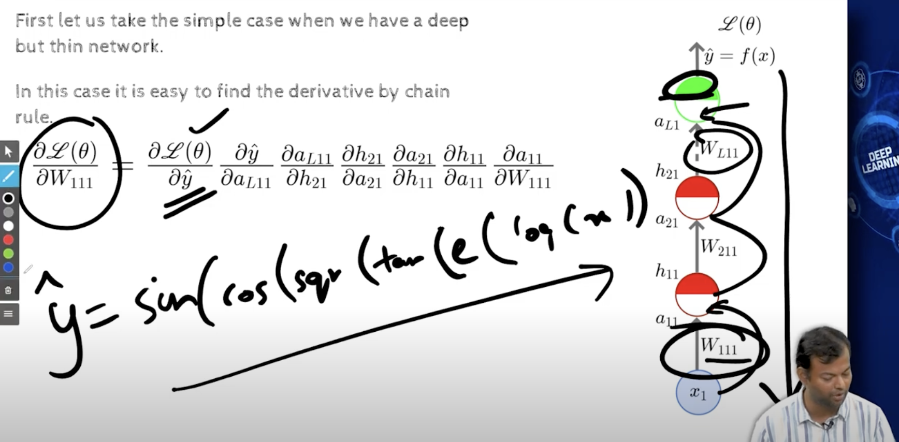
    - 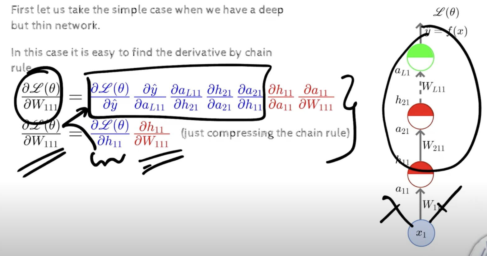
    - we have the big blue part, but if i had already computed that, then  i can reuse them
    - 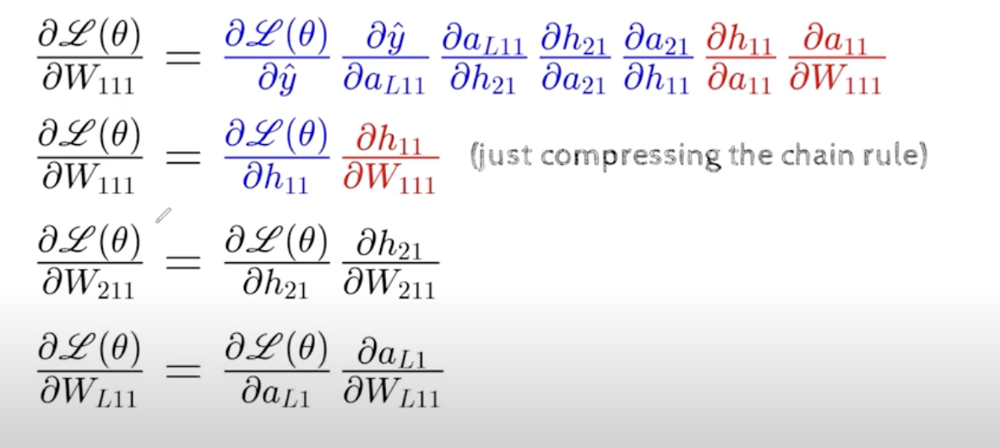
    - lets see an intuitive explanation of the backpropagation algorithm, before we go into the mathematical details
    - https://youtu.be/i0YC2jZuxUI?t=439
    - 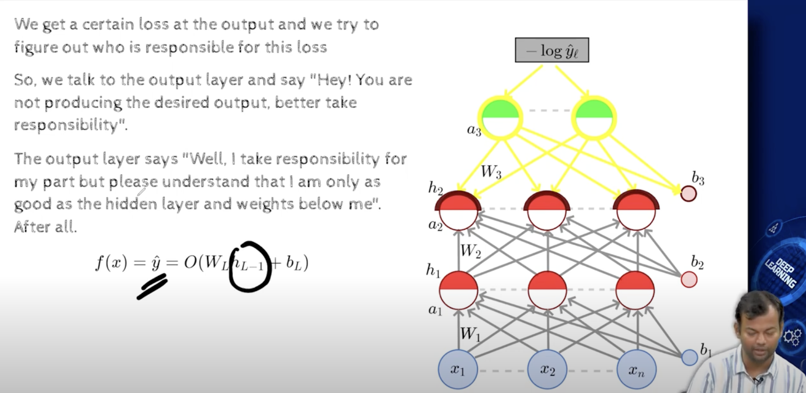
    - 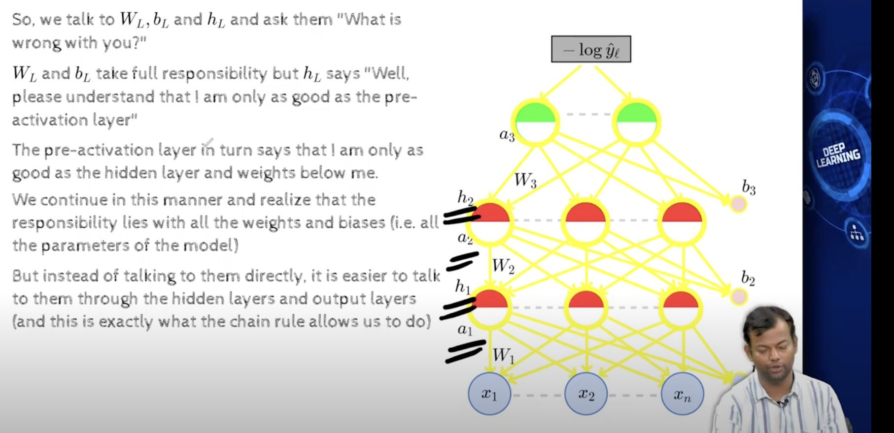
    - all the wrights and biases, a1 a2,h1,h2,a3 although they are a function of weights and biases, 
    - we find out that the responsibility lies between weights and biases, 
    - 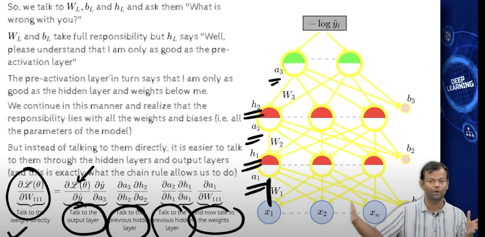
    - https://youtu.be/i0YC2jZuxUI?t=656
    - what does the derivative tells us
        - if i change w a very tiny bit,makes a large change to the loss, that means w has strong influesnce in the loss, and we should change it more,
        w is more responsible for the loss, if i change w a small amount , maybe the loss will decrease a lot, hence derivative or partial derivative is a good way of assigning,responsibility to the weights for the loss
        - it tells,, how much is this guy responsible
    - 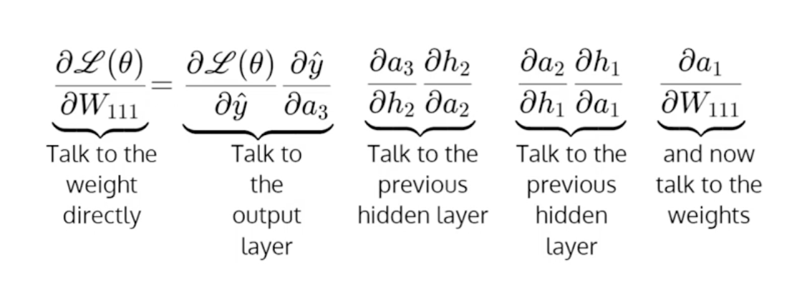
    - 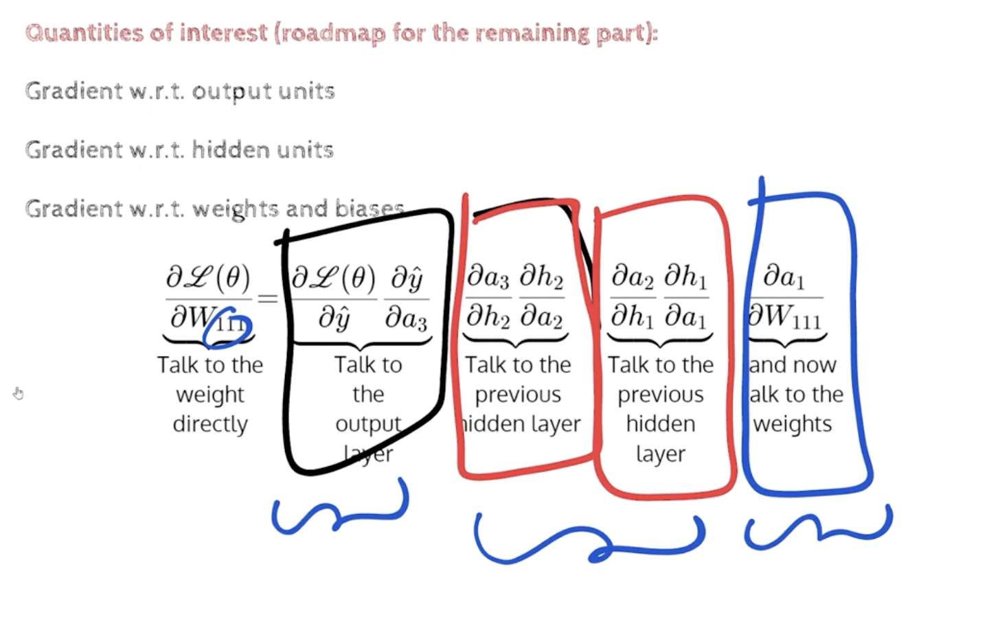
        - we also should find a way that once if we find for W111, we should be able to find for W112, W113, W121, W122, W123, W131, W132, W133, and the whole network
        - our focus is going to be on Cross entropy and Softmax output,
            - it means we are going to work on classification problem