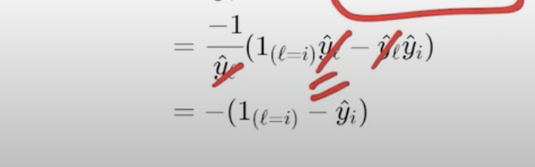

## 3.5 Backpropagation Computing : Gradient w.r.t output units

- 
- we will slowly talk to all the stake holders of gradient computation
    - output layer
    - hidden layer
    - weights
- start with first, Talk to output layers
- we want to compute the derivative of the loss function, with r.t the output units
- it has two parts, 
    - activation 
    - pre-activation
- 
- we know that it would be collection of some partial derivatives
- 
- we will do it on the first half of the upper layer
- 
- we are trying to take derivative of the loss function , which has the term yhatl, with restpect to one of y hats   , this depends only on one of the elements in the array, the one which corresponds to the true loss fiunctino
- 
- here since  y2 is responsible , others are not responsible, so we will have only one term in the derivative, and rest of the derivatives will go to zero, because we are taking derivative wrt one variable, and others are constant
- its more like an if else condition, 
- how do we write in math, its called indicator variable, 
- 
- 1 here means the indicator variable
- 
- it just encodes if else condition
- so we can agree that the above two are same
- 
- the above vector will have 1 only in one position and 0 in the remaining positions
- these kind of vectors are called one hot vector, represented as `el`, just a more compact way of writing the vector
- note h1,h2,h3 are 
- 
- https://youtu.be/T6kfyQ3_JQ8?t=615
- first lets try to find L(theta)aLi
- what is loss function here?
    - -log(yhat l)
- 
- what is yhatl?
    - it is the output of the softmax function
    - 
- 
- we are trying to compute the derivative of loss function with respect to one of element of L vector
- 
- y hat is a vector
- al is a vector 
- softmax is a vector
- 
- 
- the derivative of `e**x is e**x`
- 
- 
- 
- 
- 
- now we know that  , the gradient of the output layer, is the difference between the output of the softmax function, and the one hot vector
- talk to output layer is over
