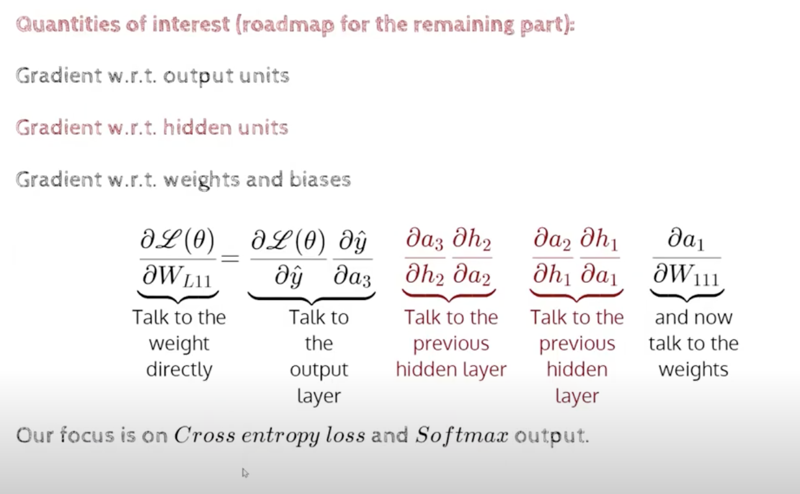
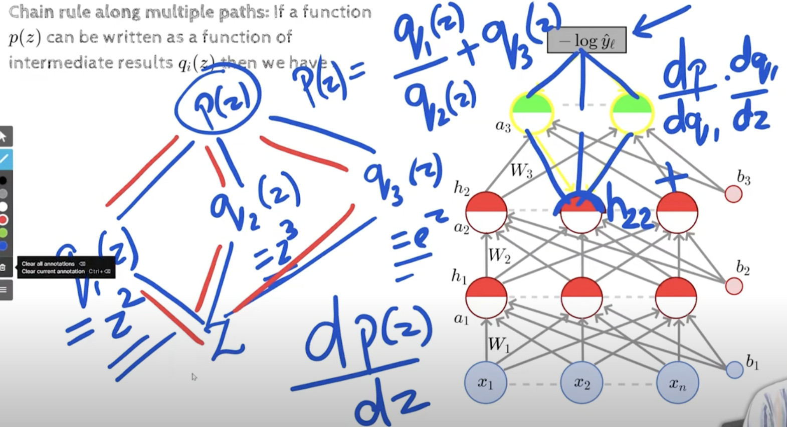
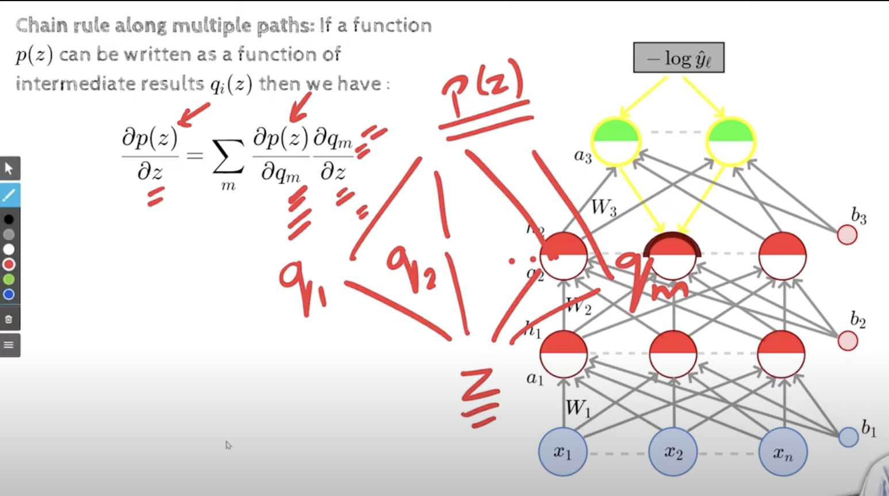
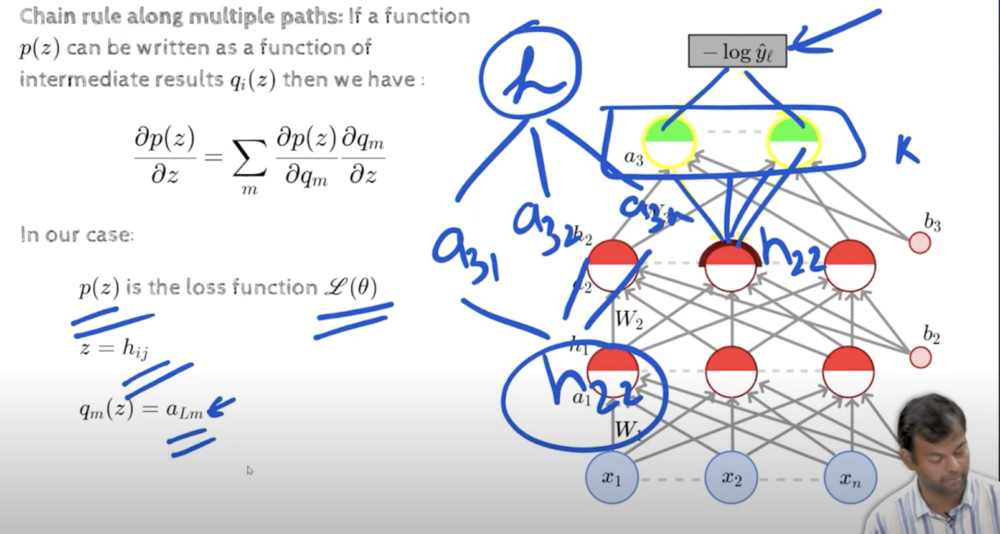
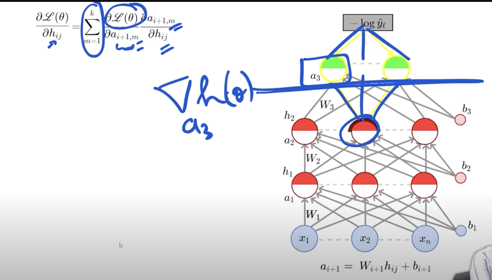
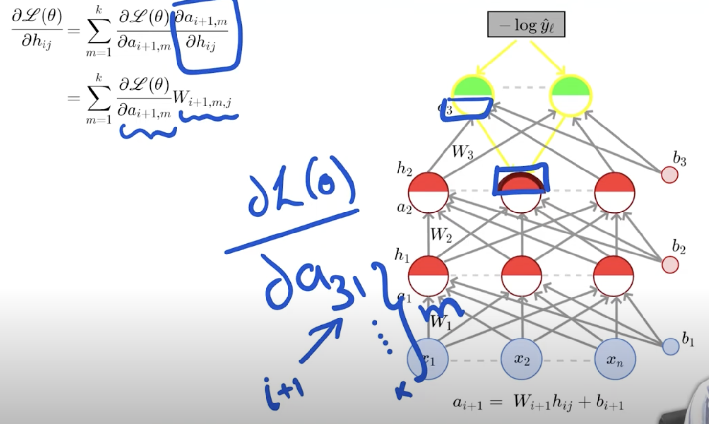
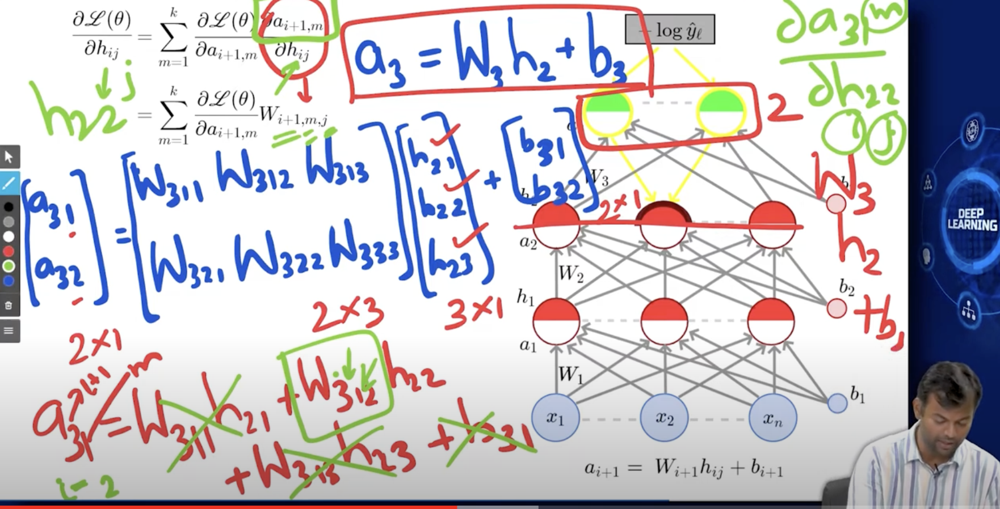
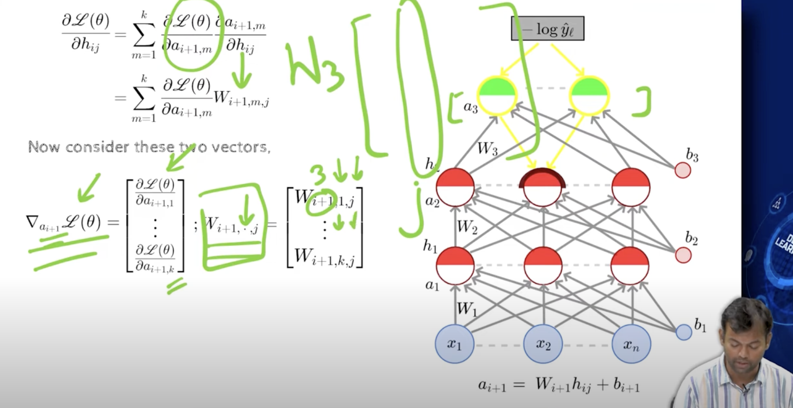

## 3.6 Gradient w.r.t Hidden Units

- Backpropagation: Computing  Gradients wrt Hidden Units

- 
- h2 is hidden layer
- 
- 
- 
- hij -> i is the layer number, j is the unit number
- k is the no of paths from the unit j in layer i to the output layer
- m is the no of units in the output layer
- 
- the first term is already computed, we just need to compute the second term   
- 
- red guys is the entire h2 vector
- 
- 
- https://youtu.be/7g-THFmBpRA?t=906