## 4.2 Plotting contours

- how to draw contour maps
- 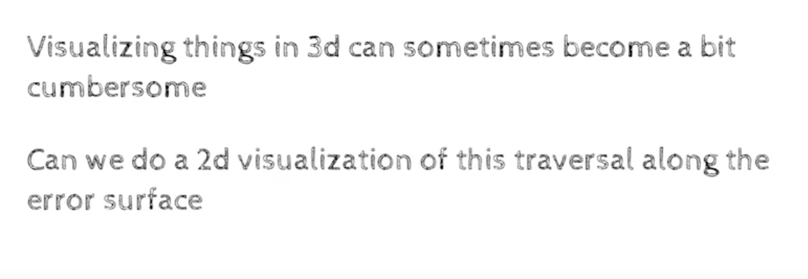
- yes
- 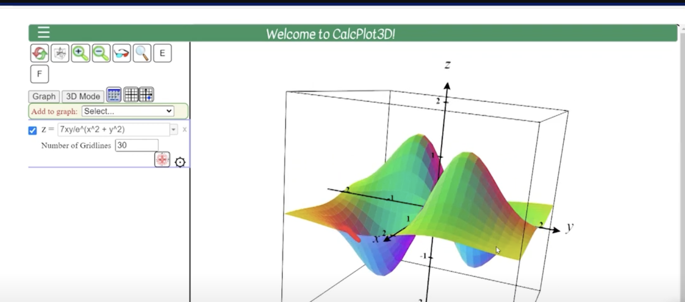
    - lets take a complex 3d plot , and ask a question
    - 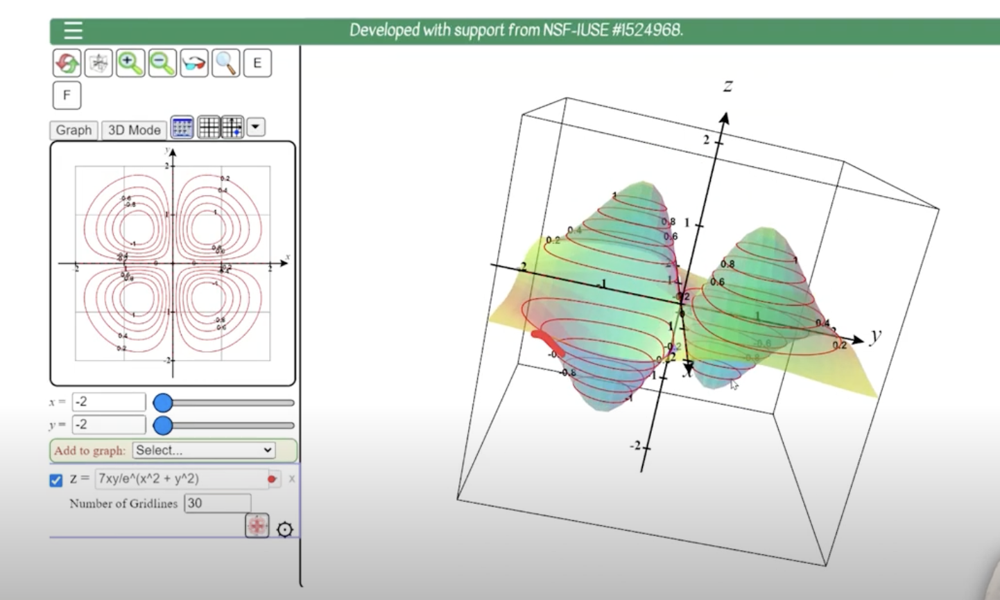
    - what every surface was given to me, at regular intervals along z axis, i have taken slices and label the intervals
    - 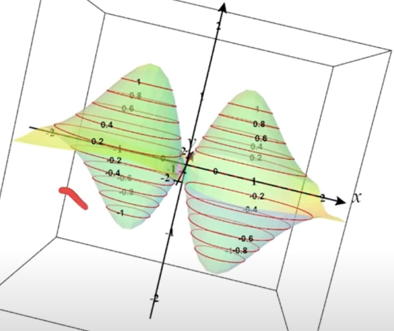
    - we can see that at every .2 distance we have taken a snap
    - -.8,-.6,-.4,-.2,0,.2,.4,.6,.8
    -  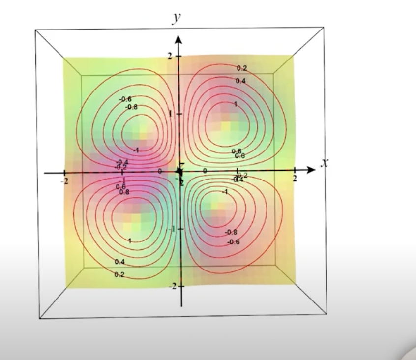
        - if we see from top, which is exactly like the contour map few images aboev
    - so Contour map is the top view of the 3d plot, such that we take slices at regualr intervals and then imagine what the slices would look from the top
    - so at a given ring, the value of z axis remains the same
    - in our case, the z axis is the loss function, and the x and y axis are the parameters w and b
    - so every slice here will correspond to the same loss value along the ring
    - 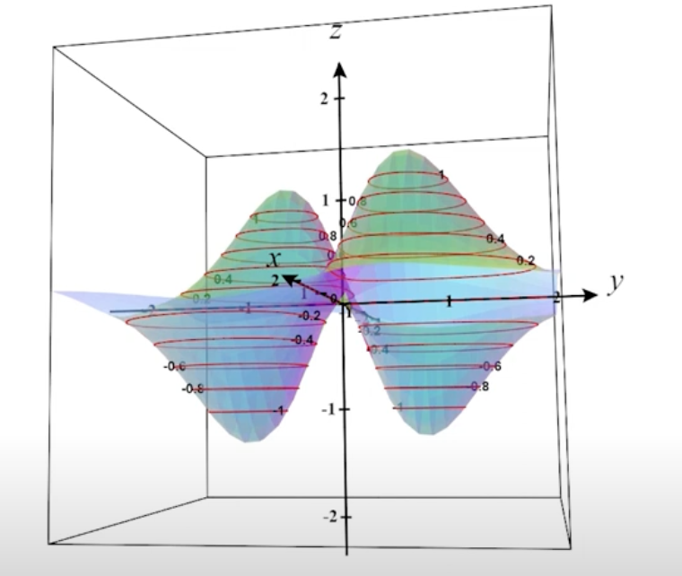
    - what we can see fromm this plot is that in some cases the distance between the rings is large 
    - 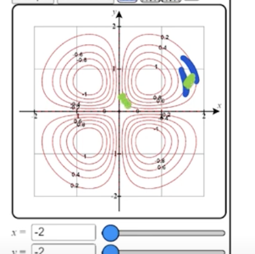
    - the distance between the two rings on the right is large on the right, and the distance between the same two rings on the left is small
    - why is this so?
    - this relates to the idea of slope
    - 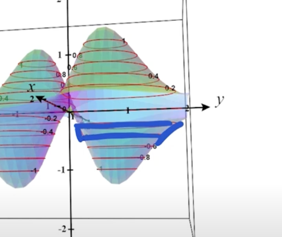
    - see this image , the slope on the right is gentle and the slope on the left is steep
    - so wherever the slope is steep, the distance between the rings is large, and wherever the slope is gentle, the distance between the rings is small
    - the idea of steep and gentle slope was important for gradient descent , that we needed to know in which region where the slope is steep and in which region the slope is gentle
    - now contour map captures that info,
    - 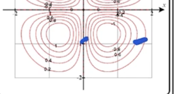
    - on the right side where the distance is large, it means the slope is gentle, and on the left side where the distance is small, it means the slope is steep
    - so looking at the contour map we can acutally guess how the 3d plot would look like
- Main take away
    - these rings corresponds to levels on the loss axis
    - they are equidistant, taken at equal distance at the loss axis
    - the distance between the rings tells us about the slope in that direction
    - if the distance is large then the slope was gentle, and if the distance is small then the slope was steep
- another example
    - 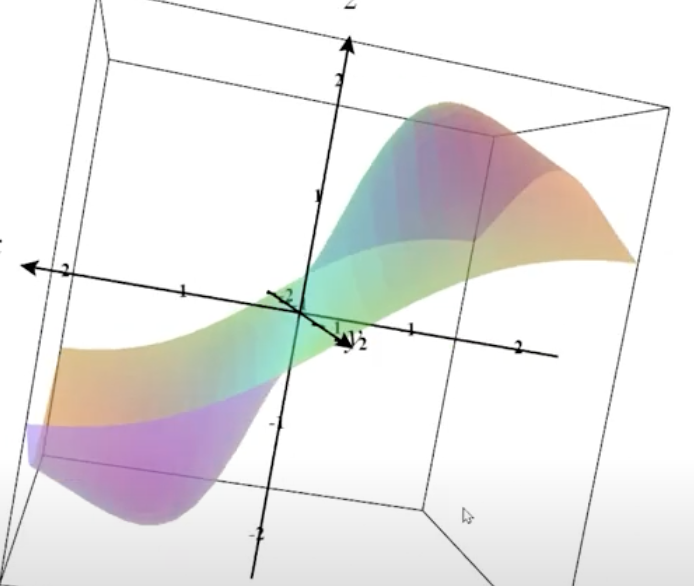
    - 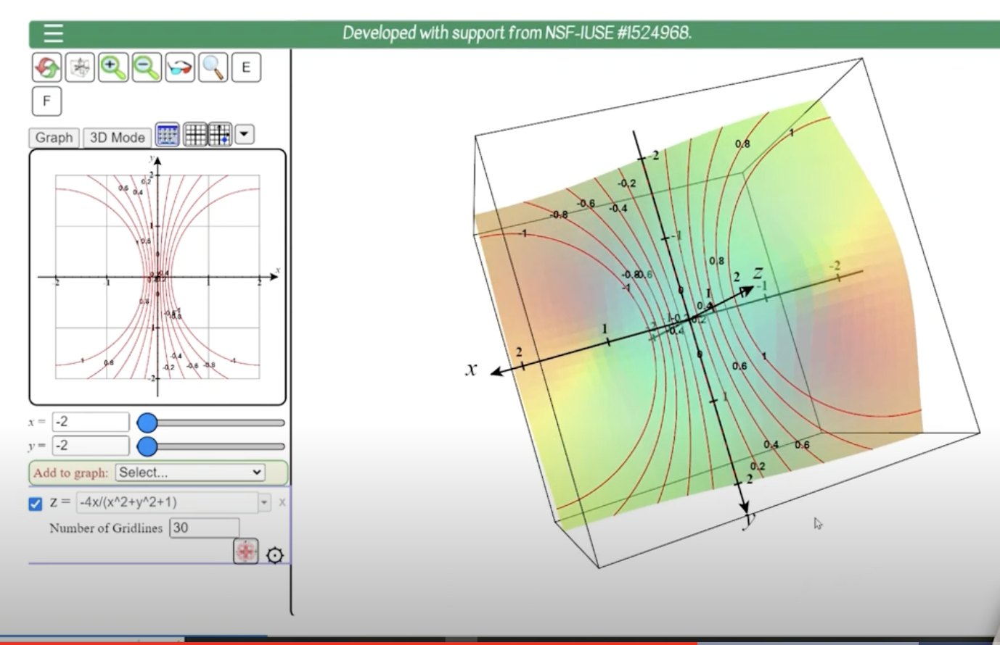
    - this is what the contour map looks like
    - 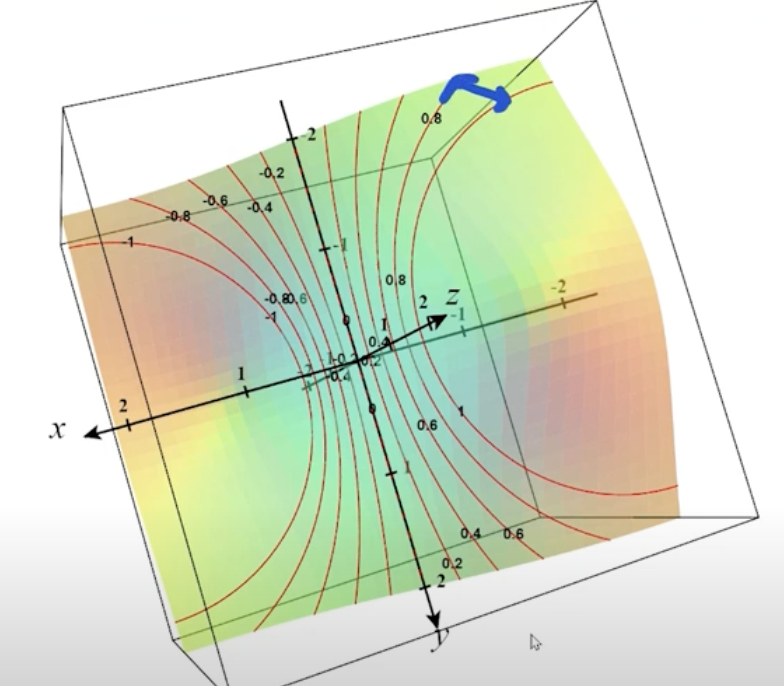
        - here the distance is large, 
        - does it correspond to the intuition of slope being gentle in that direction
        - 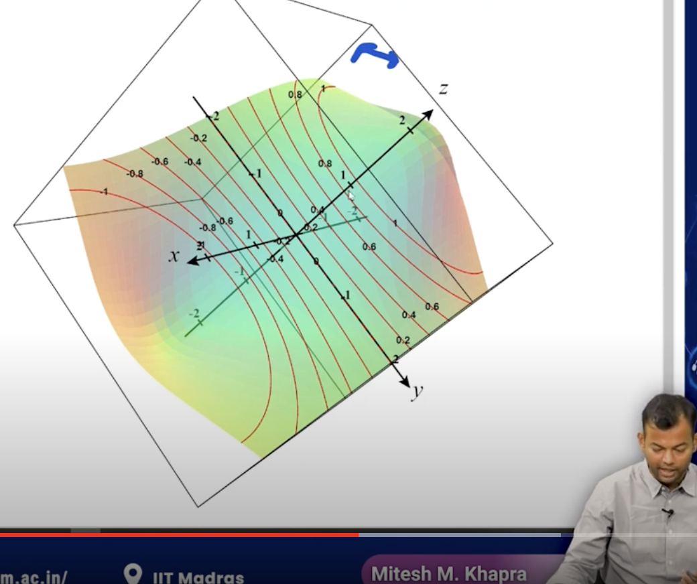
        - yes ofcourse
        - and so wherever the slope is steep, the distance between the rings is small
- lets move to gradient descent and try to explain it using contour maps
- 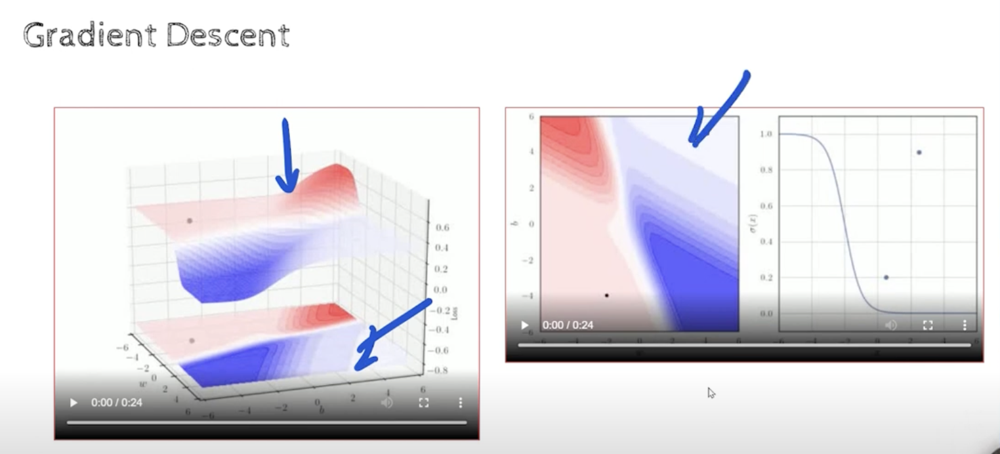
    - the top left is the 3d map and the bottom left and top right is the contour map of the saem 3d map
- 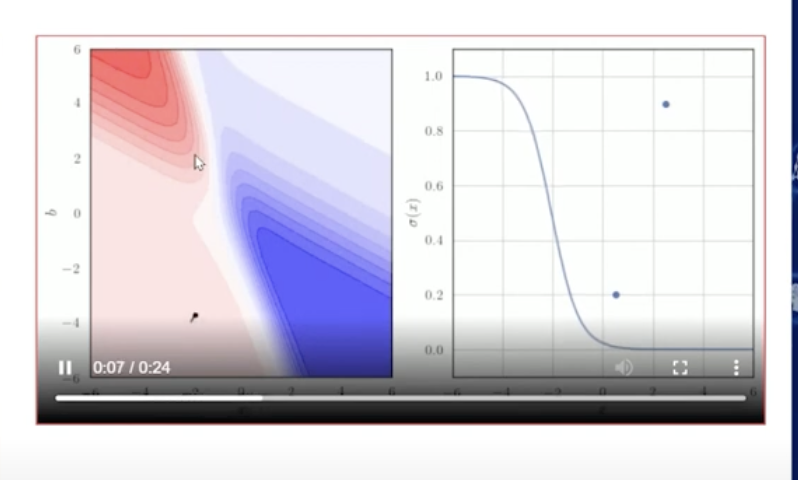
    - this is color coded,
        - dark red is the highest loss
        - dark blue means lowest loss    
        - there is a gradual change from dark red to dark blue
        - pink means somewhere inbetween 
        - https://youtu.be/fGzJOBIxXdg?t=828