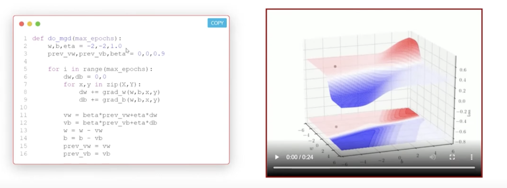

## 4.3 Momentum based Gradient descent

- 
- 
- our every step is small, but moving along this dir for a long time, what if we can accumulate all the steps and then take a big step, so that we can move faster
- 
- ut will be history vector (ut)
- we give some importance to past (beta ut-1)  history 
- plus the current update(del wt)
- 
- 
- beta is typically less than 1, so the past history is given less importance
- 
- the graph on the right is for t=9 and its giving the importance of the past history
- here x axis it T, and y axis is the importance of the past history(beta t-T)
- t = current time step
- T = past time step
- 
    - do_mgd is the momentum gradient descent
    - line 2 -> initialize random values to w,b , eta=1.0
    - we have initalized the history vector to 0(prev_vw,prev_vb)
    - beta=0.9 , we have given more importance to the past history
    - https://youtu.be/R3jlvdclAHI?t=709
    - 
        - from here it is clear that the gradient descent is way slower than the momentum gradient descent
        - it is oscillating around the solution , and we will see why so and fix that
        - but it is definitely faster thatn the gradient descent
        - fast is not always good, we might overshoot
        - 
        - if we can see it went to the blue region and it over shot and then taking a u turn and then it came back to the valley
        - it is moving out of control
    - 
    - 
    - https://youtu.be/R3jlvdclAHI?t=986
    - gradient descent and momentum gradient descent both
    - we can see that GD is decidedly going toward the minima, but MGD is going in the same direction but it is going faster
    - mgd is taking quite a u turn and then coming back to the minima
    - we will still reach the goal faster with mgd
    - 
- can we do something to reduce these oscillations?
- that the idea behind nestrov accelerated gradient descent