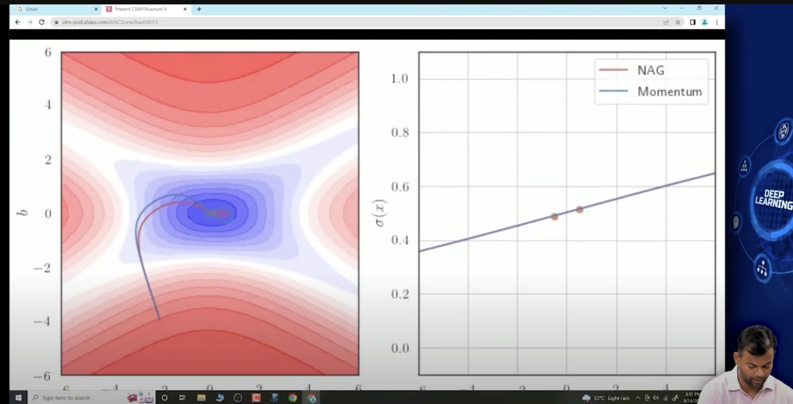

## 4.4 Nesterov Accelarated Gradient Descent

- can we do something to reduce these oscillations?
- yes, 
- 
- recall the momentum gradient descent
- it has two parts , one history and the other is the current update
- we are changing the weights using two quantities
- the first one is collection of history of the past updates, we already know what that quantity is,
- so we update the weight by this history quantity first , say that we have updated by one of the two parts, that means we have moved somewhere, now we are at some new point, and now we compute the gradient at this new point, and then move in the direction opposite of the gradient
- 
- 
- 
- 
- we can see that the oscillations have reduced and it converges faster
- 