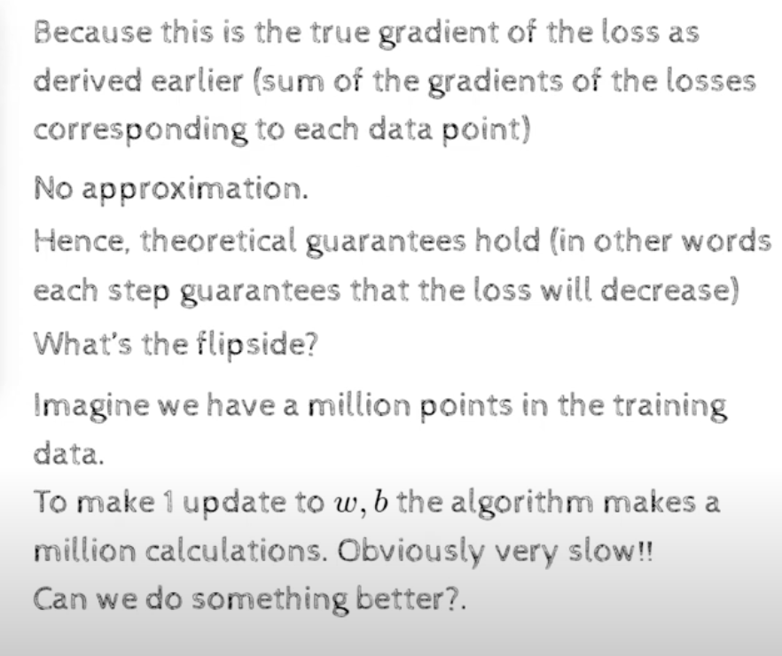

## 4.5 Stochastic vs Batch Gradient
- 
- 
- the for loop is looking at all the training data, computing the gradient and accumulating it in the sum dw and db and then comes out of the loop and then  updates the weights
- why are we going through all the training data?
    - because this is true gradient descent
    - because we want to compute the gradient of the loss function wrt w and b
    - and we want to compute it for all the training examples
    - and then we want to average it
    - and then we want to update the weights
    - 
    - no approximation is being made here
    - hence the theoritical guarantee holds(in other words each step is guaranteed to reduce the loss function)
    - 
    - can we do better, yes using stochastic gradient descent
    - 
    - 
    - 
    - 
    - 
    - 
    - 