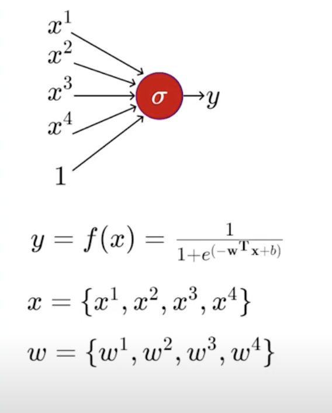
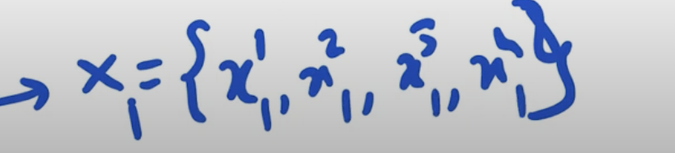
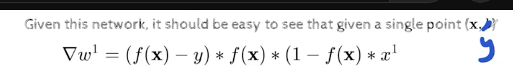
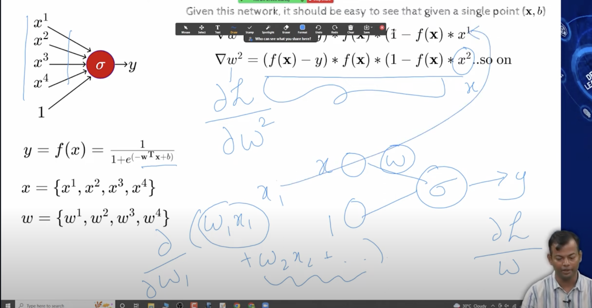
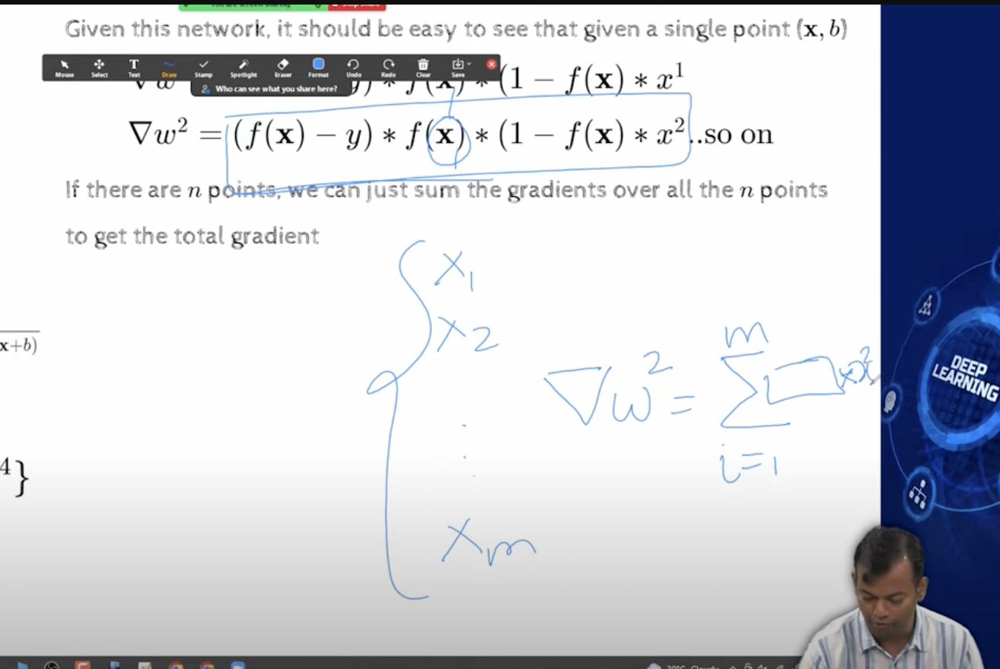
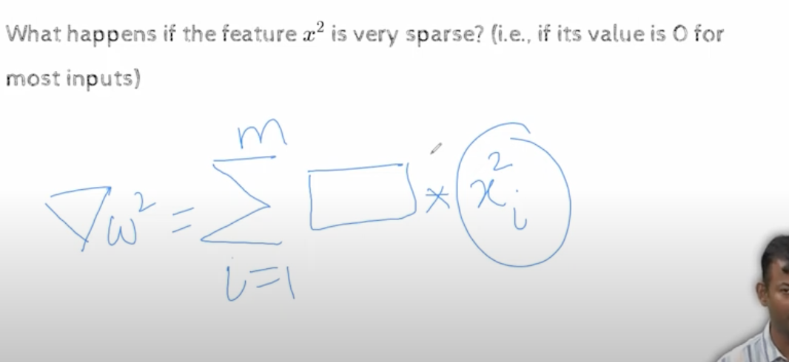
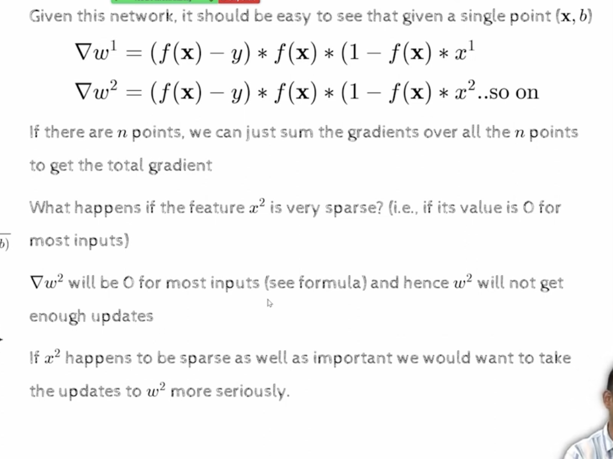
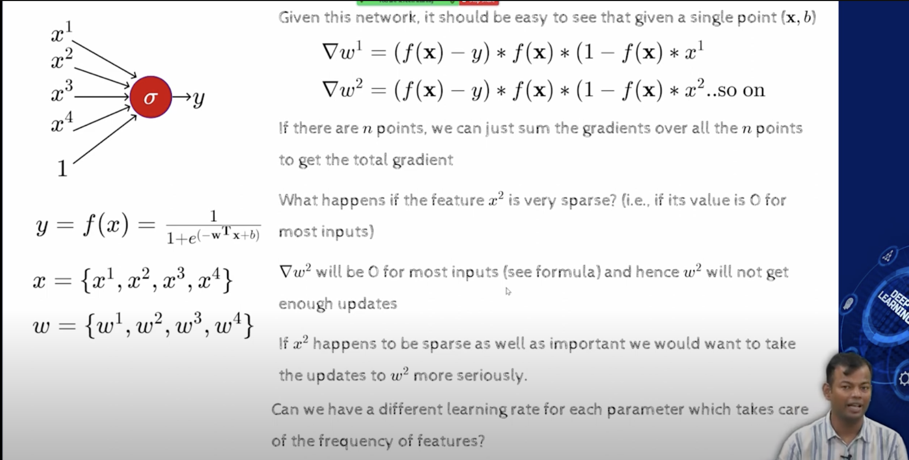

## 5.1 Gradient Descent with Adaptive learning rate

- We are looking at different variants of Gradient Descent
  - Momentum
  - corrects for the oscillations using Nesterov's Accelerated Gradient
  - Stochastic
  - Mini Batch  
- We also talked about how to come up with learning rate schedules
- During discussion we felt the need for adaptive learning rate
  - When we are on steep region we want the learning rate to be small
  - and when we are on flat region we want the learning rate to be large(far)
- How is the history been and where am i currently and can i accordingly spped up or slow down
- The Gradients will not change
  - if in steep region they will be large
  - and if in gentle region gradients will be small
- We can't do much with gradients, but the multiplying factor the learning rate, we can change that , so the we can scale up and scale down updates accordingly
- We are going to explore this idea
- 
- Simple neural network , and also we have a new  notation , as now we have 4 inputs 
- so far we were looking at simple neural network with one input and one output with one bias
- now we have 4 inputs and one output and one bias 
- each of the inputs has their associated weights w1,w2,w3,w4
- we are using subscript for training instance,so there are  M training instances, X1 to Xm
- Now we have these superscripts for the different inputs within a given training instance, 
- So now we could think of X, as in X as a vector, 
- 
- X1 - this is for first movie 
- 
- now if we wanted the derivative of the loss function wrt w1, which is one of the weights in this vector
- https://youtu.be/oqkfhBf71gc?t=248
- 
- if we have many inputs , we just sum the derivative accross all the inputs, so the derivative of loss function wrt w2 would be 
- 
- 
  - if the considered feature is very sparse, then when taking sum 
  - https://youtu.be/oqkfhBf71gc?t=567

- We have two cases
  - in steep  regions we want to the learnging rate to adapt, and be small
  - in flat regions we want the learning rate to adapt, and be large
- 
  - w decide how much that feature x contributes 
  - if w is not chnaging much, because the derivatives is not changing much, then we want to increase the learning rate
  - 
  - Can we have a different learning rate for each parameter, which takes care of the frequency of the parameter
  - if there are certain features that are very sparse, then we jack up the learning rate for those features
  - we need to have equations which automatically takes care of , how much the parameter is changing
    - if sparse feature, then we want to increase the learning rate
    - if dense feature, then we want to decrease the learning rate