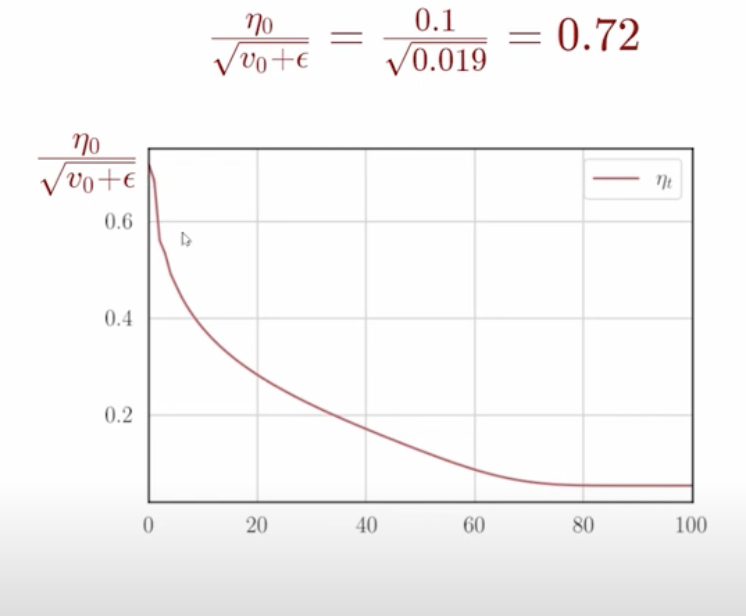

## Adagrad

- 
- for features which are getting a lot of updates, so I have a very dense feature, so the derivative is large, and we updated it in the first step to a large extent and so in the second round also we want to update it to a large extent,third step by a large value, we have done reasonable update, may be now i have to be a bit conservative and decay the learning rate
- if there was a feature whihc was very spase and got a very small update in the first iteration , because total gradient we computed was very small, again a small update in the second pass and in the third pass also a small update, so we want to increase the learning rate

## update rule for AdaGrad
- What we are going to do is to maintain the history of the updates that we are making 
- 
- del wt, tells me what update have i made or what is the gradient, 
  - it is a running sum , at every time stamp, we are adding the current derivative and square of it, 
  - we are just taking the squared derivative and keeping it as a history
  - this tells us the magnitude of the updates that are happening so far
- then what we are doing is, we are taking the learning rate neta, and dividing it by history, 
- so what will happen is if they have a feature which is very dense, and which has got lot of updates, then this history keeps increasing
- so after few iterations, (Vt will be large), so the learning rate will be small
- but if this was a sparse feature , then accross the iterations, the history will be small, so the learning rate will be large
- now the learning rate has become inversely proportional to the history, so if the history is large, the learning rate is small, if the history is small, the learning rate is large
- so this is the update rule for AdaGrad
- just like how we have update equations for W, we can have update equations for b aswell

## algo
```
v_w = v_w + dw**2
v_b = v_b + db**2
```
- this is where we accumulate the history
- taking the previous update plus the current update square
- learning rate is neta/sqrt(v_w)
- To see this in action we need to create data, where one of the features is sparse, we can show only 2d plot which means we can have , one feature on one axis and another on the other axis,
- we are going to work with two features w, b
  - remember the feature corresponding to b is always 1, because we are adding b to the weighted sum, 
  - if b was not 1, then we would have to add another feature, which is always 1
  - we are going to work with two features w, b
  - so we are going to create the data, where my x, which corresponds to w is going to be sparse

- 
- 80% of the time, x is going to be 0, and 20% of the time x is going to be 1
- hence we have a sparse feature(which means signifiacntly more than majority of the times its going to be 0)
- thats how we created the training data
- we took that data and ran the GD, momentum, NAG using that data,  
- 
- we got a loss surface like this
- lets try to explore this 
- as we know
  - red means - high loss, also there is slightly larger difference between the consecutive contour lines, which means they are a bit flat region
  - in the middle we have blue region, which means the loss is very low, and also going from red to blue as we go down, the slope is very steep , and that obvious because the difference between two consecutive contour lines is now very small
  - we start all the three algorithms from the same point , 
  - here horizontal axis is w, and vertical axis is b
- There is something interesting that these 3 algos are doing for the  dataset that we have created, can you see that?
- initially all the three algo's are moving in the same direction,of b, till some point they move only a little in the direction of b,
- this is expected, because b is a dense feature,hence gradient is large, so the learning rate is small, so the updates are small
- where as w is a sparse feature, so the gradient is small, so the learning rate is large, so the updates are large
- this means that the algo is doing proportionate movement in the direction of w and b
- https://youtu.be/WSvxne3oGr0?t=500
- even though the derivative of w is small, the learning rate is large, so the updates are large, and we are able to move in the direction of w proportionately
- 
## Lets see what adagrad does for this case
- 
- https://youtu.be/WSvxne3oGr0?t=578
- as we can see Adagrad is moving in the w direction also  
- because the LR for w, because our denominator is going to be small, our sq.rt of vt is going to be small, and if its a quantity which is less than 1, then the denominator, 
  - we are dividing neta by a quantity which is less than 1, so the learning rate is going to be large
  - hence updates in that direction increases
  - hence unlike the other algos, we are proportionately moving in the direction of w
- But note, here still the momentum based algo was faster
- because momentum based algo is able to take advantage of the fact that the loss surface is very steep in the w direction, and hence it is able to move faster in the w direction
- We can see 
  - Momentum and NAG are moving faster in the w direction
  - but compared to GD, Adagrad is moving faster in the w direction
- Also there is still scope to improve adagrad because it does not have a momentum term yet,
-  if i can add the momentum term , then we can combine the advantage of both of these,   
  - momentum
  - and the adaptive learning rate
  - 
  - the above image is the update rule for Adagrad, lets ignore epsilon for now
  - so its divided by square root of vt and for w , this vt is going to be very small 
  - 
- We will get in that direction at some point
- 
- we know that our derivative is proportional to x
- that means for the features which is sparse, these derivatives will be small , then our history will accumulate slowly , hence this effective learning rate will decay slowly
- and also its possible that initally it increases, because as denominator might be less than 1
- and also when it decreases, it decreases slowly, because the denominator is going to be small
- Lets look at a dense feature
  - 
  - Now this history is accumulating faster, because now the derivatives are going to be non zero, quite always, because this is an always on feature,
  - So our history is accumulating fast, it will not be zero for , most of the time steps, and therefore what will happen is vt will start growing rapidly  and hence this will start decaying rapidly
  - Effectively what is happening is , quickly moved in the direction of b , and came to where we wanted to be,(this will not happen), because the increments in the vertical diection will happen slowly, as opposed to earlier where it was moving fast in the vertiacl direction
  - now we are moving slowly in the vertical direction, because of this effective learning rate decaying as we keep making updates
  - 
  - on the x-axis we have number of iterations
  - on the y-axis we have the learning rate
  - dw = delta w
  - vt = history thats getting accumulated for weight w
  - neta t = learning rate at time t for w
  - https://youtu.be/WSvxne3oGr0?t=903
  - as we know vt keep increasing, as it is accumulating the gradients
  - ofcourse at some point when we reach close to the minima, when del w becomes 0, then vt will stop increasing
  - that's why this will saturate in the top right region
  - in that region the derivative has almost become zero
  - hence no additions are happening to the history
  - it was very close to zero, ofcourse some small additions are happening, but it is not increasing as fast as it was increasing earlier
  - 
  - lets look at the loss plot now
  - we started from the red region, and we are moving towards the blue region
  - initially we are in steep, we can see as we keep moving down, our derivatives becomes larger and larger in magnitude  , 
  - this direction may be positive or negative, but mag will keep on increasing
  - when we enter this valley region , the derivatives will start becoming smaller again, till they reach a point where the derivative becomes close to 0
  - remember they will increase , as we travel down the slope, and slope is increasing, (derivative will increase in the negative direction, since slope here is negative) 
  - as we are moving in the x direction , the value of y is decreasing
  - so the slope is negative, and hence the derivative is negative 
  - its going to increase in the negative direction, and then again it will start decreasing, and then it will become 0
  - 
  - initially here the derivatives as we keep going down, it keeps increasing in magnitude, and at some point,when it comes close to minima it decreases in magnitude and comes to zero
  - This is how history is accumulated and this is how derivatives are changing
  - the red curve tells us what is happening to the effectivbe learning rate
  - as history is accumulating the LR, keeps decreasing exponentially 
  - 
  - 
  - LR initilaly was 0.72 , but as we kept going down , it decreases exponentially
  - main thing to note is that , we kept our inital LR as 0.1, but it became 0.72, because of the history that was accumulating
  - 
- Lets look at the same for argument b
  - here the scale is different
  - 
  - the same behaviour happens, the gradients change as we go along, and history keeps accumulating,
  -  the only point to note here is that ,history is constantly increasing,and as the history is increasing , here the learning rate is decaying even more faster
  - 
  - b is very dense feature
  - we initialized the LR to 0.01, the same value, 
  - since the inital gradients were high, so v0 itself was 84.45, and since that was high, the initial LR was small and hence , we were moving in less aggressive direction of b, as compared to GD and Nestrov momentum
  - see the blue curve , it already starts off at 84 and its growing from there on, that's why it reaches, high values very fast , it reaches 5 digit numbers, that why the LR gets killed off aggressively, because denominator has become sq.rt of 5 digit number
  - 
  - 
  - one point to note is that even though as you come close to the minima , the derivatives have become zero, that means dwt and dbt has become zero, 
  - but history doesnt become zero, that makes sense, because its a running sum
  - and this could cause problem, which is happening near the minima in our case
  -  when the gradients are becoming small, but the history is still large and hence our effective learning rate is becoming very small
  - Now the gradients are small , the effective LR are small, and hence when we are close to the minima , or close in these flat regions, we are not able to move far, because we are not getting rid of this accumulative history that we have and we need to see if we can do something about that. 

- 
- other algos found the right value of b first and then they started moving in the w direction
- but in case of adagrad, it was moving in the w direction from the beginning itself and finds the right value for w first and then it starts moving in the b direction