## 5.3 RMSProp

- Lets see if we can do something to avoid the accumulation of b
- We are allowing to grow un inhibitedly, because its just accumulating the squares, so now frequent parameters will start receiving small updates, can we avoid this and prevent the rapid  growth of the denominator, can we try to scale down the growth of the denominator, and we know how to do that 
- 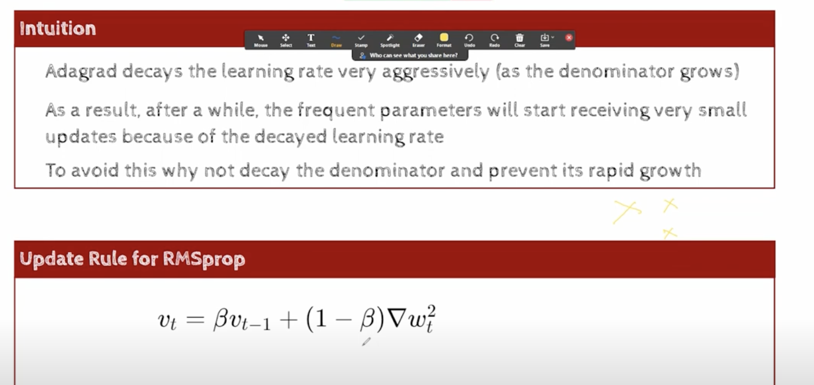
- instead of the original equation which was allowing the gradients to get added ,we can take a fraction of the gradient 
- if typical value of Beta , say 0.9
- 1-Beta = (0.1 * the gradient) 
- history continuously gets multiplied by 0.9, so whatever was my accumulated history has become 0.9 times, and my current gradient , also we are not taking it fully , we are also taking fraction of it, so thats why we are not allowing the history to grow as rapidly, as it was growing in the case of adagrad
- This is the change we have made in RMS Prop
- the update rule remains the same, and everything else remains the same  
- the only thing that has change is the denominator vt , earlier it was growing rapidly, now it is growing slowly
- we have added a new hyper parameter Beta, which is typically 0.9, and hence Beta and 1-Beta,are both less than 1, so we are multiplying the history by a fraction, and we are also multiplying the gradient by a fraction, so we are not allowing the history to grow as rapidly as it was growing in the case of adagrad
- 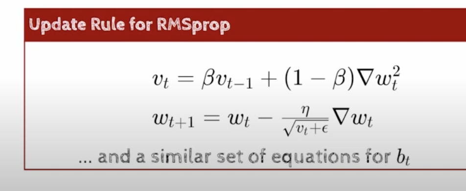
- 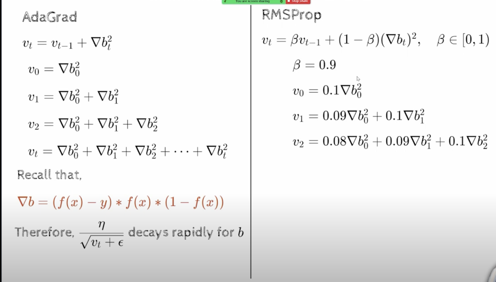
- we can see that history is exponentially decaying, because  earlier we were taking the whole of b0**2, but now we are taking a small fraction of it
- so now we are controlling the rate at which v2 is growing , im not allowing it to shoot quixkly, im doing this exponentially decaying average
- 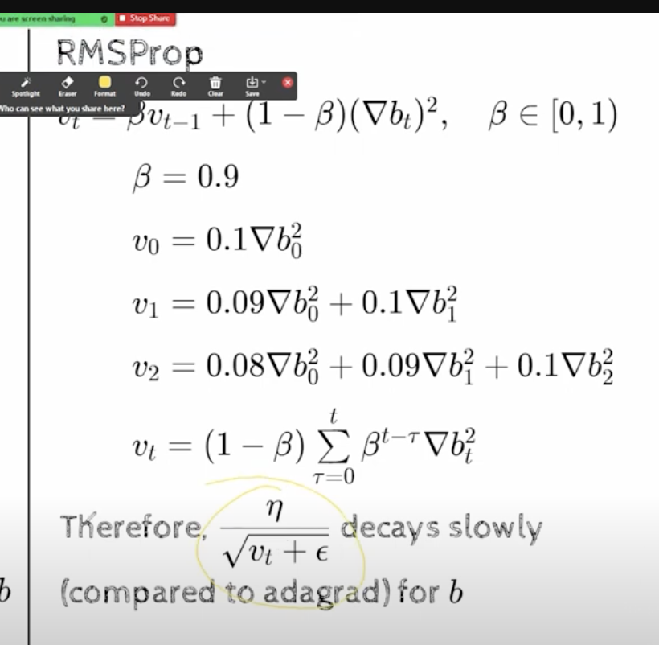
- the main takeaway is , we are using an exponentially decaying average, and hence now the denominator is going to grow less aggressively, and hence now the effective learning rate , decays slowly
- 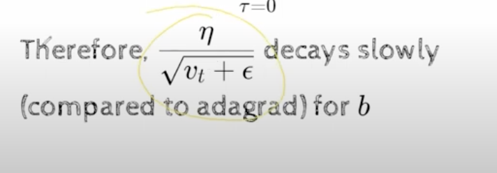
- 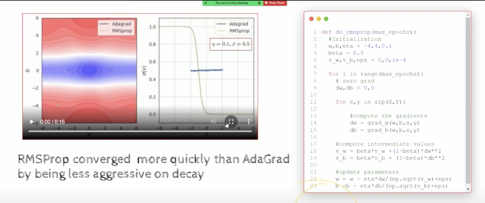
- https://youtu.be/ubOy0NPI2cY?t=318
- RMS prop has quickly reached the minima, because its learning rate is not decaying, its also following this hypotenuse, path, its making updates in the direction of w and b, proportionately , even though the updates in the w are smaller
- But notice, its oscillating near the minima, why ?
- because the learning rate is not decaying, its not decaying, because the denominator is not growing as rapidly as it was growing in the case of adagrad
- The takeaway in the above slide is RMS is faster than Adagrad, because it is less aggressive in decaying the learning rate
- 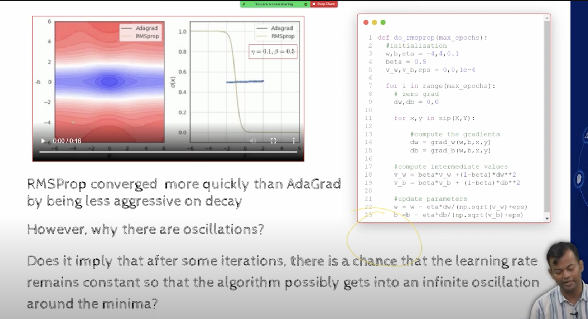
- 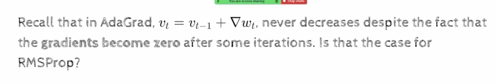
  - the formula should be del Wt**2
- when we saw the plots, we saw that vt never decreases, it keeps increasing and it saturate, but does not decrease, even thought the derivative has become zero, vt keeps increasing, and it saturates, but it does not decrease , it does not start falling down
- Lets see what is happening in RMS prop , and why it is not decreasing
- 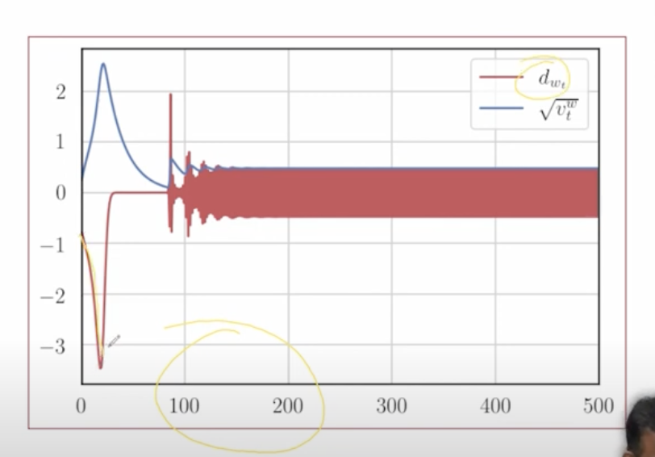
- the derivative starts from -1 , and it start to increase in the negative direction, and then it started decreasing , and became zero , and then we see the oscillations
- main point is to note vt, it increases and then it starts decreasing also
- vt can decrease in the case of RMS prop, and why does this happen?
- red color is derivative, and blue color is vt
- vt is accumulation of history, ideally it should keep growing , right?
- how is the accumulation is decreasing?
- its not because of derivative, because we are taking vt**2
- 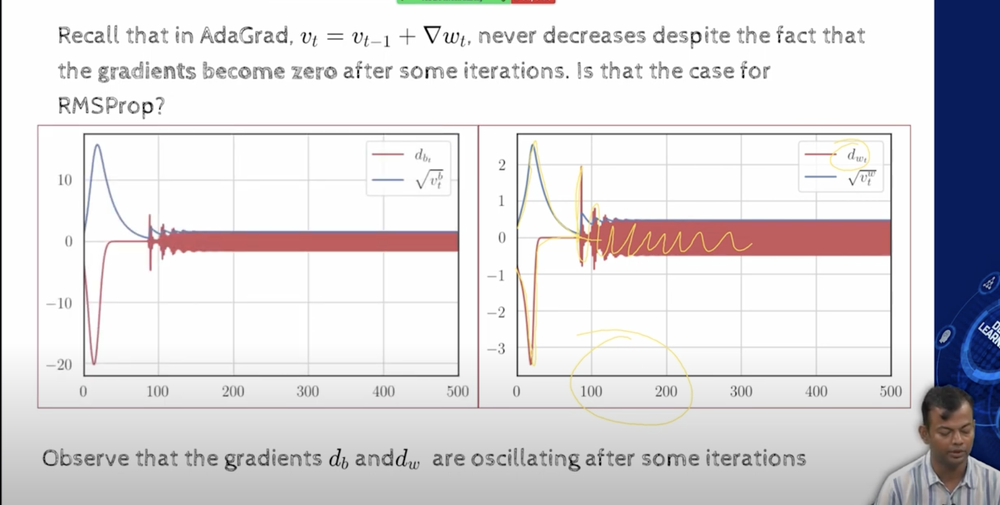
- the reason for this to happen is because of the exponentially decaying average  ,
- initially if we look at the sum, 
- https://youtu.be/ubOy0NPI2cY?t=541
- at each timestamp, the curve or history changes
- in case of adagrad
  - the denominator was always growing, hence there was always a decay in the learning rate, but now since the history can grow and decay it can also become a constant, because now, as all the current gradients are zero, all the  points are becoming closer to zero, and history is becoming constant, and hence the learning rate is becoming constant
- 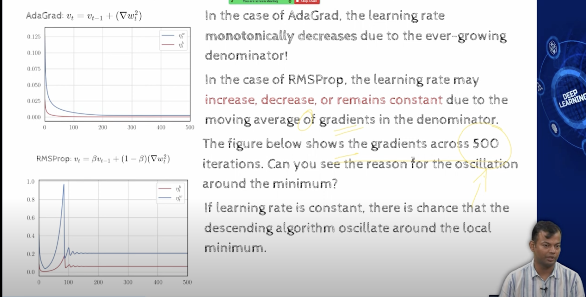