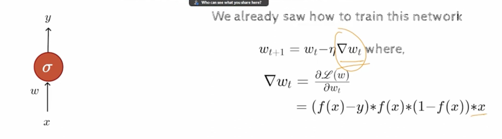
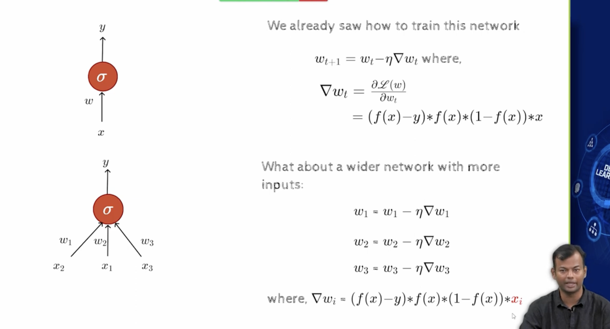
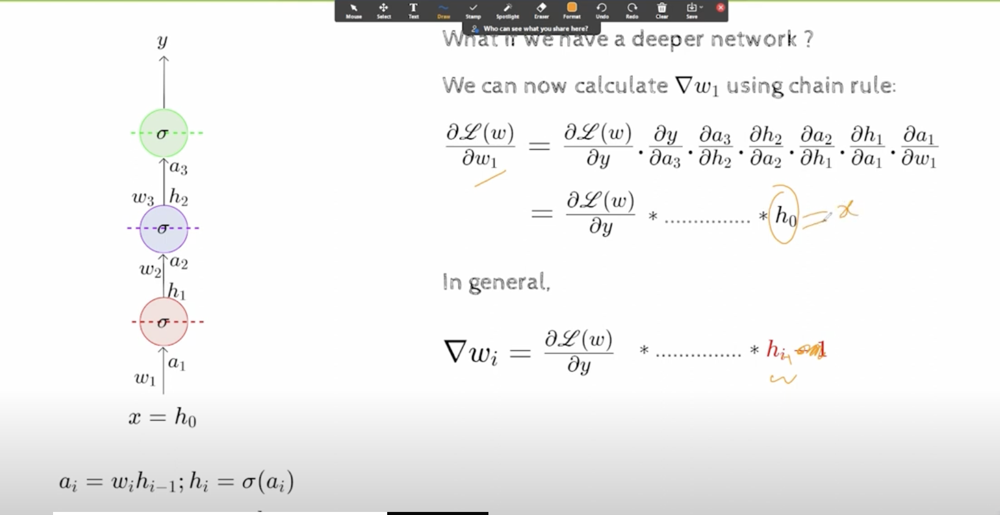
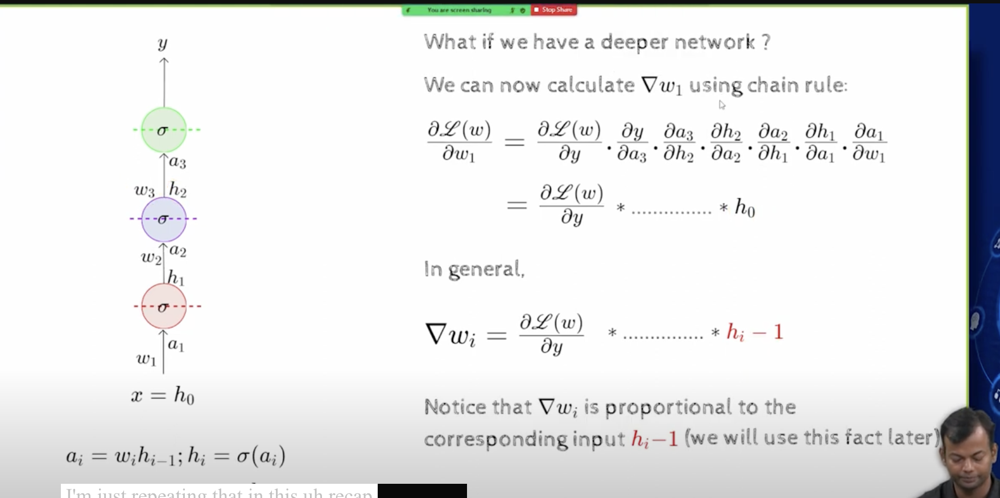
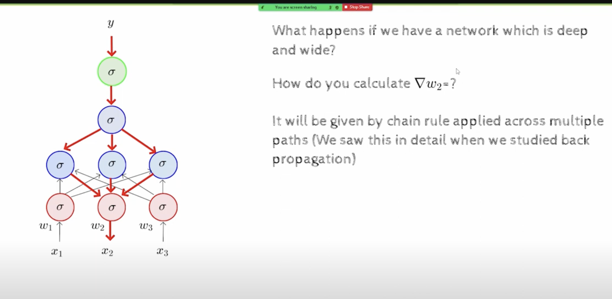
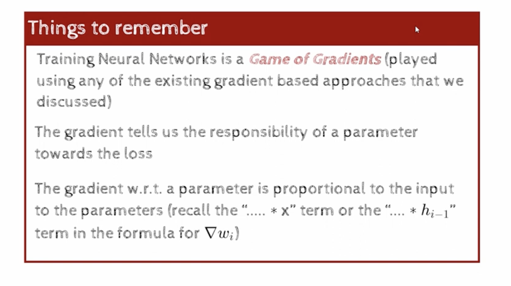
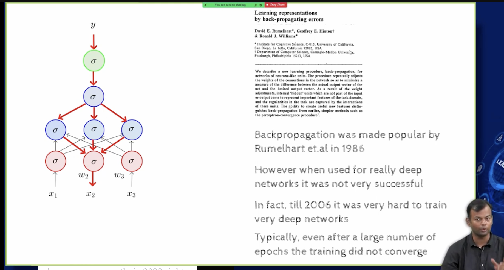

## L7.1 Deep Learning revival

- Activation function and initialization methods help us making deep neural networks converge faster and more reliably.i.e train better and faster
-   
- the key observation that we had made there was that the derivative is actually proportional to the input X 
- 
- 
- h0 is same as X, the input
- for any layer lets say w3, the derivative of the loss function wrt this weight w3  is proportional to the input of that layer (h2), 
- ie the input that the weight was connected to 
- The H's are inputs coming from previous layer, they are also of course the output of some other layer,but for the current layer they are the input
- So the derivatives are always proportional to the input connected to that weight
- 
- 
- 
- Points to remember
  - Training NN is a game of gradients
  - we compute gradients at every layer, and then we use whatever varient of GD , it could be SGD, or mini batch GD, or batch GD, or momentum based GD, or ADAM, or RMS prop, or any other varient of GD, NAG, ada delta, ada grad, ada max, etc..
  - whatever we use, the derivatives will always be used inside them
  - This gradient is the way of quantifying the responsibility of the parameters for the loss function  
    - the higher the gradient, the more responsible the parameter is for the loss function
    - the lower the gradient, the less responsible the parameter is for the loss function
  - the gradient wrt a parameter is proportional to the input connected to that parameter
- For DNN to work
  - we need more data
  - we need better hardware
- 