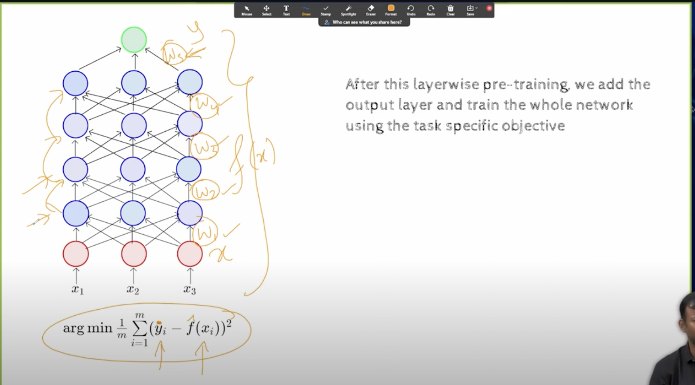

## L7.2 Unsupervised Pre-Training

- 
- 
- 
- earlier it was hard to train DNN beyond 2 or 3 layers because they did not converge well
- 
- the idea is we take  an input of 1024 dimension and in first layer we get 256 and try to reconstruct the input
- the objective is to minimize the reconstruction error
- and we take the average of it
- suppose we are able to do this with zero error, what does it tell about h1?
- it means h1 is able to capture all the information in the x
- 
- this is the idea in autoencoder, we want the more compact representation of the input
- 
- why is the word unsupervised used here?
- this is because we are not using any labels here, no `y` here
- hence the name unsupervised
- we give the input and we want to reconstruct the input
- the loss function completely depends on the input
- we are not using any labels here
- 
- now we are trying to do the same thing with for second layer
- we are trying to reconstruct h1 from h2 and we are trying to minimize the reconstruction error
- this means that h2 is another compact representation of input x
- now we keep doing this for all the layers l
- 
- 
- Note we are not randomly initializing the weights here, we are using the weights that we got from the previous layer
- i mean , we do the above computation for all the layers so they represent the input, 
- now feed this weights to the DNN and train it, it will converge faster
- Why does it work? 
  - this is because we are using the weights that we got from the previous layer
  - we are not randomly initializing the weights
- this is called unsupervised pre training
- 
- 
- what is optimization:
  - optimiaztion deals with training data
  - during regularization we are not using the training data
    - we do generalization here
    - which means with test data our model should perform well
  - if we didnt do the unsupervised pre training, we would have to randomly initialize the weights
  - which means we would not even be able to reach the optimal solution
  - Not clear answer to why it works
  - early stopping came, drop out came, all these are hacks