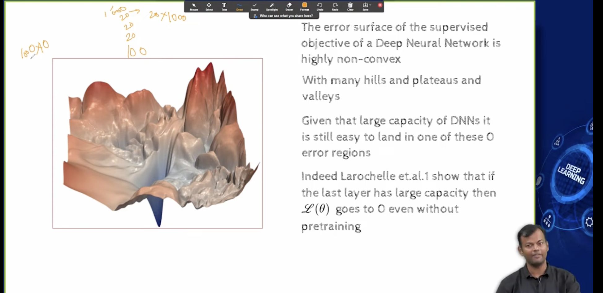

## L7.3 Optimization or Regularization?

- first lets see the people who tried to hint that this is happening due to better optimization

- 
- 
- there are some more valleys where the error is region which is not visible in the image
- given this large capacity , its still possible to find a good solution, if we have a good optimization algorithm
- the universal approximation theorem says that we can approximate any function using a neural network 
- So as per the theorem, we can approximate any function using a neural network, but the question is how do we find the weights of the neural network?
- so maybe optimization was not a problem as long as the capacity of the neural network was large enough
- UAT talks about the capicity of realy large neural network
- we are talking about exponential number of neurons
- 
- they say that if we can increase the capacity of last layer, then the loss function becomes 0,even without pre training
- 
- this is empirical, we dont know why this happens , and their cases are very specific
- this led to an important insight that pretraining is helping in   optimization, and if you can imporve optimization, then you can train deep neural networks 
- so lets focus on improving optimization, 
  - unsupervised pre training is one way of doing it

## lets look at Regularization, 
  - is it because of regularization that we are able to train deep neural networks?
  - some tried to argue on this point too
  - 
  - what does regularization do?
    - it constraints the weights to lie in a certain regions of the parameter space, 
    - we saw this when we did L2 regularization, that it constrains the weights to lie in a sphere or circle,we do not allow the magnitude of the weights to become very large
  - so only those weight configurations which lie on or within this circle are possible, you cannot go outside that boundary
  - Similarly L1 regualrization constrains the weights to lie in a square (Diamond)
  - We even saw the early stopping technique, where we stop the training process when the validation error starts increasing
- 
- indeed unsupervised pre training is a form of regularization , it is also causing the weights to lie in a certain region of the parameter space
- 
- some experiments were done to show that unsupervised pre training is robust to random initialization , means it doesnt matter how you initialize the weights, it will still work
- 
- they trained DNN, with diff no of layers, 
- we have computed the variance of the weights, and we have plotted the variance of the weights vs the number of layers
- and it says that in shallow network the variance is not very high, but as we increase the number of layers, the variance of the weights increases
- But if we do unsupervised pre training, then the variance of the weights is not very high, even for deep neural networks
- This led to the idea that maybe the whole neural network are sensitive to initialization
- So can we come up with better methods of initialization, so that sparked interest in that
- 