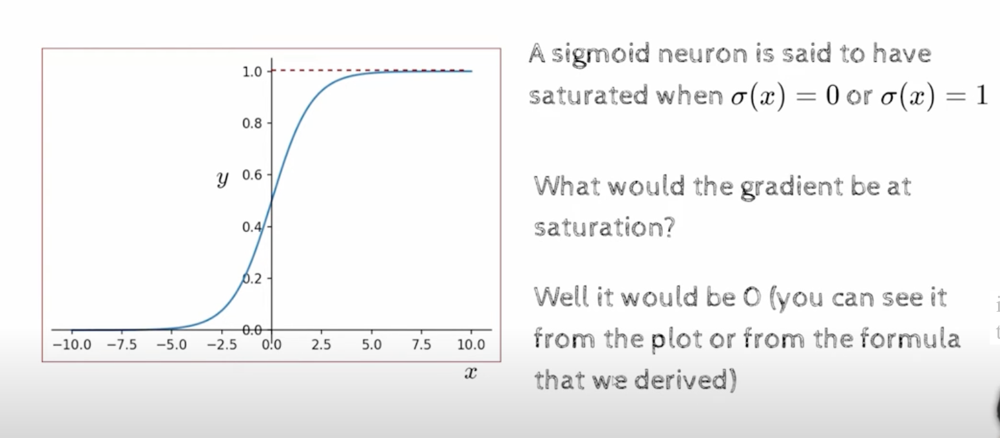

## L7.4 Better Activation functions

- today we will talk about better activation functions
- 
- 
- lets take above example, its a thin network , but still a DNN
- all the sigmas , which can be sigmoid or logistic function, or tanh, or relu, or leaky relu, or elu, or selu, or swish, or mish, or any other activation function
- we just replace by a simple linear function
- we are saying there is only linear layer and no non linear layer
- 
- 
- we cannot draw any line that can separate the two classes, 
- so the reason DNN can learn such boundaries and hence can act as a universal approximator
- because now we have a complex function between y and x which is looking like this, This is the function that we are interested in , and as we have seen while looking at the universal approximation theorem, 
- The theorem states, even if we have a single sigmoid neuron, we can approximate any function
- sigmoid was important because it was differentiable
- These non linearity is what gave DNN the power to learn complex functions
- Where do these non linearity come from?
  - they come from the activation functions, and hence we need to learn better activation functions
- 
- 
- 
- lets see what happens if we use sigmoid in a deep network
- given that the gradient of this sigmoid is given by this formula
- Note : in the extremes, when the sigmoid neurons saturate, it takes its maximum value, which is 1 , and the derivative is 0 , so the gradient is 0
- similarly when the sigmoid neurons saturate at the bottom, the gradient is also 0
- 
- a neuron is said to be saturated if it is at its peak or its lowest value
- 
- 
- once the neuron saturates, the gradient becomes 0, and the neuron stops learning
- the trainig will not progress, now the weights are not getting updated
## why would a neuron saturate?
- 
- this is not the output neuron, but instead a hidden neuron, the green would be the output of the neuron, it would be the sigmoid of LC of the inputs connected
- suppose if initial weights are very high, and now my inputs are all standardized, we subtracted the mean and divided by the standard deviation, so the inputs are all between -1 and 1
- Why would weights be high, ill initialized weights to some low value, but if there are 1000 neurons in one layer and this is a sum of 1000 terms, and even with very small weights a sum of 1000 terms reaching a value of 2.5 is not very difficult, so we have to very carefully initialize the weights
- we will learn how to initialize the weights correctly, so that we dont end up with saturated neurons, so the main point is that neurons can saturate, and if they saturate, then the trainings are problamatic, because the gradients are not flowing through
- also if the neurons are saturating with 1, that means these weights were strongly participating in the output, and hence they would have got some impact in the loss function , but that signla will not flow bcak into these weights, and hence the weights will not get updated
- 
- sigmoids are not zero centered, they are always positive, so if we have a negative input, then the output will be negative, but the gradient will be 0, so the weights will not get updated
- the sigmoids are 0.5 centered, so if we have a negative input, then the output will be negative, but the gradient will be 0, so the weights will not get updated
- what could the problem be?
- lets see this through an example
- see the diagram
  - we have the output layer
  - before that we have one sigmoid neuron
  - and it is connected to two inputs
  - h21 and h22
  - so a3=w1h21 + w2h22
  - and then we will pass it through a sigmoid
  - again if we were to update the weights w1 or w2, we would have to compute the gradient of the loss function wrt w1 and wrt w2
  - 
  - it is derivative of Loss wrt y, then the derivative of y wrt h3, then the derivative of h3 wrt a3, and then the derivative of a3 wrt w1(written as h21) 
  - derivarive of w1h21= h21
  - 
  - now what is there with the colour coding in the formula?
    - the red is common for both the derivatives 
    - the blue part is change
  - what is h21
    - it is the output of previous sigmoid neuron
    - so i know that they are gonna be positive
    - both the blue parts are positive
  - now the sign of gradients is determined by the sign of the red part
  - if the red part is positive, then both the   gradient will be positive
  - if the red part is negative, then both the  gradient will be negative
  - we cannot have one positive and one negative, so either it will be all positives or all negatives
  - so the gradient vector is having either all positive values or all negative values
  - and why are we discussing this in case of sigmoid neuron ,
  - this happened because we used sigmoid neuron, hence the blue part is positive always   
  - if we had used some other activation function with range -1 to 1, then the blue part could have been negative
  - 
  - what is the problem with this?
    - the graphs shows the partial derivative wrt w1 and wrt w2 
    - now lets consider the plane which has all possible values of derivatives w1 and w2
    - now which are the quadrants that are possible?
      - the first quadrant is possible
      - the third quadrant is possible
    - we cannot have a vector in the second quadrant or the fourth quadrant
  - we can already see , when we are doing gradient descent , we are moving in directions
  - now half the directions have been eliminated, because of sigmoid, and this is a big problem
- lets look at a toy example where it is a problem
  - 
  - suppose green is the optimal solution for w
  - 
  - we initialize from here
  - 
  - we have to move in zig zag pattern and reach the optimum , and that will take more steps to converge
  - also sigmoids are computationally expensive, because we have to compute the exponential
    - ofcourse there are faster ways of computing it, but still it is computationally expensive
  - this is all the reason, why sigmoids are not used anymore, and not convenient to use
- because of these limitations, we have moved to other activation functions, like tanh
  - tanh is zero centered
  - 
  - 
  - the problem of saturation still remains, and gradient disappears
  - the problem of limited direction of movement has been overcome
  - also computation is still expensive
  - it has the e component in it
- 
  - ReLU
  - one of the most popular activation function
  - in context of CNN
  - a12 is going to be the input to the ReLU function
  - is it non linear?
    - yes
  - 
  - 
- Advantages:
  - 
  - as long as a3 or a is positive, the gradient is positive, and will not saturate, 
- Despite all these there are still some challenges here
- 
- if we look at derivative of ReLU, its gonna be 0 for all the negative values and 1 for all the positive values
- 
- 
- if b is very negative irrespective of what w1x1 and w2x2 are, then the gradient is 0, and the weights will not get updated
- so the derivative of ReLU is 0 for all the negative values, and hence the weights will not get updated
- if derivative is 0, if we try to update w1, at some point in the chain we have this dou(h1)/dou(a1) and that is going to be 0, and hence the weights will not get updated, 
- which means the derivative of the loss function wrt w1,w2 is 0, and hence the weights will not get updated
- and also wrt b is 0, 
- if that happens
  - its not got updated, neither B has gotten updated, and now from here on, the neuron will remain dead for the rest of the training, it will never become alive again
  - and this is called the dying ReLU problem
  - but why is it?  
  - 
  - because the derivative of ReLU is 0 for all the negative values , and hence the weights will not get updated
  - w1 , w2 and B will not get updated
  - B still remains large negative, and next input comes in again the same will happen , hence the neuron will remain dead for the rest of the training
  - 
  - if LR is very high, then this problem of a large gradient flowing to B and then getting multiplied by a reasonable LR, and then B becoming very large negative, and then the neuron dying, this problem will  happen
  - in context of DL , value of 0.01 is fairly a large value
- One variant of ReLU is Leaky ReLU, it allows some leakage on the negative side
  - 
  - it does not die completely
  - it allows some gradient to flow, even when X is negative
  - 
  - 
  - Gelu and swish are also variants of ReLU