## L7.5 MaxOut

- 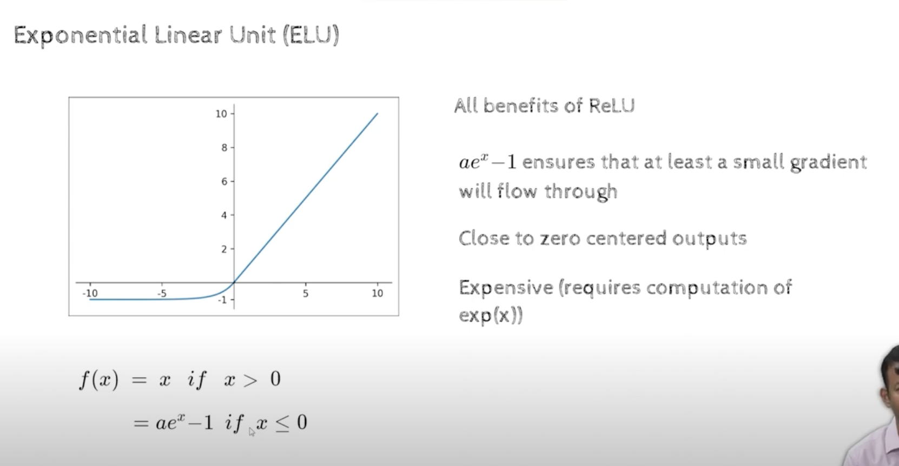
## Maxout activation

- we have discussed about model averaging where we have a dataset and create subdatasets by sampling with replacement
- lets say we have 1000 datapoints, we want to create another dataset of 1000 datapoints 
  - how we will do this is, we will take one datapoint from training dataset make a copy and , put it in this bucket, 
  - 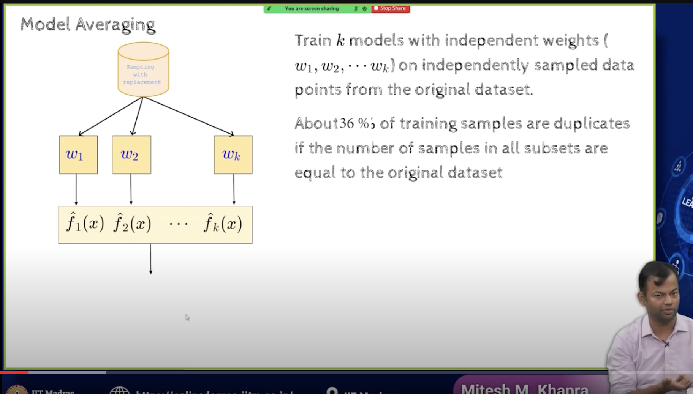
  - again sample one randomly, make a copy and put it in this bucket,
  - keep doing this until we have 1000 datapoints in this bucket
- we are going to create multiple such buckets of the original dataset
- each of these training sets will then be used to train a model, and models will have their own parameters w1,w2,..wk
- here consider w as a collection of all the parameters of the model
- here w1 ,w2,..wk are the parameters of the k models, each trained on a different version of the training set
- each of these models have same size, but it contains sampling with replacement
- it is shown that if we do this sampling with replacement, around 36% of the samples will be duplicates, and this makes sense because we are sampling with replacement
- There is a study , that shows how many duplicates we can have in a dataset of size n, if we sample with replacement
- Now we have 1000 datapoints but there are duplicates of that , so the model has better chance on overfitting  on the training set
  - because now we have fewer unique datapoints
  - and we are training on the same datapoints again and again
  - 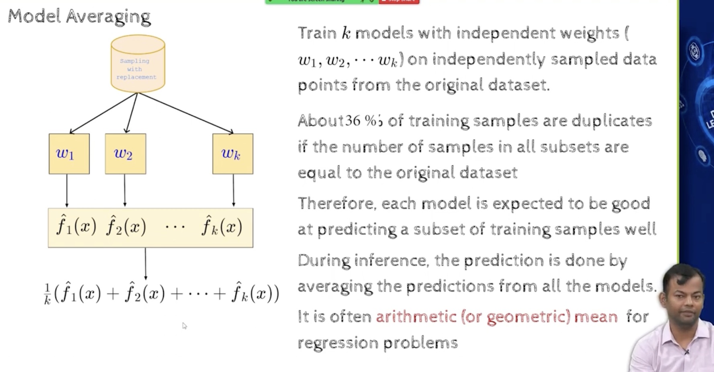
  - 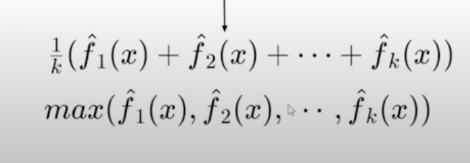
  - this is what happens in Model Averaging
  - In DNN the way we have done that was using Dropout
  - we knew it was difficult to train multiple models, so Dropout was a substitute for getting the effect of model average
-in dropouts we dont have to train multiple models, we just have to train one model
- 
- In dropouts what is happening is that you have these multiple submodels, each submodel is getting sampled rarely, because there are exponentially large no of submodels, so each submodel is getting sampled rarely, so each submodel is not getting the chance to overfit on the specific portions of the data, because it is hardly seeing the data once
- it may not even see it once
- so in case of dropout , whenever we do an update, we have to do a larger update, because this datapoint is sensitive, we should try to do a larger update
- 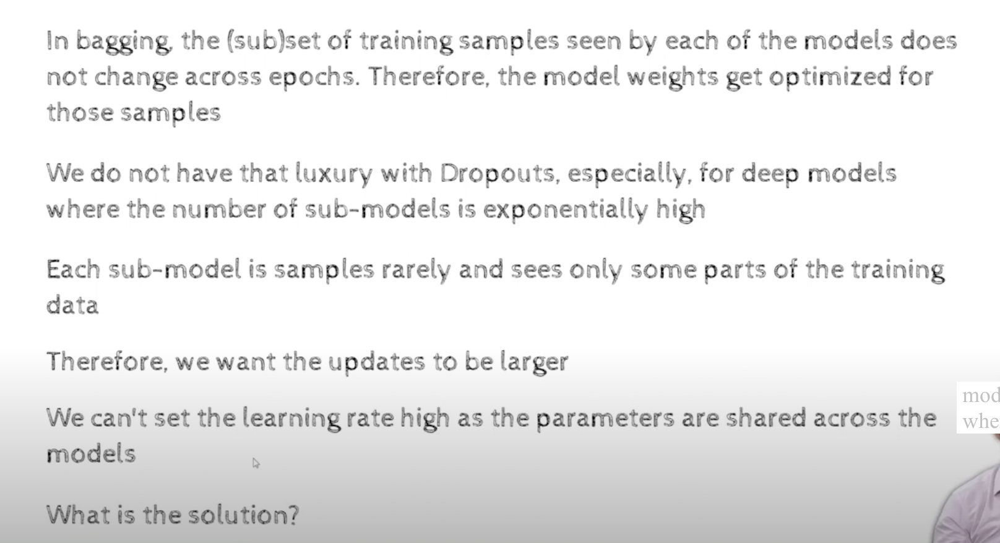
- maybe you could increase the learning rate, or you could do a larger update
- How do we close this gap between the two models?
  - this is where MaxOut comes into picture
  - 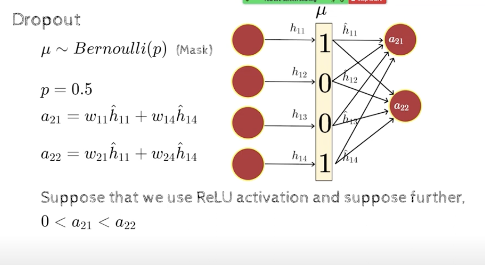
  - lets say we have these two outputs a21 and a22 have the following outputs , they are both greater than 0, because its a ReLU activation, so we want both of them to be active and not dead
    - if a21 is less than a22, it means that a22 is reacting more positively to this training sample
    - it is firing for this training sample better, because its output  is high
    - can i update a22 better as updating this right because  this is reacting weekly
- 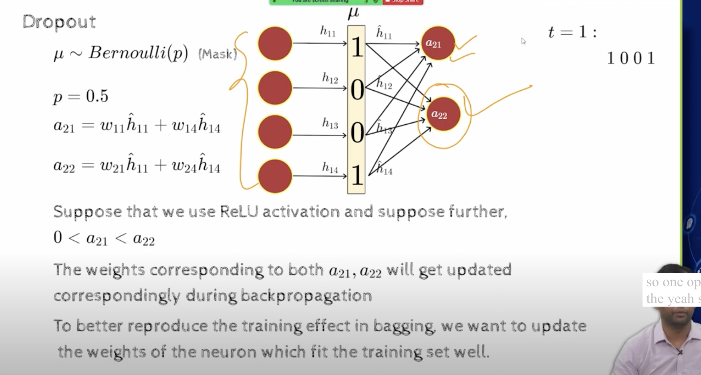
- 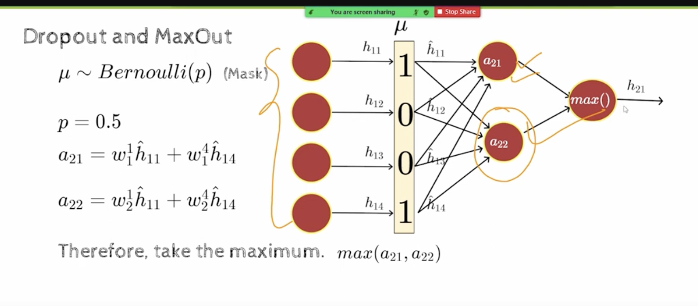
- here we chose two models, we can choose more than two models, we can choose k models and still pick the max
- 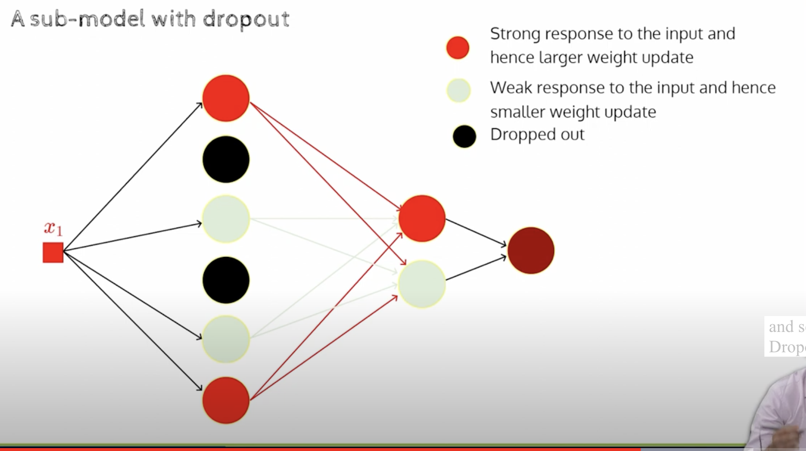
  - black nodes completely not participating in output
  - 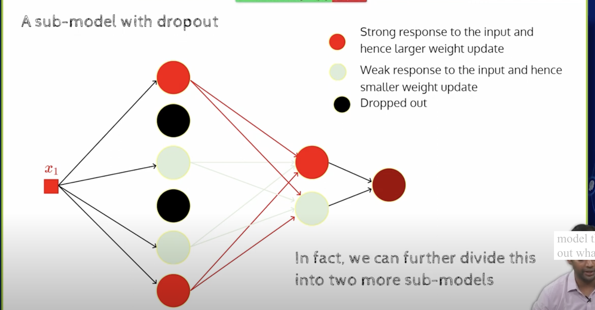
- 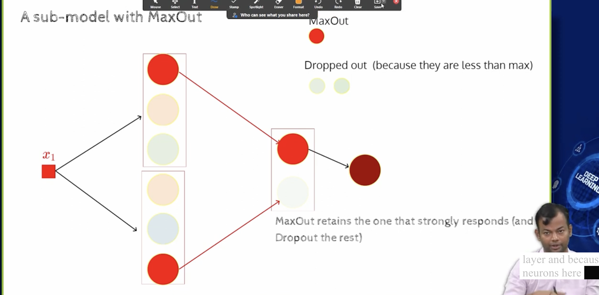
- 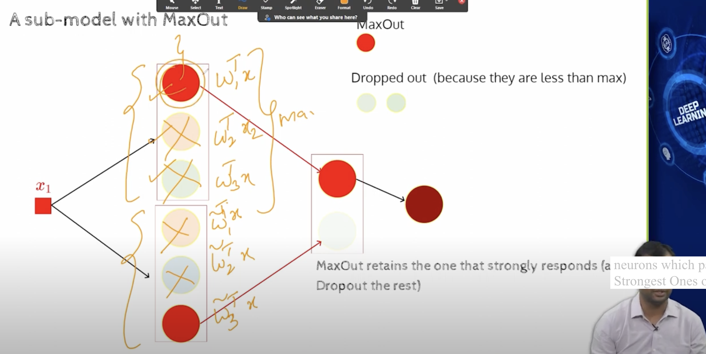
- we take the strong and drop out the week ones
- 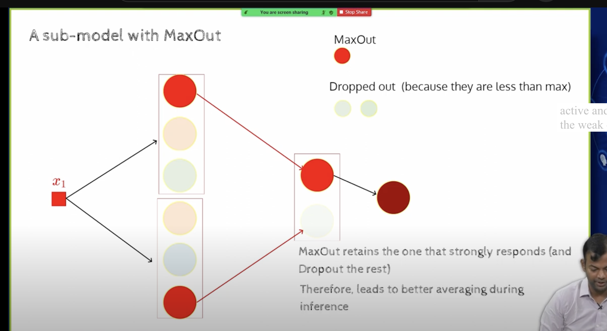
- Maxout neuron, affine transformation and not linear, because we have a +b there
- we can think of maxout as a generalization of ReLU(any version - leaky, parametric, etc..)
- Relu is a special case of maxout, one of the maxout neuron is a relu neuron and the other one is a constant 0
- 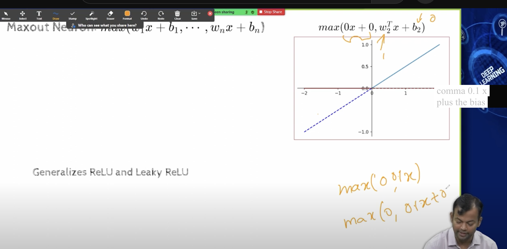
- 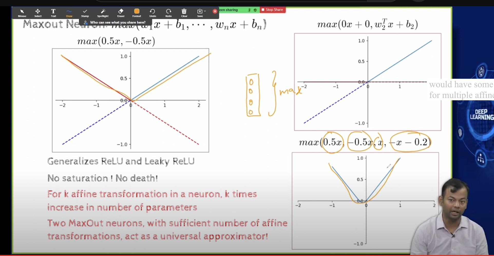