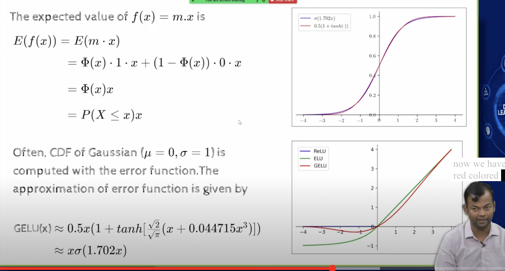

## L7.6 GELU to SILU

- 
- 
- h2 is activaion of the hidden layer 2
- a21 is preactivation of the hidden layer 2
-  
- 
- 
- 
- 
- zero centered means that the distribution is equal around negative and positive
- clearly relu is not zero centered, because along the negative axis it is zero
- 
- 
- 
- 
- 