## 8.2 The convolution operation

- 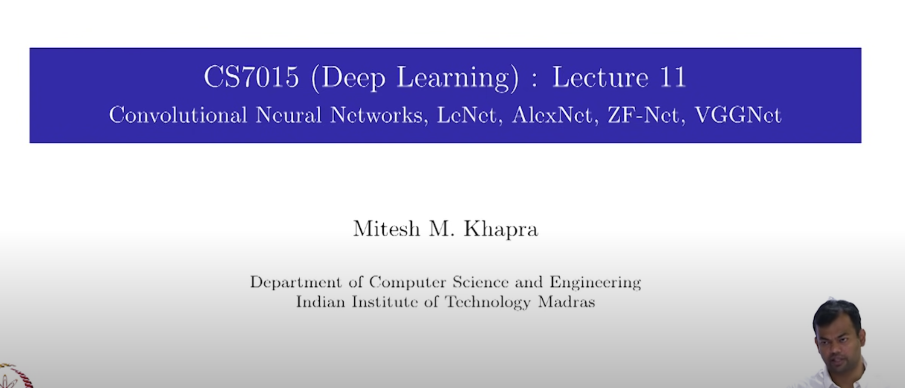
- So far we looked at Feed forward neural networks, where we have a set of input features, and we have a set of output features, and we have a set of weights that connect the input features to the output features. 
- we saw how to train them
- we saw two special cases
  - Autoencoders - for learning latent representation of data
    - in other words, we are trying to learn a compressed representation of the data
  - How to use a FFN, to learn word representation
    - we saw word to vec algo , and its different variants
      - continuous bag of words
      - skip gram model graph and so on
    - these are applications of FFNN
- We will see a diff type of NN today (CONVOLUTIONAL NEURAL NETWORK)

## THE convolution operation
- 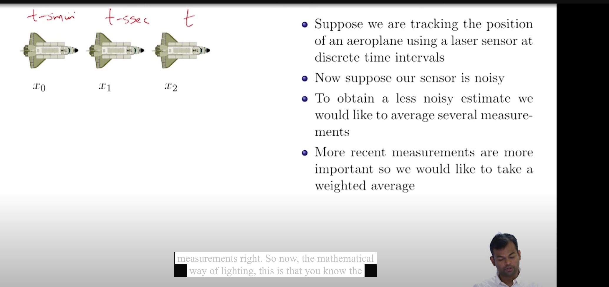
- we have this airplane , going from chennai to delhi
- and at discrete time intervals we are tracking the position of the airplane, How far its from chennai at this point, 50 km , 100 km ,etc..
- lets say we are taking these measurements every 5 or 10 seconds
- our sensors will usually be noisy, means there will be some error in the measurement
- so instead of relying on a single measurement, we can take a moving average of the last 5 measurements, that would give more accurate estimate of the position of the airplane
- recent measurements are more important than the older measurements
- give more weightage to the recent measurements
- How to write this mathematically?
  - 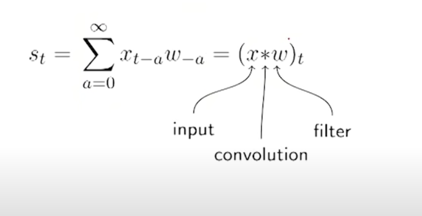
  - we know that xt is the position of the airplane at time t
  - we are interested in revised measurement of that
  - W is the weighted average of all the previous measurements taken
  - All these can be written as (x * w)t
    - x is the vector of all the measurements taken so far
    - w is the vector of weights
    - `*` is the convolution operation
    - farther the measurement from the current time, the weightage is less
    - x => input
    - w => filter
    - `*`=> convolution operation
  - in practice, we will have a window of size n, and we will take the weighted average of the last n measurements
  - in our case lets take n=6 , beyond that it doesnt make sense
  - what will the dimension of this weight array? it will be 7 (0-6)
    - 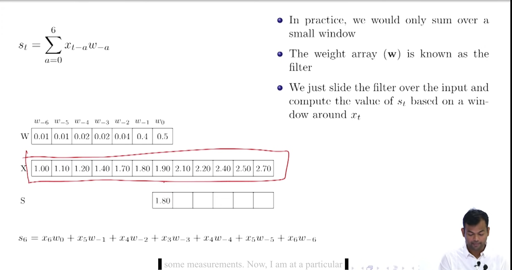
  - X => the measurements we have taken using the laser
  - we are at a particular time stamp s, and we are interested in finding the revised estimate of the position of the airplane at that time
  - we are going to take weighted average of the last 7 measurements
  - the revised estimate of s6 will be 
    - 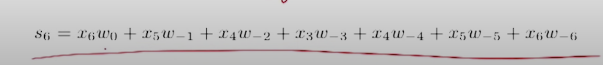
    - x6*w0 + x5*w1 + x4*w2 + x3*w3 + x2*w4 + x1*w5 + x0*w6
    - w0  => weight assigned to the current time stamp
    - using these we get a revised average
    - for the next time stamp
      - 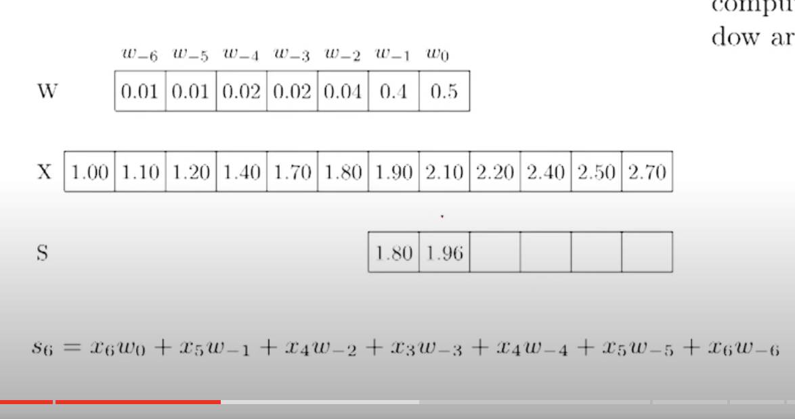
      - 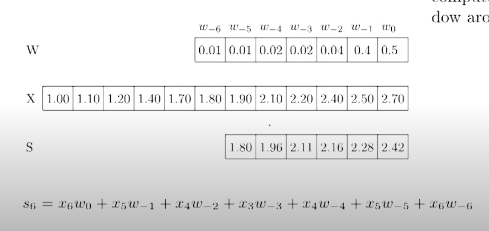
      - here the input as well as the kernel are one dimensional
      - 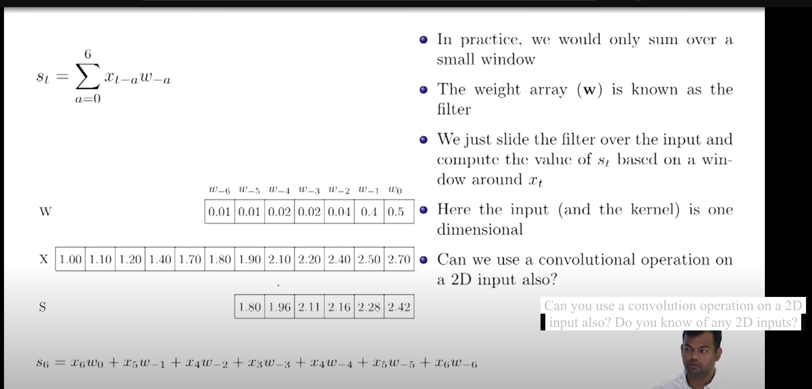
      - Can we use a convolutional operation on a 2D input also?
      - do we know of any 2D input ?
        - IMAGES
- We are trying to do the same as early, story changes from laser to a camera now
- we have taken an image , and we are not confident that not all the pixels are captured
- so for any given pixel, i want to re estimate it using its neighbourhood
- the filter will be of 3 x 3 , so the weight will be of 3 x 3
- we would now like to use a 2d fileter (m x n) - in general it will be of m x m
- 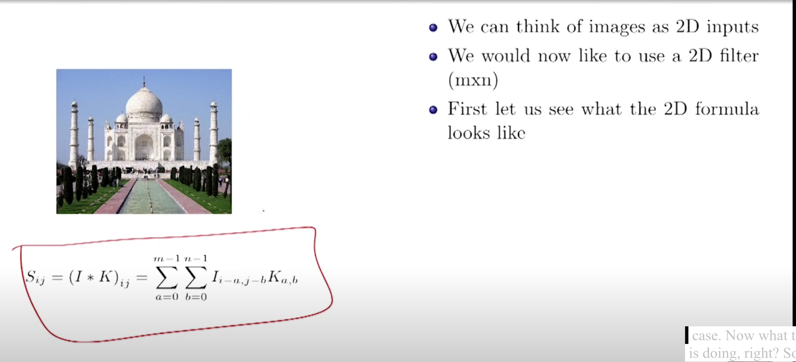
- let a pixel in the image be denoted as  I(i,j)
- we want a revised estimate of this pixel S(i,j)
- 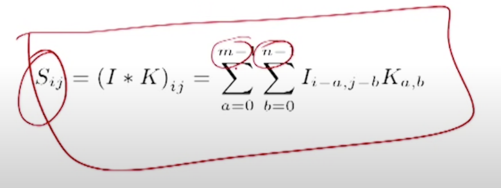
- How we are going to do that is ,we are going to look at m row and n columns before it, for each of these pixels we are going to assign a weight
- 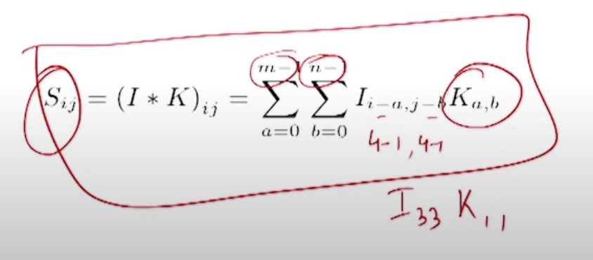
- why not future pixels, its just a convention
- But we are going to look at neighbour hood rows and columns after it
  - 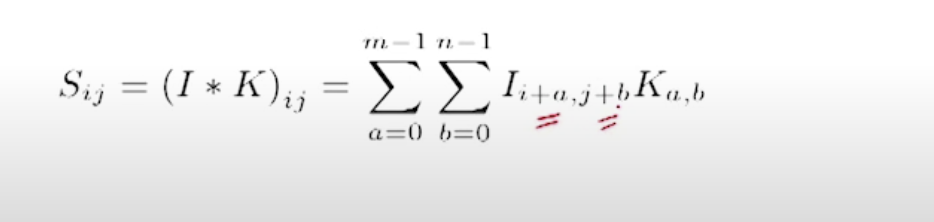
- its more natural to look at neighbourhood pixels around it
- 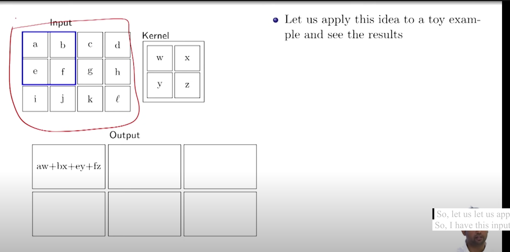
- Lets appliy this to a toy example
- we have a 2D input, and a kernel whihc is 2 x 2, m=n=2
- we are going to place this kernel at the top left corner of the image
- we will get aw+bx+ey+fz
- and we keep sliding this kernel across the image and we get a new image
- 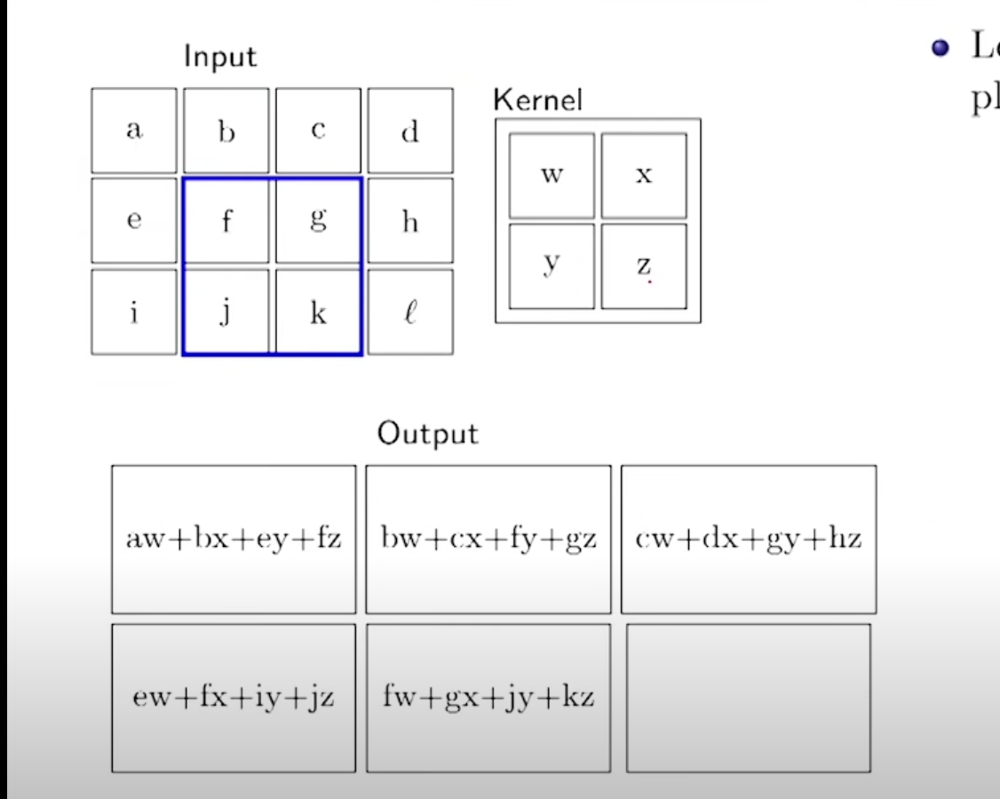
- do you observe the difference between the input and the output?
- SIZE OF THE IMAGE HAS REDUCED
- why?
- we are not padding the image
- 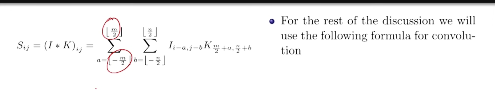
- for the further discussion we will use the centered form of the convolution operation
- that is m/2 and n/2 (-m/2 to m/2) (-n/2 to n/2)
- 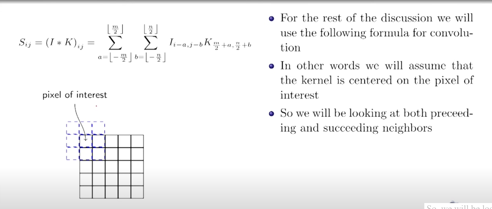
- lets see some examples of 2D convolutions applied to images
- https://youtu.be/yw8xwS15Pf4?t=658